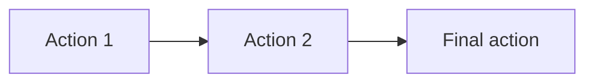

# Topic Blueprint: Replace with title

## Runtime model binding

| Boundary | Required binding | Evidence location |
| --- | --- | --- |
| Product runtime | `Action Runtime v2` | Shared Action Runtime page, registry, typed evidence/evaluation |
| Generated bundle | `teaching-tools/topic-scenario-bundle/v2` | Generated bundle root `schema` |
| Exercise plan | Current `ACTION_RUNTIME_PLAN_VERSION` | `web/shared/actionRuntime.ts` and projected plan |
| Scenario actions | Non-empty authored `actionTemplates` | First, middle, and last generated records |
| Solution document | Reviewed question-bank `solutionBoard` with database Action snapshots | Scenario authoring output, database rows, and Learn/Guided plan |

**Legacy paths explicitly excluded:** `ExerciseRuntimeSpec`, primitive dispatch, `RuntimeActionEvent.value`, Topic-specific runtime frames, and reconstruction of actions from legacy `steps`.

**Version note:** `content_id` may end in `.v1`, and registered Actions may be `kind@1`; neither changes the required Action Runtime v2 product model.

## Source mapping

| Artifact | Exact source | Assignment/status | Role |
| --- | --- | --- | --- |
| Explanation |  | approved/final | Teaching sequence and wording |
| Question bank |  | ready | Scenario records |
| Diagram assets |  |  | Geometry and prompt assets |

## Teaching intent

**Objective:**

**Ordered teaching sequence:**

1. 

**Source constraints that must not change:**

- 

## Topic registration

| Seam | Planned value or change |
| --- | --- |
| `TopicPracticeTaskId` |  |
| Task/catalog/content registration |  |
| Importer `CONFIG` |  |
| Progression/capability/challenge mapping | Not required / describe |

## User flow

## Action blueprint

| Source step | Disposition / `kind@version` | Goal | Public input | Private truth | Evidence | Diagram effect | Solution visibility | Submit boundary | Mode behavior |
| --- | --- | --- | --- | --- | --- | --- | --- | --- | --- |
|  | `Reuse ...@1` |  |  |  |  |  |  |  |  |

## Geometry contract

| Entity ID | Kind | Authored/derived | First visible action | Overlap/ambiguity | Persistent effect |
| --- | --- | --- | --- | --- | --- |
|  |  |  |  |  |  |

## SolutionBoard

| Expression order | Owner actions | Complete learner-visible prose/math | Modes | Accepted visibility boundary |
| --- | --- | --- | --- | --- |
| 1 |  |  | Learn / Guided Practice |  |

## Mode boundaries

| Mode | Truth location | Coach/board | Submission and feedback |
| --- | --- | --- | --- |
| Learn |  |  |  |
| Practice |  |  |  |
| Assessment |  |  |  |
| Review |  |  |  |

## Question-bank compilation

**Expected record count:**

**Extraction and normalization rules:**

- 

**Representative samples:**

| Position | Source question ID | Why inspect it |
| --- | --- | --- |
| First |  |  |
| Middle |  |  |
| Last |  |  |

**Invalid-record behavior:**

## Verification plan

**Focused automated checks:**

- 

**Browser paths:**

- Correct path from first action through final action.
- Wrong object/value, correction, BACK, CLEAR, and restore.
- Desktop and narrow-width inspection.

## Complete solution review

Complete this at the end of Phase 2 from generated first, middle, and last records. Do not copy disconnected `expectedLatex` fragments or Action-generated prose; read the reviewed SolutionBoard expressions as one continuous solution and verify their database snapshots.

### Assembled canonical samples

#### First

**Scenario ID:** pending

**Stem:** pending

**Answer-key result:** pending

**Assembled solution:** pending

#### Middle

**Scenario ID:** pending

**Stem:** pending

**Answer-key result:** pending

**Assembled solution:** pending

#### Last

**Scenario ID:** pending

**Stem:** pending

**Answer-key result:** pending

**Assembled solution:** pending

### Formality review

**Review verdict:** pending

**Blocking issues remaining:** pending

| Original fragment | Review dimension | Finding | Suggested revision | Disposition |
| --- | --- | --- | --- | --- |
|  | Correctness / reasoning / notation / language / LaTeX / punctuation |  |  | Applied / Rejected with reason / Requires approval |

### Final revised solution

Record the final continuous solution text for each representative pattern after applying accepted revisions. It must begin with `解：`, contain no unresolved placeholder, and end by answering the exact requested mathematical object.

## Decisions requiring approval

- 

## Verification evidence

Complete after implementation. Record commands, sample IDs, modes, browser paths, screenshots, and any deferred checks.
