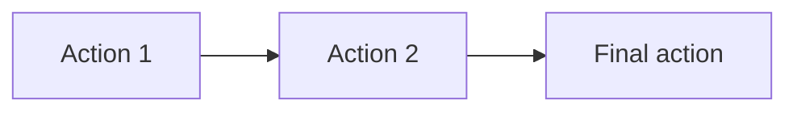

# Topic Blueprint: Replace with title

## Source mapping

| Artifact | Exact source | Assignment/status | Role |
| --- | --- | --- | --- |
| Explanation |  | approved/final | Teaching sequence and wording |
| Question bank |  | ready | Scenario records |
| Diagram assets |  |  | Geometry and prompt assets |

## Teaching intent

**Objective:**

**Ordered teaching sequence:**

1. 

**Source constraints that must not change:**

- 

## Topic registration

| Seam | Planned value or change |
| --- | --- |
| `TopicPracticeTaskId` |  |
| Task/catalog/content registration |  |
| Importer `CONFIG` |  |
| Progression/capability/challenge mapping | Not required / describe |

## User flow

## Action blueprint

| Source step | Disposition / `kind@version` | Goal | Public input | Private truth | Evidence | Diagram effect | Board effect | Submit boundary | Mode behavior |
| --- | --- | --- | --- | --- | --- | --- | --- | --- | --- |
|  | `Reuse ...@1` |  |  |  |  |  |  |  |  |

## Geometry contract

| Entity ID | Kind | Authored/derived | First visible action | Overlap/ambiguity | Persistent effect |
| --- | --- | --- | --- | --- | --- |
|  |  |  |  |  |  |

## SolutionBoard

| Expression order | Owner actions | Learner-visible template | Slot roles and IDs | Modes | Completion boundary |
| --- | --- | --- | --- | --- | --- |
| 1 |  |  |  | Learn |  |

## Mode boundaries

| Mode | Truth location | Coach/board | Submission and feedback |
| --- | --- | --- | --- |
| Learn |  |  |  |
| Practice |  |  |  |
| Assessment |  |  |  |
| Review |  |  |  |

## Question-bank compilation

**Expected record count:**

**Extraction and normalization rules:**

- 

**Representative samples:**

| Position | Source question ID | Why inspect it |
| --- | --- | --- |
| First |  |  |
| Middle |  |  |
| Last |  |  |

**Invalid-record behavior:**

## Verification plan

**Focused automated checks:**

- 

**Browser paths:**

- Correct path from first action through final action.
- Wrong object/value, correction, BACK, CLEAR, and restore.
- Desktop and narrow-width inspection.

## Decisions requiring approval

- 

## Verification evidence

Complete after implementation. Record commands, sample IDs, modes, browser paths, screenshots, and any deferred checks.
