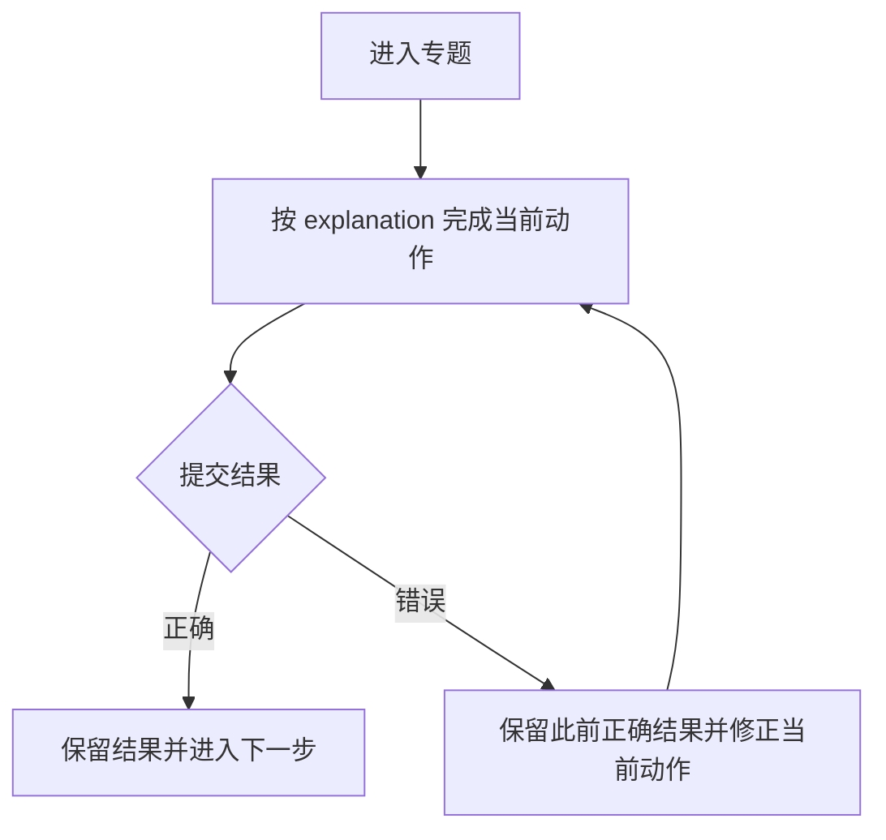

# 专题体验规格：专题名称

## 内容来源

列出 explanation 段落、题目 ID、图资源与界面步骤的对应关系。只记录来源，不重新分析学习问题或学习目标。

## 用户流程图

## 页面结构

### Learn

### Practice

### Review

### 窄屏与触摸布局

## 交互规则

| explanation 来源步骤 | 学生看到什么 | 学生做什么 | 完成条件 | 正确后保留什么 | 错误时如何修正 | 下一状态 | 来源资源 |
| --- | --- | --- | --- | --- | --- | --- | --- |
|  |  |  |  |  |  |  |  |

## 页面状态说明

| 状态 | 触发条件 | 页面表现 | 可执行动作 | 保留的数据 | 退出条件 |
| --- | --- | --- | --- | --- | --- |
| 初始 |  |  |  |  |  |
| 当前步骤未完成 |  |  |  |  |  |
| 可以提交 |  |  |  |  |  |
| 提交正确 |  |  |  |  |  |
| 提交错误 |  |  |  |  |  |
| session 恢复 |  |  |  |  |  |
| 资源或请求失败 |  |  |  |  |  |

## 待确认事项

- [ ] 用户需要确认的真实体验决策。

## 实现与验收记录

仅在规格获批并进入实现后填写。记录关键实现落点、验证命令和结果；不要加入发布或运营计划。
