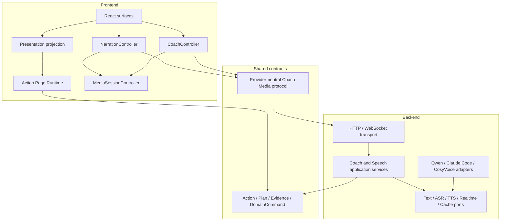

# ADR-005：Action Presentation 与 Conversational Media 分层

## Status

Implemented（兼容窗口内）· 2026-08-12

本 ADR 承接 [ADR-004](./ADR-004-frontend-action-runtime.md)。媒体分层本身不决定 Action Runtime 的
判题和持久化策略；Learn / Practice / Assessment 的判定边界以后续
[ADR-006](./ADR-006-local-practice-training-runtime.md) 为准。本 ADR 补充三个此前没有明确归属的能力：

- Action 完成后对页面元素做一次性强调；
- Action 进入时朗读确定性的教师文案；
- 学生主动提问时提供普通回合式或全双工语音答疑。

## Central Decision

核心决策是：**Action Runtime 负责教学状态和语义结果；Presentation 负责一次性强调和音频播放；
Coach Application 负责生成式答疑编排；具体模型只存在于 Infrastructure Adapter。**

其中：

- `TransientEmphasis` 继续只是 `WorkspaceView` 上的可选、前端瞬态字段，不升级成 Cue、Frame、
  Timeline、Playback 或可重放历史；
- Action 朗读是确定性的 `ActionNarration` 用例，不经过 LLM；
- 普通 AI 答疑是 `CoachTurn` 用例，可采用“流式文本模型 + 流式 TTS”；
- 全双工通话是 `LiveCoachSession` 用例，可采用 Qwen Audio/Omni Realtime；
- TTS、Coach 和 Emphasis 彼此独立，只通过当前 Action 的公开上下文关联，不共享生命周期状态。

## Context

当前实现已经具备上述能力的雏形，但边界分散：

```text
ActionRuntimeFrame
├── PageRuntime / checkpoint / evaluation
├── TransientEmphasis surface routing
├── deterministic teacher TTS
├── typed/audio coach turn
├── MediaRecorder
├── provider selector
├── realtime voice session
├── HTMLAudioElement playback
└── coach rail rendering

Backend
├── /api/action-speech       -> concrete Qwen TTS
├── /api/action-coach        -> ASR + LLM + TTS / Omni / CosyVoice
└── /api/coach-realtime      -> raw-ish provider WebSocket relay
```

这导致以下概念被混在一起：

- Action Runtime 的状态推进与 React 音频副作用；
- 教师固定朗读与生成式 Coach 回答；
- “能力选择”与具体供应商/模型选择；
- 公共 WebSocket 协议与上游供应商协议；
- 当前 Action 的 CoachDirective 与独立的 Realtime transcript。

## Scope and Non-goals

本 ADR 覆盖：

- 前端 Action Runtime、Projection、Presentation、Media Session 的依赖方向；
- 后端 Coach/Speech 的 application、port、adapter、transport 边界；
- 固定朗读、流式 Coach、全双工通话三条链路的职责；
- 迁移期间的兼容与安全策略。

本 ADR 明确不引入：

- 教学时间轴、seek、回放历史、snapshot frame；
- topic 作者手写动画或语音脚本的强制要求；
- 把 transient emphasis 写入 XState context、checkpoint、sessionStorage、数据库；
- 让 LLM 直接操作 DOM、JSXGraph、React state 或音频设备；
- 把供应商的 WebSocket 事件协议原样暴露给浏览器。

## Target Layers



依赖规则：

```text
React surfaces
  -> presentation controllers / views
  -> Action Runtime or provider-neutral media clients
  -> shared contracts

Transport
  -> application services
  -> ports
  <- infrastructure adapters implement ports

Action Runtime never imports audio, browser media APIs or provider clients.
Transport never chooses prompts, models or teaching policy.
Adapters never read React, XState or session UI state.
```

## Layer Responsibilities

| 层 | 负责 | 不负责 |
| --- | --- | --- |
| Shared Action Contracts | Plan、Action、Evidence、DomainCommand、公开 Coach 上下文 | React view、音频字节、供应商模型名 |
| Frontend Action Runtime | 当前 Action、draft、evidence、world、evaluation、trace | TTS、播放器、录音、WebSocket |
| Presentation Projection | 从 Action 结果推导 `TransientEmphasis`，切分到 Canvas/SolutionBoard | 保存历史、决定教学步骤、调用模型 |
| Narration Controller | 选择教师文案、预取、缓存键、朗读策略 | 生成回答、修改 Runtime |
| Coach Controller | 收集提问上下文、消费流式事件、完成后应用 `CoachDirective` | 直接调用供应商、持有 Action 真值 |
| MediaSessionController | 独占播放/采集、取消、打断、音频队列、autoplay 状态 | 生成文本、理解数学、保存会话 |
| Backend Application | 构造安全上下文、选择能力、编排 ASR/LLM/TTS、执行 mode policy | Express/WebSocket 细节、供应商事件格式 |
| Ports | 声明 Text、ASR、TTS、Realtime、Cache、Telemetry 能力 | SDK 实现和环境变量 |
| Infrastructure Adapters | 调用具体供应商、解析其事件、映射错误和 usage | 决定教学权限、向浏览器透传原始协议 |
| Transport | 鉴权、schema、限流、连接生命周期、公开事件转发 | prompt、模型路由、Action kind 分支 |

## Public Contract View

以下是声明式架构契约，不要求生产代码使用 F#。

### Transient presentation

```fsharp
module ActionPresentation

type EmphasisTarget =
    | CanvasEntity of id: string
    | CanvasTeachingMark of id: string
    | SolutionExpression of id: string

type TransientEmphasis = {
    key: string
    targets: EmphasisTarget list
}

type ActionPresentationProjector =
    abstract FromCompletion:
        commands: DomainCommand list
        -> TransientEmphasis option

    abstract FromEvaluation:
        evaluation: ActionEvaluationResponse
        -> TransientEmphasis option
```

`key` 的不变量是：同一个 runtime instance 内每次新强调都唯一；普通 re-render 保持不变；
被 presentation 消费后可以清除。它不是业务 id，也不进入任何恢复协议。

### Deterministic narration

```fsharp
module ActionNarration

type NarrationPolicy =
    | Disabled
    | ReplayOnly
    | AutoPlay

type TeacherUtterance = {
    utteranceId: string
    exerciseId: string
    actionId: string
    displayLatex: string
    spokenText: string
    policy: NarrationPolicy
}

type NarrationController =
    abstract EnterAction:
        TeacherUtterance
        -> Async<Result<unit, NarrationError>>

    abstract Prefetch:
        TeacherUtterance list
        -> Async<unit>

    abstract ReplayCurrent:
        unit
        -> Async<Result<unit, NarrationError>>

    abstract Stop:
        unit
        -> unit
```

`TeacherUtterance` 由审核过的 Action 文案推导。Topic author 必须为确定性朗读入口双写展示用
`entryLatex` 与口播用 `entrySpoken`；`latexToSpokenChinese` 只作为存量 bundle 的版本化 fallback。

### Exclusive media session

```fsharp
module BrowserMedia

type AudioPurpose =
    | ActionNarration
    | CoachReply
    | LiveConversation

type AudioSessionState =
    | Idle
    | Buffering of purpose: AudioPurpose
    | Playing of purpose: AudioPurpose
    | CapturingLiveConversation
    | BlockedByAutoplay of purpose: AudioPurpose
    | Failed of message: string

type AudioInput =
    | Url of string
    | PcmStream of EventStream<byte array>

type MediaSessionController =
    abstract Play:
        purpose: AudioPurpose * input: AudioInput
        -> Async<Result<unit, MediaError>>

    abstract BeginCapture:
        unit
        -> Async<Result<EventStream<byte array>, MediaError>>

    abstract Interrupt:
        reason: string
        -> unit

    abstract State:
        unit
        -> AudioSessionState
```

任一时刻只有一个有声输出 owner。开始 Coach、Realtime 或新 Action 朗读时，必须通过同一个
controller 取消旧播放和未完成请求，避免 HTMLAudio、WebAudio 和提示音互相覆盖。

### Turn-based streaming coach

```fsharp
module CoachApplication

type CoachTurnInput = {
    exerciseId: string
    mode: LearningMode
    currentActionId: string
    trace: StudentTrace
    studentText: string option
    studentAudio: byte array option
    conversation: CoachConversationTurn list
}

type CoachTurnEvent =
    | TranscriptCompleted of text: string
    | DisplayTextDelta of text: string
    | SpokenSegmentStarted of segmentId: string * text: string
    | AudioDelta of segmentId: string * bytes: byte array
    | DirectiveCompleted of CoachDirective
    | TurnCompleted of usage: UsageSummary option
    | TurnFailed of code: string * retryable: bool

type CoachTurnApplication =
    abstract Start:
        CoachTurnInput
        -> Async<Result<EventStream<CoachTurnEvent>, CoachStartError>>

    abstract Cancel:
        turnId: string
        -> Async<unit>
```

流式发声只允许在一个完整、可朗读并通过 mode policy 的 segment 上开始；不能直接把单个 token
送进 TTS。第一阶段 Learn/Practice 可以开放，Assessment 默认继续使用确定性提示，直到逐段
防泄漏策略有独立验收。

### Backend effect ports

```fsharp
module CoachPorts

type TextGenerationRequest = {
    systemPolicy: string
    context: CoachContext
    question: string
}

type TextGenerationEvent =
    | TextDelta of string
    | TextCompleted

type SpeechRequest = {
    text: string
    voiceProfile: string
    format: string
}

type SpeechEvent =
    | SpeechStarted
    | SpeechAudioDelta of byte array
    | SpeechCompleted

type TextCoachEngine =
    abstract StreamReply:
        TextGenerationRequest
        -> Async<Result<EventStream<TextGenerationEvent>, ProviderError>>

type SpeechSynthesizer =
    abstract Stream:
        SpeechRequest
        -> Async<Result<EventStream<SpeechEvent>, ProviderError>>

type SpeechRecognizer =
    abstract Transcribe:
        audio: byte array
        -> Async<Result<string, ProviderError>>

type RealtimeVoiceProvider =
    abstract Open:
        context: CoachContext
        -> Async<Result<RealtimeVoiceSession, ProviderError>>

type SpeechCache =
    abstract TryGet:
        cacheKey: string
        -> Async<byte array option>

    abstract Put:
        cacheKey: string * audio: byte array * ttl: System.TimeSpan
        -> Async<unit>
```

公开 contract 不枚举 Qwen、Omni、CosyVoice 或具体模型版本。供应商选择属于 composition root 和
deployment policy；浏览器最多选择“固定朗读开关”“实时通话开关”或产品定义的质量档位。

### Live conversation

```fsharp
module LiveCoach

type LiveCoachContext = {
    exerciseId: string
    mode: LearningMode
    currentActionId: string
    publicTrace: StudentTrace
}

type LiveCoachClientEvent =
    | AppendAudio of byte array
    | UpdateContext of LiveCoachContext
    | StopSession

type LiveCoachServerEvent =
    | Ready
    | SpeechStarted
    | StudentTranscript of string
    | CoachTranscriptDelta of string
    | CoachAudioDelta of byte array
    | Interrupted
    | Closed of reason: string
    | Failed of code: string
```

浏览器只发送上述 allowlist 事件。Backend adapter 将它们映射成供应商事件；任何 provider-specific
`session.update`、tool、model 或 instruction 事件都不能由浏览器直接构造。

## Primary Flows

### 1. Action completion emphasis

```text
Action child completes
  -> DomainCommands / accepted SolutionBoard context
  -> deriveTransientEmphasis
  -> WorkspaceView.transientEmphasis
  -> surface adapter
  -> renderer plays once
  -> presentation acknowledges and clears the pending value
```

Action kind 不参与映射。新 Action 复用已有 `DomainCommand` 时自动获得默认强调；新增
`DomainCommand` 时，编译期穷尽检查要求明确选择“映射目标”或“无强调”。

### 2. Deterministic teacher narration

```text
ExercisePlan loaded
  -> derive current + next TeacherUtterance
  -> memory cache lookup / bounded prefetch
  -> action enters
  -> MediaSessionController plays cached audio
  -> cache miss falls back to streaming TTS
```

这条链路不调用 LLM。恢复题目可以重新准备音频，但不能把强调动画作为历史重放。

### 3. Turn-based coach

```text
student text/audio
  -> CoachTurnApplication
  -> optional ASR
  -> TextCoachEngine stream
  -> punctuation-aware SpokenSegmenter
  -> per-segment mode/safety policy
  -> SpeechSynthesizer stream
  -> public CoachTurnEvent stream
  -> MediaSessionController immediate playback
  -> final CoachDirective applied to Action Runtime
```

第一段发声不等待完整回答和完整音频。最终 `CoachDirective` 仍经过 schema 与 capability policy，
生成式文本不能直接产生 DOM 或 Action 命令。

### 4. Live coach

```text
browser capture
  -> typed backend WebSocket
  -> LiveCoach application session
  -> RealtimeVoiceProvider adapter
  -> typed audio/transcript events
  -> MediaSessionController
```

Live session 在 Action 改变时收到经过验证的 `UpdateContext`。它是 Coach 能力的替代 adapter，
不是 Action Runtime 的子状态机。

## State Ownership

| State | Owner | Persistence |
| --- | --- | --- |
| Action draft/evidence/world/revision | Action Runtime / backend evaluator | 按 ADR-004 |
| `TransientEmphasis` pending key/targets | frontend presentation bridge | 不持久化；消费后清除 |
| renderer animation progress | Canvas/SolutionBoard renderer | 不持久化 |
| current teacher utterance and prefetch cache | NarrationController | 内存或有界浏览器缓存 |
| active playback/capture/cancellation | MediaSessionController | 不持久化 |
| Coach turn lifecycle | CoachController + backend application | 只保留必要 transcript/telemetry |
| provider socket/session | infrastructure adapter | 不持久化；有最大时长 |
| private answer truth | backend evaluator | 不进入 media protocol |

## Transport and Safety Rules

1. HTTP/WS 入口先做 schema、大小、origin/auth、并发和时长限制，再进入 application service。
2. Browser 与 backend 使用 provider-neutral versioned protocol；禁止原样双向透传供应商事件。
3. 所有长任务都接受取消信号；忽略 stale result 不能代替取消供应商计费任务。
4. Realtime 上游未 ready 前，输入必须有界排队或明确拒绝，不能静默丢帧。
5. 缺少 API key、非法模型配置和 provider handshake 失败必须变成连接级错误，不能抛出到进程顶层。
6. Live voice 默认不在 Assessment 开启；普通流式 Coach 在 Assessment 也必须先通过单独的防泄漏验收。
7. Provider/model/voice 只写入 server telemetry，不写进需要前端同步升级的业务 union。

## Observability Contract

每个 narration/coach/live session 至少记录：

- `request_started_at`；
- `provider_connected_at`；
- `llm_first_text_at`；
- `first_spoken_segment_at`；
- `tts_first_audio_at`；
- `browser_first_audio_at`；
- `completed_at` / `cancelled_at` / `failed_at`；
- pipeline capability、provider/model（server-only）、usage/cost（可获得时）；
- autoplay blocked、barge-in、dropped/backpressured frame 计数。

验收关注浏览器实际首声，不用“上游返回了第一包”代替端到端指标。

## Compatibility Strategy

迁移期间保留现有三条入口作为 fallback：

- `POST /api/action-speech`；
- `POST /api/action-coach`；
- `WS /api/coach-realtime`。

新增 versioned provider-neutral stream protocol 后，前端通过 backend capability projection 选择能力，
而不是把 `omni | cosyvoice` 保存在业务 contract。旧入口在新路径稳定并完成回滚演练后再删除。

## Architectural Invariants

1. Action Runtime 不依赖 TTS、LLM、MediaRecorder、AudioContext 或供应商 SDK。
2. Emphasis 是 `WorkspaceView` 的瞬态 presentation metadata，不是 Cue/Timeline/历史状态。
3. Topic author 默认不声明强调动画；确定性朗读入口必须同源双写展示文案与口播文案。
4. 固定 Action 朗读绝不经过 LLM。
5. 所有音频播放和采集由一个 MediaSessionController 仲裁。
6. 普通 Coach、流式 Coach、Live Coach 共享同一安全的公开上下文构造器和 mode policy。
7. Transport 不 import 具体 provider service；application 不 import Express/React/WebSocket UI。
8. 供应商原始协议不跨越 backend transport boundary。
9. Assessment 私有真值不进入 prompt、trace、stream event 或浏览器。
10. Restore 不重放 transient emphasis；重新进入 Action 可以朗读，但不能伪装成历史 playback。

## Consequences

正面影响：

- TTS、Omni Realtime、Emphasis 有明确且不同的归属；
- 可以替换模型而不改 Action Runtime 或浏览器业务 union；
- 固定朗读可通过预取/缓存获得最低延迟；
- 普通 Coach 可在完整回答前开始发声；
- 全双工通话仍可独立演进，不污染 request/response Coach；
- ActionRuntimeFrame 可以回到页面组合职责。

成本：

- 需要一套小型、versioned 的公开流式协议；
- 需要统一 WebAudio/HTMLAudio 的播放仲裁；
- 流式生成必须补齐逐段分割、取消、背压和 Assessment 安全策略；
- 迁移期会同时维护旧 URL 音频与新 audio-delta 两种适配器。

## Follow-up Contracts

后续需要单独细化但不在本 ADR 展开实现分支的契约：

- `SpokenSegmenter` 的中文标点、公式原子性和最大等待规则；
- `SpeechCache` 的 key、TTL、容量与隐私策略；
- `CoachTurnEvent v1` 的精确 JSON schema；
- Assessment 逐段防泄漏规则；
- browser audio queue 的 PCM/Opus 格式选择与背压阈值。
