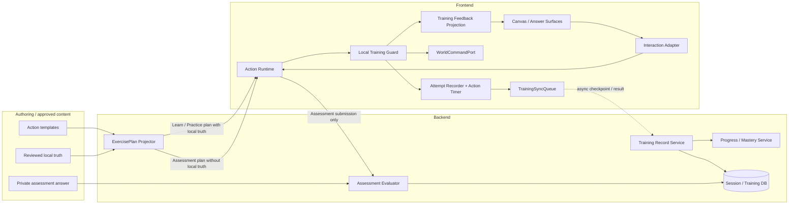
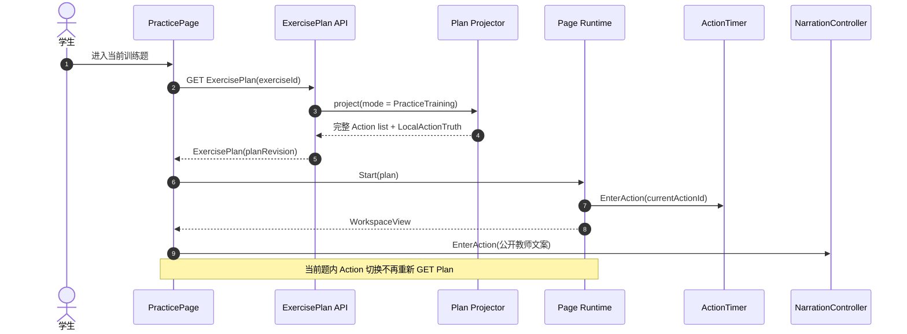
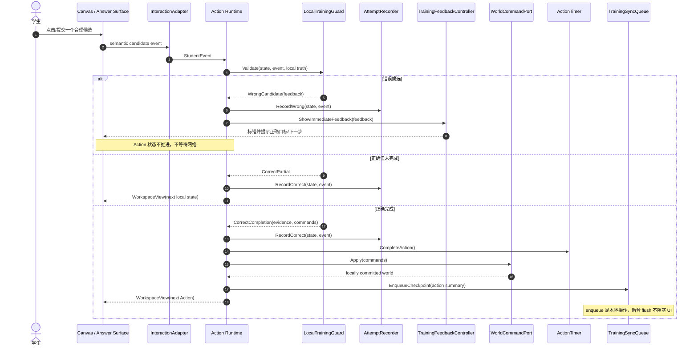
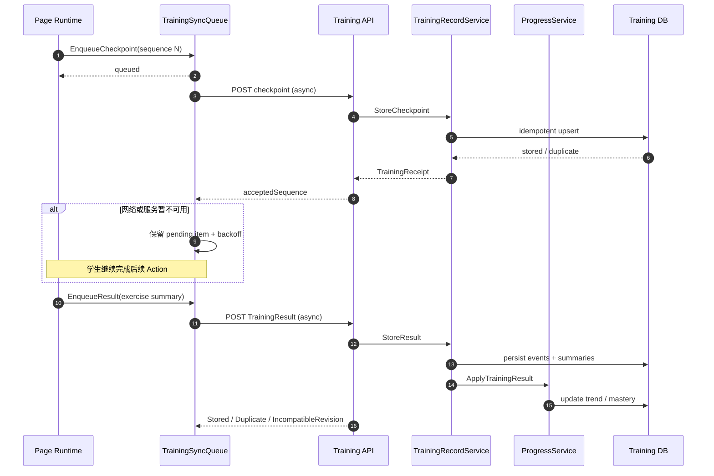
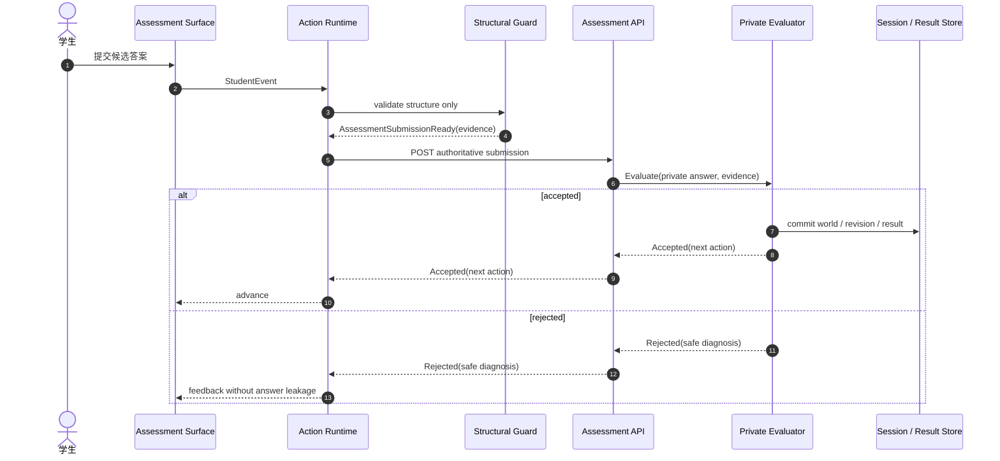

# ADR-006：Practice 本地训练 Runtime 与 Assessment 权威判定分离

## Status

Accepted（remediation in progress）· 2026-08-12

> 2026-08-12 ADR 一致性审核将本 ADR 由 Implemented 下调为 remediation in progress。主路径（local-training
> 判定策略、本地推进、持久 queue、result ingest 不重判数学正确性）可运行，但以下条款尚未完全落实：
>
> - `trainingGuard.ts` 不存在：候选 outcome 仍在 `pageRuntime` 按执行后 snapshot 猜测，且无 `IgnoredIllegal`
>   分类（§Module Responsibilities、§Local attempt and completion）；
> - `actionTimer.ts` 不存在：用 `Date.now()` 墙钟差，缺单调时钟、visibility 暂停、active segments 与 BACK
>   重入续计，违反 §Metrics Semantics 计时契约；
> - `hitTestable` / `candidate` / `advanceEnabled` 三字段同值（= `enabled`），三层语义未实现（§Module Responsibilities）；
> - metrics contract 不完整：缺 back/clear/hint/coach 分别计数、UTC start/completion、active duration segments
>   与 `errorDistribution(actionStateBefore, candidate)`（§Metrics Semantics）。
>
> 以上由 Training remediation 分支跟踪；只有门禁真实通过后才重新标记 Implemented。

本 ADR 覆盖 [ADR-004](./ADR-004-frontend-action-runtime.md) 中“Guided Practice 使用
`ServerAuthoritative`”以及“backend 对 Practice 每个 Action 做数学判定”的旧边界。ADR-004 的
frontend Page Runtime、typed Action、DomainCommand、Assessment 私有真值和版本化 session 原则继续有效。

语音、固定朗读、Coach 和媒体播放仍遵循
[ADR-005](./ADR-005-action-presentation-and-conversational-media.md)；它们消费训练事件和公开上下文，
不参与训练正确性判定。

## Central Decision

Practice 是答案公开的程序性训练器，不是答案隐藏的考试器。三种模式使用三个明确的判定策略：

| 模式 | 浏览器是否持有正确目标 | 判定策略 | Action 完成含义 | 主要目标 |
| --- | --- | --- | --- | --- |
| Learn | 是 | `LocalDemonstration` | 已按审核路径演示完成 | 看懂过程 |
| Practice / Training | 是 | `LocalTraining` | 学生已在本地正确完成 | 速度、准确率、操作熟练度 |
| Assessment / Challenge | 否 | `ServerAuthoritative` | 后端已接受提交 | 独立掌握程度 |

Practice 的候选输入由 Action Runtime 当场分类，错误立即反馈，正确输入立即推进；完成 Action 或整道题
后异步上传训练记录。上传失败不能阻塞当前题的训练路径。

Backend 对 Practice 仍负责 plan、session、记录、跨设备进度、熟练度和选题，但不再重新判定每个数学
答案是否正确。需要可信评分或防篡改结果时必须进入 Assessment，而不能把 Practice 重新变成考试。

## Context

迁移前 Action Runtime v2 只有两种 `ValidationPolicy`：

```text
Learn             -> local-teaching
Guided Practice   -> server-authoritative
Assessment        -> server-authoritative
```

这会产生四个产品与数据问题：

1. Practice 每个 source step 完成后进入提交状态，等待 backend evaluator，再恢复 session 和重新取 plan；
2. `Action completed` 只表示“结构上填完”，数学上仍可能被 backend 拒绝，事件语义不诚实；
3. `wrongAttempts` 只在 backend `rejected` 后增加，本地 guard 已经识别的错误没有进入核心准确率；
4. 只有 session 总耗时和题目首次提交正确率，没有 Action entry 到 completion 的局部耗时与点击级命中率。

这套模型适合 Assessment，却不能衡量学生是否在提示、guard 和页面 affordance 下越来越快、越来越准。

## Scope and Non-goals

本 ADR 覆盖：

- Learn、Practice、Assessment 的 plan 投影和 validation policy；
- Practice Action 的本地候选分类、即时反馈、状态推进和 DomainCommand 应用；
- Action/题目级训练指标、异步 checkpoint/result 上传和恢复；
- Canvas/Answer surface 的 hit-test、候选、正确性三层语义；
- Training Runtime 与 Narration、Coach、Media、backend progress service 的边界；
- Assessment 继续隐藏答案并由 backend 权威判定的隔离门禁。

本 ADR 不要求：

- 把 Practice 记录当作不可伪造的考试成绩；
- 上传 pointer move、hover、动画帧或每个文本输入键击；
- 让 backend 对 Practice evidence 再跑一次数学 evaluator；
- 让 presentation、audio 或 Coach 决定 Action 是否正确；
- 删除 Assessment evaluator、session/version 校验或 Review 的权威结果链路。

## Target Architecture



依赖方向：

```text
React surfaces
  -> InteractionAdapter
  -> Action Runtime + local validation contract
  -> AttemptRecorder / ActionTimer / WorldCommandPort
  -> TrainingSyncQueue
  -> provider-neutral Training API

Training transport
  -> Training Record application service
  -> repository / progress ports

Assessment transport
  -> private evaluator

Presentation / Narration / Coach
  <- consume WorkspaceView, TrainingFeedback and public StudentTrace
  -X-> decide correctness or mutate training metrics
```

## Module Responsibilities and Target Paths

| Module | Target path | Responsibility |
| --- | --- | --- |
| Mode/plan contracts | `web/shared/actionRuntime.ts` | 三种 validation strategy、mode-safe Action envelope、Assessment leak guards |
| Training event contracts | `web/shared/trainingRuntime.ts` | attempt、Action summary、exercise result、checkpoint/receipt schema |
| Plan projector | `web/backend/src/services/actionRuntime/topicPlanProjector.ts` | Learn/Practice 下发 local truth；Assessment 移除它 |
| Local training guard | `web/frontend/src/action-runtime/training/trainingGuard.ts` | 把候选事件分类为 illegal、wrong、correct partial、correct completion |
| Attempt recorder | `web/frontend/src/action-runtime/training/attemptRecorder.ts` | 点击级计数、错误状态分布、assistance 计数 |
| Action timer | `web/frontend/src/action-runtime/training/actionTimer.ts` | Action enter、前后台暂停、completion 的单调时钟耗时 |
| Page Runtime | `web/frontend/src/action-runtime/pageRuntime.ts` | 本地推进、应用 commands、切换 Action、产生 checkpoint |
| Interaction projection | `web/frontend/src/action-runtime/projectWorkspaceView.ts` | 分开 hit-testable、candidate、advance-enabled 和 visual state |
| Training feedback | `web/frontend/src/presentation/training/TrainingFeedbackController.ts` | 即时视觉/可选确定性语音反馈；不改变 guard 结果 |
| Sync queue | `web/frontend/src/persistence/training/TrainingSyncQueue.ts` | 有序、幂等、可重试的非阻塞 checkpoint/result flush |
| Training application | `web/backend/src/services/training/application/` | schema/session/plan/revision 校验、幂等写入、summary 接收 |
| Progress service | `web/backend/src/services/training/progress/` | 趋势、熟练度、下一组训练题；不重新判数学正确性 |
| Training transport | `web/backend/src/transport/http/trainingRoutes.ts` | auth、payload limit、runtime schema、receipt 映射 |
| Assessment evaluator | `web/backend/src/services/actionRuntime/topicTypedEvaluator.ts` | 仅 Assessment/Challenge 的私有权威判定 |

路径表达目标职责；迁移期可以保留 compatibility adapter，但新 Training 模块不得反向依赖 v1
`RuntimeActionEvent` 或题型专用页面。

## Public Contract View

以下是声明式架构契约，不要求生产代码使用 F#。Action-specific JSON 是显式 type-erasure boundary；
它必须按 `kind + version` 在浏览器 registry 和 backend ingress 处运行 schema validation，不能直接强制转换。

### Mode-safe plan

```fsharp
module LearningModeContracts

type LearningMode =
    | Learn
    | PracticeTraining
    | AssessmentChallenge

type OpaqueActionJson

type LocalActionTruth = {
    schemaVersion: int
    value: OpaqueActionJson
}

type ValidationStrategy =
    | LocalDemonstration of truth: LocalActionTruth
    | LocalTraining of truth: LocalActionTruth
    | ServerAuthoritative

type ActionContract = {
    actionId: string
    sourceStepId: string
    kind: string
    version: int
    instruction: string
    input: OpaqueActionJson
    validation: ValidationStrategy
    checkpointOnComplete: bool
}

type ExercisePlan = {
    planVersion: int
    exerciseId: string
    planRevision: int
    mode: LearningMode
    actions: ActionContract list
    currentActionId: string
    world: WorldProjection
}
```

Plan projector 必须满足：

- Learn 和 Practice 的每个 Action 都有经过审核、可本地校验的 `LocalActionTruth`；
- Practice 收到当前 exercise 的完整 Action list，不因 Action 完成重新取 plan；
- Assessment 的 payload、DOM、trace、Coach context 和 media event 都不存在 `LocalActionTruth`；
- `planRevision` 表示内容/协议兼容性，不再被每个 Practice Action 的本地完成递增。

### Local attempt and completion

```fsharp
module LocalTrainingRuntime

type Feedback = {
    messageLatex: string
    spokenText: string option
    focusTargetId: string option
    wrongObjectIds: string list
}

type AttemptOutcome =
    | IgnoredIllegal
    | WrongCandidate of feedback: Feedback
    | CorrectPartial
    | CorrectCompletion of evidence: ActionEvidence * commands: DomainCommand list

type ActionRuntimeResult =
    | TrainingAttemptHandled of AttemptOutcome
    | AssessmentSubmissionReady of evidence: ActionEvidence

type ActionRuntimeError =
    | UnsupportedActionVersion of kind: string * version: int
    | InvalidActionInput of actionId: string
    | MissingLocalTruth of actionId: string
    | LocalTruthForbiddenInAssessment of actionId: string

type LocalTrainingRunner =
    abstract Handle:
        action: ActionContract * event: StudentEvent
        -> Result<ActionRuntimeResult, ActionRuntimeError>
```

`CorrectCompletion` 是本地验证后的终态，所以其 evidence 和 commands 可以立即应用。Assessment 只产生
`AssessmentSubmissionReady`；只有 backend accepted 后才产生正式 completion。

### Training telemetry

```fsharp
module TrainingTelemetryContracts

type AttemptClassification =
    | CorrectCandidate
    | WrongCandidate

type TrainingAttemptEvent = {
    eventId: string
    exerciseId: string
    actionId: string
    actionKind: string
    actionStateBefore: string
    sequence: int
    occurredAt: System.DateTimeOffset
    elapsedMs: int64
    classification: AttemptClassification
    candidateId: string option
}

type AssistanceLevel =
    | Unassisted
    | ImmediateFeedbackOnly
    | HintUsed
    | CoachUsed

type ActionTrainingSummary = {
    actionId: string
    actionKind: string
    startedAt: System.DateTimeOffset
    completedAt: System.DateTimeOffset
    durationMs: int64
    correctAttemptCount: int
    wrongAttemptCount: int
    backCount: int
    clearCount: int
    hintCount: int
    coachCount: int
    firstAttemptCorrect: bool
    assistanceLevel: AssistanceLevel
}

type ExerciseTrainingResult = {
    resultId: string
    sessionId: string
    exerciseId: string
    planRevision: int
    completedAt: System.DateTimeOffset
    actions: ActionTrainingSummary list
    attempts: TrainingAttemptEvent list
}

type TrainingCheckpoint = {
    checkpointId: string
    sessionId: string
    exerciseId: string
    planRevision: int
    sequence: int
    currentActionId: string
    completedActions: ActionCompletion list
    summaries: ActionTrainingSummary list
    pendingAttempts: TrainingAttemptEvent list
}

type TrainingReceipt =
    | Stored of acceptedSequence: int
    | Duplicate of acceptedSequence: int
    | IncompatibleRevision of currentPlanRevision: int
    | InvalidEnvelope of message: string

type TrainingSyncError =
    | QueueUnavailable of message: string
    | TransportUnavailable of message: string
    | ReceiptRejected of message: string

type TrainingSyncPort =
    abstract EnqueueCheckpoint:
        TrainingCheckpoint
        -> Result<unit, TrainingSyncError>

    abstract EnqueueResult:
        ExerciseTrainingResult
        -> Result<unit, TrainingSyncError>

    abstract Flush: unit -> Async<Result<TrainingReceipt list, TrainingSyncError>>
```

`Enqueue*` 只能写本地持久队列，不等待网络。`Flush` 可由 Action 完成、题目完成、组结束、页面隐藏或
退出前 best-effort 触发；网络失败保留队列并继续训练。

### Backend record and progress ports

```fsharp
module TrainingBackendPorts

type TrainingRecordError =
    | SessionNotFound
    | ExerciseNotInSession
    | ActionNotInPlan of actionId: string
    | RevisionNotCompatible of currentPlanRevision: int
    | InvalidTrainingRecord of message: string

type ProgressUpdateError =
    | ResultNotStored
    | ProgressWriteFailed of message: string

type ExerciseSelectionError =
    | NoEligibleExercise
    | PlanProjectionFailed of message: string

type TrainingRecordService =
    abstract StoreCheckpoint:
        TrainingCheckpoint
        -> Async<Result<TrainingReceipt, TrainingRecordError>>

    abstract StoreResult:
        ExerciseTrainingResult
        -> Async<Result<TrainingReceipt, TrainingRecordError>>

type ProgressService =
    abstract ApplyTrainingResult:
        ExerciseTrainingResult
        -> Async<Result<unit, ProgressUpdateError>>

    abstract SelectNextExercise:
        sessionId: string
        -> Async<Result<ExercisePlan, ExerciseSelectionError>>
```

Backend ingress 可以校验 session/exercise/action membership、schema/version、非负计数、sequence 单调性、
summary 与 event 基本算术一致性以及 revision 兼容性。它不能调用 private evaluator 来重判 Practice 的
数学正确性。

## Interaction Semantics

`enabled` 不再同时表示“能命中”“是合理候选”“点击后可推进”。目标投影必须表达三层含义：

| 层 | 含义 | 是否发事件 | 是否进入命中率 |
| --- | --- | --- | --- |
| `hitTestable` | surface 能识别这个对象 | 取决于 candidate policy | 否 |
| `candidate` | 与当前 Action 有语义关系，可能正确也可能错误 | 是 | 是 |
| `advanceEnabled` | 当前状态下会推进 Action | 是 | 是，计为正确 |

事件规则：

- 与任务无关的非法对象可以不响应，或发事件后归类为 `IgnoredIllegal`；不进入准确率；
- 合理但错误的候选必须发 `OBJECT.SELECTED`/语义提交事件，由 guard 记录并即时反馈；
- 正确候选计为 correct attempt，可能推进到下一局部状态或完成 Action；
- 文本输入不按键击计数。每种 Action 必须声明语义提交边界，例如 Enter、失焦、选择选项或点击确认；
- BACK、CLEAR、hint 和 Coach 使用分别计数，不进入语义命中率分母。

## State Ownership

| State | Owner | Persistence |
| --- | --- | --- |
| current Action、局部选择、答案草稿 | frontend Action Runtime | sessionStorage / local checkpoint |
| Practice local truth | ExercisePlan + Action registry | 当前 plan 生命周期；Assessment 禁止存在 |
| attempt sequence、计数、Action timer | AttemptRecorder / ActionTimer | 本地队列，异步上传 |
| draft/locally committed world | Page Runtime + WorldCommandPort | checkpoint/result；无需 backend 回传 canonical world |
| immediate feedback | TrainingFeedback projection | 瞬态；记录的是 attempt，不是动画状态 |
| upload retry/idempotency | TrainingSyncQueue | 有界本地持久队列 |
| training history/mastery | backend Training/Progress services | 数据库 |
| Assessment private answer/evaluation | backend evaluator | 权威 session/result store |
| narration/coach/media lifecycle | ADR-005 presentation/media modules | 不进入训练 world 或 correctness state |

## UML Sequence Diagrams

以下 Mermaid `sequenceDiagram` 采用 UML 时序图语义，参与者名称对应上面的目标模块。

### 1. Practice 载入一次完整 Plan



### 2. 错误候选、正确局部输入与本地完成



### 3. 异步 checkpoint、整题结果与失败重试



### 4. Assessment 保持权威提交链路



## Metrics Semantics

### Action-level source metrics

每个完成的 Practice Action 至少记录：

```text
actionId / actionKind
startedAt / completedAt / durationMs
correctAttemptCount / wrongAttemptCount
backCount / clearCount / hintCount / coachCount
firstAttemptCorrect / assistanceLevel
errorDistribution(actionStateBefore, candidateId)
```

`durationMs` 使用浏览器单调时钟计算实际前台训练时间；UTC 时间戳用于跨设备关联。页面 hidden/暂停时
停止累计；BACK 后重新进入同一 Action 时继续累计原 Action 的 active segments，直到最终保留的正确完成。
该策略必须由统一 `ActionTimer` 实现，不能由各 React 组件各自计时。

### Derived metrics

```text
semanticHitAccuracy
  = correct candidate attempts
    / (correct candidate attempts + wrong candidate attempts)

actionFirstTryAccuracy
  = actions completed with wrongAttemptCount = 0
    / all completed actions
```

二者不能合并。一次 Action 中“点错 B、点对 C、点错 BC、点对 AD”的 semantic hit accuracy 是
`2 / 4 = 50%`，`firstAttemptCorrect = false`。

题目/题组聚合还应产出 `totalDurationMs`、`hintedActionCount`、`slowestActionKind`、按 Action state/kind
的错误分布和同类 Action 的速度趋势。汇总值可由前端随结果上传，backend 必须以事件和 Action summary
重新计算或做算术一致性校验；这属于数据完整性校验，不是数学判题。

## Voice and Coach Integration

- Learn 可以由 `NarrationController` 朗读并由 runtime 自动执行审核事件；不产生 Practice 成绩；
- Practice 在 Action enter 时可朗读公开 instruction，在 wrong candidate 后可朗读确定性 feedback；guard、
  attempt 记录和状态推进必须先完成，音频排队或 autoplay blocked 不得阻塞训练；
- Practice Coach 可以引用公开 local truth 给具体提示，但 hint/Coach 使用必须进入 assistance metrics；
- Assessment Coach context 不含 local truth，stream/live 能力继续受 ADR-005 的 Assessment gate 约束；
- `MediaSessionController` 只仲裁声音。它不增加/撤销 wrong attempt，也不决定 Action completion。

## Backend Validation and Trust Boundary

Practice 上传是客户端生成的训练遥测，适合个性化训练和趋势分析，不是防作弊成绩。Backend 允许做：

- session、exercise、Action ID 和 plan membership 校验；
- schema、contract version、plan revision 和 idempotency 校验；
- sequence 单调、时间/计数非负、数量上限和基本算术一致性校验；
- payload、auth、rate limit、retention 和隐私校验。

Backend 不做：

- 用 private answer key 对 Practice evidence 重判正确性；
- 因训练 checkpoint 暂时失败而阻断本地 Action；
- 把客户端 Practice summary 提升为 Assessment/certification 结果。

## Failure and Recovery Rules

1. Action Runtime 必须在没有网络的情况下完成已加载的整道 Practice 题。
2. Sync queue 使用 `checkpointId/resultId + sequence` 幂等；重复上传不能重复累计熟练度。
3. 页面刷新优先恢复兼容 `planRevision` 的本地 checkpoint；跨设备 checkpoint 只能恢复已确认 sequence。
4. `IncompatibleRevision` 停止重放旧草稿并请求新 plan，但保留旧 result 作为带版本的历史记录。
5. queue 必须有容量、过期和退避策略；达到上限时优先保留 Action summary/result，允许丢弃更细的旧 attempt，
   并记录 telemetry，不能静默伪造零错误。
6. unload flush 只是 best effort；可靠性来自持久队列和下一次启动重试，不依赖同步网络请求。

## Architectural Invariants

1. Practice plan 对正确目标公开；Assessment plan 对正确目标隐藏，两者不能复用同一个含糊 policy。
2. Practice 候选正确性只在 frontend Action Runtime 判定，完成路径不等待 backend evaluator。
3. `Action completed` 在 Practice 中只表示已经正确完成。
4. 错误候选必须能够到达 guard；surface 不能用不可点击过滤把它们从指标中抹掉。
5. illegal、wrong candidate、correct candidate、BACK/CLEAR/hint 是不同事件类别。
6. DomainCommand 只在 correct completion 应用；wrong attempt 不改变 Action state 或 world。
7. attempt 记录先于可丢失的 presentation/audio 副作用。
8. Training upload 是异步、幂等、可重试的；网络失败不改变本地 correctness。
9. Backend 可以验证训练记录 envelope，但不重判 Practice 数学答案。
10. Assessment private truth 不进入 Practice/Coach/media 公共 contract，也不因本迁移被删除。
11. 新 Action capability 必须同时声明 candidate semantics、local truth schema、attempt boundary 和 metrics tests。
12. Practice 数据不得被展示为可信考试成绩；需要可信结论时使用 Assessment。

## Consequences

正面影响：

- 错误反馈和 Action 推进不再受网络延迟影响；
- `Action completed`、Evidence 和 DomainCommand 的语义一致；
- 能得到点击级命中率、Action 局部耗时、错误状态分布和 assistance 数据；
- 一道题只需一次完整 plan，backend 从在线裁判收敛为训练记录与进度服务；
- Learn、Practice、Assessment 的产品意图与安全边界清楚。

成本与风险：

- Practice plan 会公开完整本地真值，不能再承担考试或防作弊用途；
- frontend registry 的每个 Action 都必须具备可审核的 local validator 和 candidate semantics；
- 需要可靠的浏览器持久队列、幂等 ingest 和版本兼容策略；
- 当前基于 backend rejected 的结果/历史统计需要迁移，旧记录与新训练指标必须标明 schema version；
- `enabled` 拆分会触及 Canvas、Answer controls、agent command capability 和 accessibility tests。

## Verification Gates

- Practice 一个 candidate event 到 feedback/next-state 的路径不发 evaluation request；
- Practice 完成整道题期间 plan fetch 次数为 1，除非 revision conflict、restore 或进入下一题；
- wrong candidate 进入 `wrongAttemptCount` 且 Action state/world 不推进；
- correct partial、correct completion 和 DomainCommand 顺序有 contract tests；
- semantic hit accuracy 与 action first-try accuracy 使用固定 fixtures 验证；
- BACK、CLEAR、hint、Coach 和 background timing 有独立统计测试；
- offline 完成后重新联网只写入一次 result；
- Assessment payload leak tests 证明没有 `LocalActionTruth` 或等价可推导字段；
- Assessment 仍调用 private evaluator，Practice 静态/运行时门禁证明不调用；
- narration/Coach/media 失败不改变 attempt count、Action completion 或本地 world。

## Follow-up Contracts

迁移实施前还需要在对应 workstream 冻结以下精确 schema：

- `TrainingAttemptEvent v1` 的 candidateId 隐私与保留策略；
- 文本/方程 Action 的语义 attempt boundary；
- `TrainingSyncQueue` 容量、TTL、退避和降级顺序；
- `TrainingResult v1` 到 mastery/trend 的聚合规则；
- 旧 server-authoritative Practice session 的恢复与 schema-version 展示策略。

实施顺序和 worktree 所有权见
[Action Training / Presentation / Voice 分层迁移实施方案](../execution/action-presentation-voice-migration-plan.md)。
