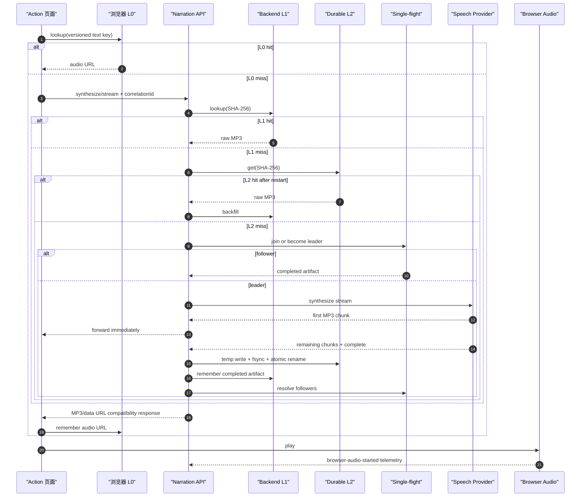

# ADR-007：持久化语音成品与真实 Voice Benchmark

## Status

Accepted；M1 已实现，真实付费 provider 基线待在具备凭据的环境执行。2026-08-13。

本 ADR 承接 [ADR-005](./ADR-005-action-presentation-and-conversational-media.md)。ADR-005 决定了
deterministic narration、turn Coach、live Coach 的分层；本 ADR 决定 deterministic narration 成品如何跨
backend restart 复用，以及如何以“浏览器真正开始播放”为终点测量 voice 链路。

## Central Decision

采用内容寻址的分层缓存：浏览器模块内缓存为 L0、backend 进程内缓存为 L1、持久化
`SpeechArtifactStore` 为 L2。单实例部署的 L2 是原始 MP3 文件；多实例部署时替换为对象存储或共享文件系统。

Redis **不是**语音成品的默认 source of truth。只有多实例出现跨实例热点复用或缓存击穿时，才把 Redis
作为可选热缓存和分布式 single-flight/lock；音频成品仍由 durable artifact store 保存。

真实链路 benchmark 采用 Playwright Test 驱动 Chromium，并将 Action/用户交互、HTTP、server timeline 与
`browser-audio-started` 通过 `correlationId` 合并。普通测试默认跳过真实 provider，避免 CI 意外计费。

## Context

原实现有两个有界 `Map`：浏览器 8 条、backend 128 条。backend restart 后 Map 清空，同一教师文案会再次
调用 CosyVoice。原 telemetry 还把 cache hit 标成 provider connected/TTS first audio，无法区分真正 provider
延迟和缓存命中。

需要同时解决：

- backend restart 后仍复用语音；
- 模型、音色、口语化规则改变后不能复用旧音频；
- 同一冷 key 并发请求不能重复调用付费 provider；
- 取消/失败不得发布部分 MP3；
- 缓存不可用时语音仍能降级生成；
- benchmark 必须测到浏览器播放，而不止 provider 返回第一包；
- 每个耗时样本必须能说明来自 memory、persistent 还是 provider。

## Scope

本 ADR 覆盖 deterministic Action narration 的 L1/L2、cache identity、single-flight、原子提交、telemetry
和 browser benchmark。Turn Coach 使用同一 benchmark/timeline 体系，但本 ADR 不持久化生成式 Coach 回答。

非目标：

- 不让 Action Runtime 读取音频文件或缓存状态；
- 不在 shared browser contract 暴露 provider/model；
- 不在本阶段引入 Redis、SQLite、S3 SDK 或 CDN；
- 不把学生语音或生成式回答纳入长期 artifact cache；
- 不由 benchmark 自动删除生产缓存目录或重启生产进程。

## Target Architecture

```text
Browser
└── NarrationController
    ├── L0 bounded Blob/data URL cache
    └── HTTP narration client
        └── NarrationApplication
            ├── L1 bounded raw-MP3 cache
            ├── same-key in-process single-flight
            ├── SpeechArtifactStore port
            │   ├── FileSystemSpeechArtifactStore (single instance)
            │   └── ObjectSpeechArtifactStore (future multi-instance)
            ├── SpeechSynthesizer port
            └── TelemetrySink port
```

依赖方向保持为 transport → application → ports ← adapters。Application 只依赖 provider-neutral identity 和
artifact contract，不读取 CosyVoice 环境变量，也不构造文件路径。

## Contract View

以下是声明式架构契约，不要求生产代码使用 F#。

```fsharp
module DurableNarration

type SpeechSynthesisIdentity = {
    profileVersion: string
    provider: string
    model: string
    voice: string
    format: string
    sampleRate: int
}

type SpeechArtifact = {
    bytes: byte array
    contentType: string
}

type ArtifactSource =
    | Memory
    | Persistent
    | Provider

type SpeechArtifactStore =
    abstract TryGet:
        key: string * cancellation: System.Threading.CancellationToken
        -> Async<Result<SpeechArtifact option, StorageError>>

    abstract PutCompleted:
        key: string * artifact: SpeechArtifact * cancellation: System.Threading.CancellationToken
        -> Async<Result<unit, StorageError>>

type NarrationResult = {
    artifact: SpeechArtifact
    source: ArtifactSource
}

type NarrationApplication =
    abstract Synthesize:
        spokenText: string * correlationId: string
        -> Async<Result<NarrationResult, SpeechError>>

    abstract Stream:
        spokenText: string * correlationId: string * onAudio: (byte array -> unit)
        -> Async<Result<NarrationResult, SpeechError>>
```

`SpeechArtifactStore` 只接收完成音频。临时文件、原子 rename、对象存储 multipart commit 等发布语义属于
adapter；application 不允许把 provider partial chunk 当作已完成 artifact。

## Content Identity

artifact key 是下列 canonical record 的 SHA-256：

```text
profileVersion
speechTextVersion
provider
model
voice
format
sampleRate
normalizedSpokenText
```

不变量：

1. key 是 64 位小写十六进制摘要，不把原文放入文件名；
2. 文本先 `trim` 并压缩空白；
3. `SPEECH_TEXT_VERSION` 改变必然产生新 key；
4. model/voice/format/sample rate 任一改变必然产生新 key；
5. provider adapter 通过 `cacheIdentity` 公开输出身份，application 不读取 provider 配置；
6. 不做“删除全部旧缓存”式失效，旧 artifact 由容量/生命周期策略异步回收。

## Primary Sequence



当前 single-flight follower 在 leader 完成后一次收到完整 MP3；leader 仍实时收到 provider chunk。这保证只调用
一次 provider。若未来 benchmark 证明 follower 的 tail latency 不可接受，再演进为有界多订阅者 chunk fan-out。

## FileSystem Adapter

单实例 adapter 使用 `<root>/<sha256>.mp3`。写入流程是唯一同目录临时文件 → 写完整音频 → `fsync` →
原子 `rename`。读取只接受合法 SHA-256 key；空 artifact、provider failure 或 cancellation 都不得发布 `.mp3`。

默认目录为 backend 工作目录下 `.cache/action-speech`。`ACTION_SPEECH_CACHE_DIR` 可指定持久卷；显式空值、
`off`、`none` 或 `disabled` 回滚到原来的 memory-only 模式。

默认路径适合本地和单容器验证；生产必须把它映射到真正持久卷，否则容器重建仍会丢失。M1 用文件名本身作为
内容索引，不引入 SQLite sidecar。按字节配额、last-access/LRU、后台清理由后续运维阶段补充。

## Telemetry and Benchmark Contract

每个 narration timeline 可以包含：

- `narrationArtifactSource`: `memory | persistent | provider`；
- `memoryCacheLookupMs`；
- `persistentCacheLookupMs`；
- `singleFlightWaitMs`；
- `providerSynthesisMs`；
- `artifactBytes`。

cache hit 不填写 `providerConnectedAt` 或 `ttsFirstAudioAt`，避免伪装 provider 活动。浏览器继续上报
`browserFirstAudioAt`。Server 内部 duration 用 monotonic clock；浏览器 E2E 使用浏览器本地时间。跨机器直接相减
epoch 前必须保证时钟同步，原始时间戳保留用于诊断。

Playwright benchmark 输出 JSONL 原始记录和按 `flow + scenario + cacheSource` 分组的 min/mean/p50/p95/max。
真实 provider 场景只有显式 `VOICE_BENCHMARK_ENABLED=true` 才运行。

## Redis Decision

Redis 可以保存二进制并使用 RDB/AOF，但这不使它自动成为成本最低的 durable blob store。将所有 MP3 常驻
Redis 会放大内存成本，还必须单独处理 `maxmemory`、eviction、AOF/RDB 和备份。

满足以下任一条件时再评估 Redis：

- backend 变为多实例且同 key 冷 miss 会落到不同实例；
- 对象存储 RTT 明显影响热语音 p95；
- 需要跨实例锁、lease 或 single-flight；
- 已有受运维支持的 Redis，且按字节容量/淘汰策略明确。

即使引入 Redis，建议结构仍是 per-instance L1 → optional Redis hot tier/lock → object store durable L2。

## Failure and Rollback

- L2 read/write 非取消错误：记录后降级 provider/L1，不阻断 narration；
- provider failure/cancellation：失败当前请求，不提交 artifact；
- L2 损坏或不可写：将 `ACTION_SPEECH_CACHE_DIR=off` 回滚 memory-only；
- identity 规则错误：提升 `profileVersion`/`SPEECH_TEXT_VERSION`，不覆盖旧 key；
- benchmark telemetry 失败：不得影响播放、Action state、attempt 或 assessment；
- browser autoplay blocked：作为独立结果，不记为成功延迟。

## Consequences

收益：backend restart 后可复用固定语音；同 key 并发只产生一个 provider 调用；版本失效明确；真实用户播放
延迟可按缓存层归因。

代价：需要持久卷、容量治理和 cache privacy/retention 运维；首次冷合成仍受 provider 影响；单实例
single-flight 不协调其他实例；兼容 REST path 仍临时构造 Base64 data URL，有额外内存开销。

## Verification Gates

- backend rebuild 后同一 store/key 不调用 provider；
- L1 hit、L2 hit 的 provider timestamps 为空；
- model/voice/profile/sample rate/text version 改变产生 miss；
- 同 key 并发 provider call count 等于 1；
- partial failure/cancellation 后目录无有效 MP3 或临时残留；
- L2 故障仍能合成并在 L1 复用；
- Playwright 默认执行全部 skip，显式开启后输出可汇总 JSONL；
- 正式基线以 `browser-audio-started` 为终点，而不是后端完成时间。

## Follow-ups

- 按字节容量、last-access metadata 和后台清理；
- 多实例 object-store adapter 与跨实例 single-flight；
- 预生成审核过的 Topic narration artifact；
- voice-recorded turn、full-duplex live、网络整形和并发负载场景；
- 基线采集后确定环境分层的 p95 SLO，而不是先拍固定阈值。
