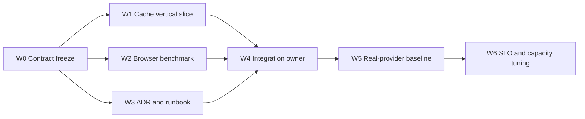

# Durable Speech Cache 与 Voice Benchmark Implementation Plan

## Document Status

- 状态：M1 implementation complete；真实 provider 基线待执行
- 日期：2026-08-13
- 架构依据：[ADR-007](../adr/ADR-007-durable-speech-artifacts-and-voice-benchmarking.md)
- 上游媒体边界：[ADR-005](../adr/ADR-005-action-presentation-and-conversational-media.md)

本计划既记录本次实现，也作为后续 agent/subagent 扩展容量治理、多实例缓存和 voice 场景的任务切分合同。

## Outcome

1. deterministic narration 具有 L0 browser、L1 backend memory、L2 durable artifact 三层复用；
2. backend restart 后 L2 hit 不调用 TTS；
3. 同 key 冷并发由 single-flight 合并；
4. cache identity 覆盖文本和所有输出参数；
5. 失败/取消不发布部分 MP3；
6. telemetry 能区分 memory、persistent、provider 并给出阶段耗时；
7. Playwright 能在真实 Chromium 中测到 browser first audio；
8. benchmark 默认不调用付费 provider。

## Parallel Delivery Model

实施按“互斥文件所有权 + integration owner”并行。Agent 不得修改其他 workstream 的文件，也不得还原 dirty
worktree 中不属于本任务的修改。



W1、W2、W3 在 W0 后可以同时由三个 subagent 执行。W4 必须串行收口共享文件、依赖、脚本和全量测试。
W5 需要用户提供可用服务、provider 凭据与计费授权，不可由普通 CI 自动运行。

## Workstream Ownership

| Workstream | Agent 类型 | 独占文件/目录 | 依赖 | 状态 |
| --- | --- | --- | --- | --- |
| W0 Contracts | integration owner | `SpeechSynthesizer.ts`、`TelemetrySink.ts` | ADR-005 | 完成 |
| W1 Cache | backend worker | `NarrationApplication.ts`、`SpeechArtifactStore.ts`、`FileSystemSpeechArtifactStore.ts`、cache tests | W0 | 完成 |
| W2 Benchmark | benchmark worker | `web/frontend/benchmarks/voice/**`、`playwright.config.ts` | W0 telemetry | 完成 |
| W3 Docs | docs worker | ADR-007、本计划、ADR index | W0 decision | 完成 |
| W4 Integration | root/integration owner | composition、`app.ts` 注释、package files、`.gitignore` | W1–W3 | 完成 |
| W5 Baseline | environment runner | benchmark result artifact only | running services/credentials | 待执行 |
| W6 Scale | future workers | object store/Redis/load scripts | W5 evidence | 未开始 |

共享热点文件只允许 integration owner 修改：

- `web/backend/src/services/coach/composition.ts`；
- `web/backend/package.json`；
- `web/frontend/package.json` 与 lockfile；
- `.gitignore`；
- `docs/adr/README.md`。

若 worker 必须改变热点文件，应先给 integration owner 发消息，只提交所需 patch 描述；不要跨所有权直接改。

## W0 — Contract Freeze

交付：

- `SpeechSynthesisIdentity`；
- `SpeechArtifact` / `SpeechArtifactStore` port；
- narration artifact source 与缓存阶段 telemetry；
- 明确 cache hit 不产生 provider timestamps。

门禁：

- contract 不 import filesystem、Redis、DashScope SDK；
- provider/model 不进入 shared browser business contract；
- `SpeechSynthesizer` 的普通 turn streaming contract 保持兼容；
- TypeScript backend build 通过。

## W1 — Backend Cache Vertical Slice

### Tasks that can run within one backend worker

这些步骤彼此依赖，应由同一 worker 顺序完成，避免同时修改 `NarrationApplication.ts`：

1. 实现 canonical identity 和 SHA-256 key；
2. 将 L1 值从完整 data URL 改为原始 MP3 artifact；
3. 在 L1 miss 后接入 optional L2；
4. 增加 same-key single-flight；
5. 将 leader provider chunk 实时转发，完成后提交 L2/L1；
6. 记录 source/duration telemetry；
7. 接入 filesystem adapter 与 composition config；
8. 增加测试并加入 backend test runner。

### Files

- `web/backend/src/services/coach/application/NarrationApplication.ts`
- `web/backend/src/services/coach/ports/SpeechArtifactStore.ts`
- `web/backend/src/services/coach/ports/SpeechSynthesizer.ts`
- `web/backend/src/services/coach/adapters/FileSystemSpeechArtifactStore.ts`
- `web/backend/src/services/coach/adapters/CosyVoiceSpeechSynthesizer.ts`
- `web/backend/src/services/coach/__tests__/NarrationApplication.test.ts`

### Gates

- L1 repeat: provider calls `1`；
- new application + same directory: provider calls `0`，source=`persistent`；
- identity variants each miss；
- two same-key concurrent requests: provider calls `1`；
- provider partial failure: no `.mp3`/`.tmp`；
- cancellation: no artifact，later retry calls provider；
- broken L2: provider succeeds and second request hits L1；
- `npm test` passes。

## W2 — Benchmark Framework

W2 与 W1 并行，因为它只消费 HTTP 与 telemetry contract，不修改 cache implementation。

### Deliverables

- Playwright Chromium project；
- browser init observer for Action entry/fetch/telemetry；
- narration real-chain spec；
- streaming text Coach spec；
- server timeline polling/join；
- JSONL reporter and summary；
- runbook and opt-in environment guard。

### Current scenarios

| Flow | Scenario tag | Preparation | Expected source/measurement |
| --- | --- | --- | --- |
| Narration | `provider-cold` | fresh L2 namespace and new process | provider |
| Narration | `memory-hit` | repeat without restart | memory |
| Narration | `persistent-after-restart` | preserve L2, restart process | persistent |
| Narration | `page-load` | current environment | source read from telemetry |
| Turn Coach | `text-stream` | real LLM/TTS credentials | interaction → browser audio |

Scenario tag 不操纵缓存。Runner 必须按 runbook 准备环境，最终以 telemetry 的 source 为准；不允许根据场景名字
伪造命中类型。

### Metrics

- interaction/action-enter/request → browser audio；
- request → response headers；
- server request → provider connected / LLM first text / first segment / TTS first audio；
- TTS first audio → browser audio；
- server total；
- L1 lookup、L2 lookup、single-flight wait、provider synthesis；
- artifact bytes、success/failure/autoplay blocked count。

### Gates

- `playwright test --list` 可发现全部场景；
- 未设置 `VOICE_BENCHMARK_ENABLED=true` 时全部 skip；
- reporter 对零样本、失败样本和缺失 timeline 字段可运行；
- JSONL 保留原始数据，summary 按 flow/scenario/source 分组；
- 不 mock `Audio`、fetch、backend cache 或 provider；
- trace/screenshot 只在失败时保存。

## W3 — ADR and Runbook

可与 W1/W2 并行。文档 agent 只写 `docs/**`，以已批准 contract 为事实来源；不能把 future Redis、SQLite、S3
写成已实现。

门禁：

- ADR 有 central decision、sequence、contract、invariants、failure/rollback、Redis tradeoff；
- plan 有 DAG、文件所有权、parallel waves、gates 和 Definition of Done；
- 状态区分“代码完成”和“真实付费基线未运行”。

## W4 — Integration and Verification

Integration owner 的顺序：

1. 检查 dirty tree，保留无关用户修改；
2. 审查 port/application/adapter 依赖方向；
3. 安装固定 Playwright dev dependency 和 Chromium；
4. 合并 package scripts 和 test runner；
5. 更新过期 `stores no audio on disk` 注释；
6. ignore cache/benchmark outputs；
7. 执行 backend tests；
8. 执行 frontend tests/typecheck/build；
9. 执行 Playwright discovery/default-skip/summary smoke；
10. `git diff --check` 并审查最终 diff。

验收命令：

```bash
cd web/backend && npm test
cd web/frontend && npm test
cd web/frontend && npm run typecheck && npm run build
cd web/frontend && npm run benchmark:voice
cd web/frontend && npm run benchmark:voice:summary
git diff --check
```

`npm run benchmark:voice` 在默认环境应报告 skip，而不是发出 provider 请求。

## W5 — Real-provider Baseline

### Preconditions

- backend/frontend 使用与目标部署相同的 region/network；
- `DASHSCOPE_API_KEY` 与 Coach provider auth 可用；
- `ACTION_SPEECH_CACHE_DIR` 指向专用 benchmark namespace；
- 明确本轮调用预算；
- 系统时钟同步；
- 记录代码 SHA、provider model/voice、文本 corpus 和机器规格。

### Run matrix

| Class | Samples | Notes |
| --- | ---: | --- |
| memory/persistent hit | ≥100 each | report p50/p95 |
| provider cold, short/medium/long text | 20–30 each | small N report raw + p50/p90；谨慎解释 p95 |
| turn Coach text stream | 20–30 | fixed question/context |
| autoplay blocked | ≥10 | must not enter success distribution |
| rapid Action switch/cancel | ≥20 | no stale playback/partial artifact |
| same-key concurrency | 1/5/20 clients | provider call count remains 1 per process |

网络矩阵至少包含 LAN、40–80 ms RTT、150–250 ms RTT；网络整形参数必须随结果保存。

运行示例见 `web/frontend/benchmarks/voice/README.md`。输出目录不得提交 Git；需要归档时上传 CI artifact 或
内部 benchmark storage。

## W6 — Evidence-driven Extensions

以下任务可以在 W5 后并行，每个 task 使用独占 adapter/test 目录：

- Agent A：按字节 L1/L2 capacity 与 last-access metadata；
- Agent B：对象存储 adapter、range/content-type/integrity tests；
- Agent C：Redis lock/hot-tier spike，仅比较 object store baseline；
- Agent D：k6 HTTP concurrency/spike/soak；
- Agent E：Playwright prerecorded microphone turn 与 live Coach；
- Agent F：authoring-time deterministic narration pre-generation。

各 agent 不得同时修改 composition root。它们交付 adapter + tests + wiring instructions，由 integration owner
集中接线。

Redis spike 的接受条件不是“能用”，而是：在相同 artifact corpus 和并发下，p95/重复 provider 调用/成本显著
优于 object-store-only，且明确 persistence、eviction、maxmemory、backup 与故障回退。否则保持不用 Redis。

## Definition of Done

M1 code DoD：

- [x] durable filesystem L2 and versioned SHA-256 identity；
- [x] L1 backfill and same-key single-flight；
- [x] atomic complete-only publish and fallback；
- [x] source/stage telemetry；
- [x] backend unit/integration tests；
- [x] Playwright framework, reporter, summary and opt-in guard；
- [x] ADR and agent-parallel implementation plan；
- [x] frontend/backend build and test gates；
- [ ] paid real-provider baseline collected；
- [ ] p95 SLO approved from measured baseline；
- [ ] production persistent volume/capacity/retention runbook approved。

因此，本次代码交付可以合并；不能声称已经得到生产延迟数字或已经证明 Redis 无价值。是否引入 Redis、对象存储
和何种 SLO，必须由 W5 数据决定。
