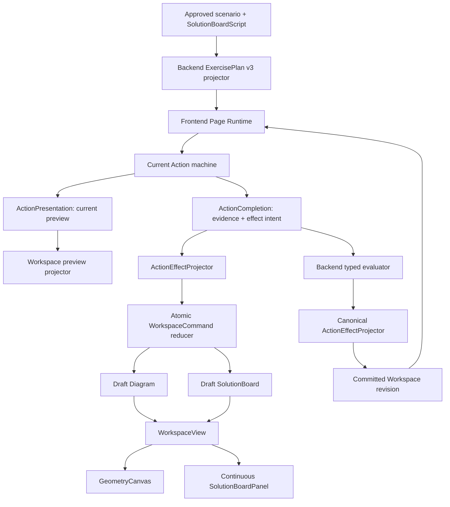

# SolutionBoard State：连续教师板书设计报告与实施计划

## 文档状态

- 状态：Superseded（历史方案）
- 日期：2026-08-11
- 决策范围：Action Runtime v3、Topic Learn / Guided Practice / Assessment、Review
- 关联文档：
  - [ADR-004：前端 Action Runtime 与后端教学计划边界](../../adr/ADR-004-frontend-action-runtime.md)
  - [PRD-01：Action 驱动的学习与练习工作台](./PRD-01-action-driven-workspace.md)
  - [Action Runtime 迁移计划](../../execution/action-driven-workspace-migration-plan.md)

> **2026-08-11 架构更正：** 本文后续描述的 `BoardCommand`、`boardTargets`、slot 填充以及 `world.solutionBoard` 已不再是当前实现。现行契约由问题库持有完整、审核过的 SolutionBoard；发布时将每个 Action/mode/stage 对应的完整只读投影写入 `question_solution_revisions` 与 `question_action_solution_boards`，后端通过 `solutionBoardContext` 下发。Action 只提交 typed evidence 和 diagram commands，不拼接或持久化板书正文；Assessment 不接收任何 SolutionBoard context。本文其余内容仅保留为历史设计记录。

## 1. Executive summary

### 1.1 中央决策

SolutionBoard 必须成为与 Diagram 同级的、可增量应用、撤销、重放、提交和恢复的学习世界状态。

每个 Action 仍由自己的 XState machine 管理当前选择和输入，但它需要同时产生两类声明式效果：

1. `DiagramCommand`：在左图上构造线、点、标签、份数、对应关系和高亮痕迹；
2. `BoardCommand`：在右侧连续板书中揭示表达式、把 LaTeX 值填入既有 slot，并确认该表达式书写完成。

两类命令进入同一个 `ActionEffectBatch`，由 Page Runtime 原子地应用。撤销一个 Action 时，左图和右侧板书必须一起回退；服务端接受一个 Action group 时，左图和板书必须以同一 revision 一起提交。

状态机负责“何时发生什么数学变化”，但不负责 React、CSS、卡片或任意中文字符串拼接。板书正文来自离线审核过的 `SolutionBoardScript`；状态机只把自己的语义结果绑定到稳定的 board slot。

### 1.2 为什么不是继续扩展 `projectStepRecord`

现有 `projectStepRecord` 只是在渲染时读取 `current snapshot + page.evidence`，临时返回 `template + values + summary`。它没有独立状态、命令批次、服务端 commit 或跨步骤恢复能力。

继续给它增加更多字符串和 CSS，只会得到更复杂的临时步骤投影，无法保证：

- 图与板书同一 Action 同步变化；
- BACK / CLEAR 同时撤销图和字；
- 服务端 reject 只回滚对应 Action；
- 刷新或跨设备恢复完整书写过程；
- Review 重放与学生当时看到的内容一致；
- Assessment 不泄露未来步骤和私有答案。

### 1.3 用户体验目标

```text
┌──────────────同一张题图──────────────┬────────────连续板书────────────┐
│ 原始图形                             │ 解：                         │
│ + 已确认构造                         │ 过 E 作 EF ∥ AC，交 BD 延长线 │
│ + 已确认标签/份数                    │ 于 F。                        │
│ + 当前 Action 的临时预览             │ ∵ ……                         │
│                                      │ ∴ AG:BG = 1:1                │
└──────────────────────────────────────┴──────────────────────────────┘
```

- 右侧是一张连续答题纸，不显示步骤卡片、完成徽章或待完成卡片。
- 已写内容永久保留；当前 Action 只在末尾的当前表达式继续书写。
- SolutionBoard 是只读教师板书，不承担学生填空或公式输入；学生作答仍属于 Action 自己的交互区。
- 左图的 preview 与右侧由系统填写的 slot 在同一语义事件后同步更新。
- 进入下一 Action 时，当前预览无闪烁地转为已确认痕迹。
- 未到达的教师解答不渲染；Assessment 也不得把它藏在 DOM 或网络 payload 中。

## 2. 当前实现审计

### 2.1 可以保留的基础

- `kind@version` Action registry 和每次只运行一个 child actor；
- typed `ActionEvidence`；
- Page Runtime 对 `DomainCommand` 的 draft、batch、replay 和 targeted rollback；
- backend 的 accepted / rejected / conflict、revision 和 idempotency；
- React 只消费 `WorkspaceView`，不按 Action kind 分支的方向。

### 2.2 必须修正的缺口

| 缺口 | 当前表现 | 目标修正 |
| --- | --- | --- |
| 板书不是状态 | 每次 render 临时拼 `ExerciseStepView[]` | `SolutionBoardProjection` 进入 workspace world |
| 图与板书不是同一事务 | 图有 command batch，板书没有 | 同一 `ActionEffectBatch` 原子应用两类命令 |
| authoring 没有板书模板 | 通用 Action definition 硬编码句式 | 题目 authoring 产出审核过的 LaTeX-with-slots `SolutionBoardScript` |
| 大部分 Action 没有图形效果 | form machine 的 commands 为空 | 扩充 DiagramCommand：标签、份数、关系和强调 |
| 完成历史不可完整恢复 | completed id 存在，具体板书依赖临时 evidence | backend 持久化包含 board 的 committed workspace |
| 跨 source step world 不连续 | 当前 stored world 选择依赖 sourceStepId | instance 的上一 committed revision 永远是下一次 base |
| 板书混入作答控件 | 板书空格和 answer form 容易被误认为同一个交互 | SolutionBoard 只读；Action 输入保留在独立交互区 |
| Assessment 有潜在泄露风险 | 若完整模板只在 CSS 隐藏仍可读取 | backend 按 mode 过滤 board script，不能只隐藏 UI |

## 3. 设计原则与不变量

1. **单一事实来源**：当前 Action draft 只属于 child machine；已完成的图与板书只属于 workspace state。
2. **同 Action 同 batch**：一个 Action 的 Diagram 和 Board effect 不能分别提交或分别回滚。
3. **作者拥有语言**：老师写什么来自审核后的内容数据；Action kind 只拥有语义角色和行为。
4. **状态机拥有时机**：进入、选择、完成时揭示哪个表达式、系统填写哪个 board slot，由 Action definition 投影。
5. **renderer 无业务分支**：SolutionBoard renderer 不读取 action kind、machine state 名或 source primitive。
6. **preview 不冒充 commit**：当前 Action 的临时效果由 child snapshot 纯投影；完成后才进入 effect batch。
7. **重放优先于反向修改**：BACK / reject 删除 batch 后从 committed base 重放，不维护易错的逆命令。
8. **服务端不信任客户端效果**：evaluation request 仍只提交 evidence；backend 用审核内容和已验证 evidence 生成 canonical effects。
9. **版本固定**：scenario、board script、action contract 和 effect schema 都随 session 固定。
10. **安全早于隐藏**：不允许下发的解答内容不得出现在 plan、HTML、trace 或前端 bundle 数据中。

## 4. 目标架构



依赖方向：

```text
Authoring data
    → shared board/effect contracts
    → backend plan + canonical commit
    → frontend runtime
    → WorkspaceView
    → generic renderers

React renderer -X→ action registry
Board reducer  -X→ XState state names
Backend        -X→ frontend actor snapshots
```

## 5. Architecture contracts

以下为声明式架构契约，不要求生产代码使用 F#。

### 5.1 Authoring contract

```fsharp
module SolutionBoardAuthoring

type BoardExpressionSpec = {
    expressionId: string
    sourceStepId: string
    ownerActionIds: string list
    latexTemplate: string
    modes: LearningMode list
}

type SolutionBoardScript = {
    schemaVersion: int
    documentId: string
    headingLatex: string
    expressions: BoardExpressionSpec list
}

type ActionBoardTargets = {
    actionId: string
    semanticTargets: Map<string, string>
}

type AuthoredExercise = {
    actionTemplates: AuthoredActionTemplate list
    solutionBoard: SolutionBoardScript
    actionBoardTargets: ActionBoardTargets list
}
```

`latexTemplate` 是一整段可直接交给现有数学 renderer 的 LaTeX，其中只允许出现稳定的 slot 占位符，例如：

```text
\text{过 }{{construction.through}}\text{ 作 }{{construction.helper}}
\parallel {{construction.reference}}
```

slot 的值也始终是一串 LaTeX。系统只做安全的 slot substitution，不为文字、点名、数值和公式再定义不同 render 类型。

`semanticTargets` 把 Action 定义认识的语义角色映射到 board slot。例如：

```text
make-parallel:
  throughPoint     → construction.through
  helperLine       → construction.helper
  referenceLine    → construction.reference

intersect-carriers:
  carrierLine      → construction.carrier
  intersectionPoint → construction.intersection
```

这些 role 属于 `kind@version` 的 schema，由 registry 和 bundle validator 校验；React 不理解 role。

### 5.2 Board state and commands

```fsharp
module SolutionBoardDomain

type BoardExpressionPhase =
    | Hidden
    | Writing
    | Complete

type BoardExpression = {
    expressionId: string
    sourceStepId: string
    latexTemplate: string
    slotValues: Map<string, string>
    phase: BoardExpressionPhase
}

type SolutionBoardProjection = {
    schemaVersion: int
    documentId: string
    headingLatex: string
    expressions: BoardExpression list
}

type BoardCommand =
    | RevealExpression of expressionId: string
    | FillSlot of slotId: string * latex: string
    | CompleteExpression of expressionId: string

type BoardCommandError =
    | UnknownExpression of string
    | UnknownSlot of string
    | DuplicateExpression of string
    | InvalidPhaseTransition of expressionId: string
    | InvalidLatex of slotId: string

type SolutionBoardReducer =
    abstract CreateBase:
        SolutionBoardScript
        -> Result<SolutionBoardProjection, BoardCommandError>

    abstract Apply:
        SolutionBoardProjection * BoardCommand list
        -> Result<SolutionBoardProjection, BoardCommandError>
```

Board command 不包含 JSX、HTML、CSS class、KaTeX DOM 或自由定位坐标。静态教师文字必须来自 `SolutionBoardScript`，不能由 machine 随意 append。v1 不支持动态增加表达式；需要重复行时由 authoring 预先声明，未来确有必要再升级 board schema。

### 5.3 Unified workspace effects

```fsharp
module TeachingWorkspaceDomain

type DiagramCommand
type DiagramProjection

type WorkspaceCommand =
    | DiagramEffect of DiagramCommand
    | BoardEffect of BoardCommand

type ActionEffectBatch = {
    actionId: string
    sourceStepId: string
    commands: WorkspaceCommand list
    committed: bool
}

type WorkspaceProjection = {
    diagram: DiagramProjection option
    solutionBoard: SolutionBoardProjection option
    revision: int
}

type TeachingWorkspaceState = {
    base: WorkspaceProjection
    committed: WorkspaceProjection
    draft: WorkspaceProjection
    batches: ActionEffectBatch list
    revision: int
}

type WorkspaceCommandError =
    | DiagramCommandFailed of string
    | BoardCommandFailed of BoardCommandError
    | BatchReferencesWrongAction of string
    | RevisionMismatch of expected: int * actual: int

type WorkspaceCommandPort =
    abstract ApplyAtomically:
        WorkspaceProjection * ActionEffectBatch
        -> Result<WorkspaceProjection, WorkspaceCommandError>

    abstract Replay:
        committed: WorkspaceProjection * batches: ActionEffectBatch list
        -> Result<WorkspaceProjection, WorkspaceCommandError>
```

`ApplyAtomically` 必须先验证整个 batch，再产生新 projection。任何一个 Diagram 或 Board command 失败时，两侧都不能部分生效。

### 5.4 Action machine boundary

```fsharp
module ActionRuntimeBoundary

type BoardPreview = {
    commands: BoardCommand list
    activeSlotId: string option
}

type ActionPresentation = {
    enabledObjectIds: string list
    selectedObjectIds: string list
    answerSlots: AnswerSlotView list
    diagramPreview: DiagramPreview option
    boardPreview: BoardPreview option
}

type ActionCompletion = {
    evidence: ActionEvidence
    effects: ActionEffectBatch
}

type ActionDefinition =
    abstract CreateMachine:
        ActionContract
        -> ActionActor

    abstract ProjectPresentation:
        ActionSnapshot
        -> ActionPresentation

    abstract ProjectCompletion:
        ActionContract * ActionEvidence
        -> Result<ActionCompletion, WorkspaceCommandError>
```

责任边界：

- child machine context 保存当前选择、输入和 history；
- `ProjectPresentation` 从当前 snapshot 产生临时 diagram/board preview；
- `ProjectCompletion` 只从 contract + evidence 产生稳定、可重放的 effect batch；
- Page Runtime 保存 completed batches，不把完整 Board document复制进 child context；
- `projectStepRecord` 被删除，不再成为板书事实来源。

### 5.5 Workspace view and renderer

```fsharp
module SolutionBoardPresentation

type BoardExpressionView = {
    expressionId: string
    latex: string
    isCurrent: bool
}

type SolutionBoardView = {
    headingLatex: string
    visibleExpressions: BoardExpressionView list
    currentExpressionId: string option
}

type WorkspaceView = {
    canvas: CanvasView
    solutionBoard: SolutionBoardView option
    coach: CoachView
    controls: ControlView
}
```

SolutionBoard renderer 是纯只读输出，没有自己的用户事件。学生的选择、输入和提交继续进入现有 `WorkspaceEvent` / Action machine；Action snapshot 再把相应数学结果以 LaTeX 填入板书 slot。

### 5.6 Backend and persistence ports

```fsharp
module SolutionBoardBackend

type EvaluationRequest = {
    sessionId: string
    exerciseId: string
    sourceStepId: string
    revision: int
    evidence: ActionEvidence list
    idempotencyKey: string
}

type AcceptedEvaluation = {
    committedWorkspace: WorkspaceProjection
    nextActionId: string option
    revision: int
}

type EvaluationResult =
    | Accepted of AcceptedEvaluation
    | Rejected of Diagnosis * revision: int
    | Conflict of latestPlan: ExercisePlan

type CanonicalEffectProjector =
    abstract Project:
        authoredExercise: AuthoredExercise * acceptedEvidence: ActionEvidence list
        -> Result<ActionEffectBatch list, WorkspaceCommandError>

type WorkspaceRepository =
    abstract LoadCommitted:
        sessionId: string * exerciseId: string
        -> Async<WorkspaceProjection option>

    abstract Commit:
        sessionId: string * exerciseId: string * sourceStepId: string * revision: int * workspace: WorkspaceProjection
        -> Async<Result<unit, PersistenceError>>
```

客户端不上传 `BoardCommand` 作为权威结果。Backend evaluator 验证 evidence 后，由 `CanonicalEffectProjector` 重新生成 effect batch，并把整个 `WorkspaceProjection` 原子持久化。

## 6. Runtime lifecycle

### 6.1 Bootstrap

1. Backend 根据 pinned scenario/version 和 mode 生成 `ExercisePlan v3`。
2. Plan 包含允许当前 mode 获取的 `SolutionBoardScript`、Action list 和上一 committed workspace。
3. Frontend 校验 plan、board script、action target 引用和 command schema。
4. Page Runtime 以 committed workspace 为 base；checkpoint 中的 completed evidence 只重建尚未 commit 的 batch。
5. 当前 child machine 从 partial draft 恢复，board preview 从 snapshot 重新投影。

### 6.2 一个语义操作

以“先点 E，再点 AC，作 EF ∥ AC”为例：

| 事件 | 左图 | 右侧板书 | 状态性质 |
| --- | --- | --- | --- |
| 进入 Action | E 与候选线可操作 | 揭示“过 __ 作 __ ∥ __”当前 expression | preview |
| 点击 E | E 被选择，平行线仍未生成 | `throughPoint` slot 显示 E | preview |
| 点击 AC | 显示 EF 平行线 preview | `referenceLine` 显示 AC，`helperLine` 显示 EF | preview / complete transition |
| Action complete | EF 进入 draft diagram | 三个 slot 进入 draft board batch | uncommitted batch |
| source step accepted | EF 和板书同时进入 committed workspace | 当前 expression 或共享 expression 进入下一 Action | authoritative commit |

从 preview 切换到 completed batch 必须在 Page Runtime 的一次 notification 中完成，避免图或文字闪回空白。

### 6.3 BACK、CLEAR、reject

- 当前 child 内 BACK：恢复 child history，重新投影当前 preview；不改 completed batches。
- 跨 Action BACK：删除最后一个未提交 `ActionEffectBatch`，从 committed workspace 重放剩余 batches，重新 mount 对应 child。
- CLEAR source step：删除该 `sourceStepId` 的所有未提交 batch，并清空当前 child。
- Backend reject：根据 `wrongActionIds` 删除对应未提交 batch；图和板书一起重放；无关已确认内容保留。
- Revision conflict：丢弃本地未提交 authoritative projection，载入 latest plan；若 evidence 仍可应用，再经 schema/version 校验后恢复。

### 6.4 Commit and cross-step continuity

Committed workspace 必须按 exercise instance 累积，不能因为进入新的 `sourceStepId` 而回到该步骤自己的初始 world。

规则：

```text
next base = last committed workspace for this instance
```

`sourceStepId` 只用于审计、targeted rollback 和 review 定位，不能决定是否读取上一 world。这一点是连续图形和连续板书成立的必要条件。

## 7. Diagram effect extension

为了让“每个 Action 都有图的变化”成立，需要把 `DiagramCommand` 从纯构造扩展为教学标注命令：

```fsharp
module DiagramTeachingCommands

type DiagramValue =
    | TextLabel of string
    | MathLabel of string

type DiagramCommand =
    | ConstructParallel of throughPointId: string * referenceLineId: string * outputLineId: string
    | ConstructCarrier of fromPointId: string * toPointId: string * outputLineId: string
    | IntersectLines of firstLineId: string * secondLineId: string * outputPointId: string
    | SetEntityLabel of entityId: string * labelId: string * value: DiagramValue
    | SetSegmentShare of segmentId: string * markId: string * value: DiagramValue
    | SetCorrespondenceMark of firstEntityId: string * secondEntityId: string * markId: string
    | SetRelationMark of entityIds: string list * markId: string * value: DiagramValue
```

持久化命令只描述数学痕迹。呼吸、hover、当前高亮、箭头动画等仍是 renderer preview，不进入 committed world。

Action 最低效果要求：

| Action | Diagram effect | Board effect |
| --- | --- | --- |
| `make-parallel` | 构造平行线 | 填所过点、辅助线、参照线 |
| `intersect-carriers` | 构造延长线和交点 | 填延长线、交点，完成构造句 |
| `mark-segment-values` | 在线段旁增加值标签 | 写“由题意 …”或对应边长行 |
| `pair-segments` | 增加对应边记号 | 写相似/对应关系 |
| `ratio-scratch` | 增加份数或比例标记 | 写比例、代值、约分 |
| `convert-collinear` | 强调整段与两个分段 | 写整段加减关系 |
| `enter-equation` | 强调参与列式的对象 | 写完整等式链和结果 |
| `select-option` | 高亮被选择的数学结论对象（若有） | 写规范判断句 |
| `enter-text` | 可选标签，不强制 | 把学生输入写入规范位置 |

## 8. Authoring and content model

### 8.1 板书必须来自题目解答，不从 UI 文案猜

优先来源：教师 assignment 中已经审核的 `solution_steps[].content_latex`、步骤图和 explanation。

Importer 的职责是：

1. 保留教师原始推导顺序；
2. 把每个解答段落编译成一个稳定的 LaTeX expression template；
3. 把动态数学对象替换为 LaTeX slot；
4. 为 slot 绑定负责它的 `actionId + semantic role`；
5. 直接使用已有 `LearningMode` 标注允许下发的 modes；
6. 输出可人工审核的 preview 和 validation report。

禁止：

- runtime 根据 `title`、`instruction` 或 primitive 猜板书；
- 在通用 Action definition 中写死某个专题的完整句子；
- 从 answer key 自动生成未经教师审核的因果连接词；
- 用 HTML 字符串作为板书协议。

### 8.2 示例 authoring shape

```yaml
solution_board:
  schema_version: 1
  heading_latex: "\\text{解：}"
  expressions:
    - expression_id: construct-helper
      source_step_id: construct-helper
      owner_action_ids:
        - construct-helper/make-parallel
        - construct-helper/intersect-carriers
      modes:
        - learn
        - guided-practice
      latex_template: >-
        \\text{过 }{{construction.through}}\\text{ 作 }
        {{construction.helper}}\\parallel {{construction.reference}}
        \\text{，交 }{{construction.carrier}}\\text{ 延长线于 }
        {{construction.intersection}}\\text{。}
```

YAML 只是 authoring 表达，发布后进入 versioned JSON contract。

### 8.3 Publication gates

每个发布题必须验证：

- document、expression、slot ID 在题内唯一且稳定；
- `sourceStepId` 和 `ownerActionIds` 全部可解析；
- 每个 board target 指向存在的 slot；
- slot value 是合法且有长度限制的 LaTeX；
- 每个核心 Action 至少有一个 Diagram 或 Board committed effect，并明确为何另一侧可为空；
- 同一 source step 的最后一个 Action 能结束所有仍处于 Writing 的 expression；
- Assessment plan 不包含 modes 未授权或由私有答案导出的 expression；
- 所有动态 LaTeX 通过安全渲染约束；
- board script 能独立渲染成教师审核 preview。

## 9. Learning mode policy

| Mode | 下发内容 | 运行时行为 | 完成后 |
| --- | --- | --- | --- |
| Learn | 审核过的教学 script；允许公开 teaching bindings | 老师边演示边写，系统根据 Action snapshot 填 slot | 连续保留完整规范板书 |
| Guided Practice | 只下发公开方法模板，不下发私有 expected values | 学生仍在 Action UI 作答；accepted evidence 再驱动板书 | accepted 后写入正确结果 |
| Assessment | 默认不下发教师 solution script | SolutionBoard 关闭，不把板书变成答题器 | 提交结束后由独立 Review API 提供规范解答 |
| Review（独立视图） | 加载完整 canonical board document | 只读或逐 Action replay，不属于 `LearningMode` | 可定位到 evidence、图形痕迹和能力点 |

任何“先下发再用 CSS 隐藏”的方案都不满足 Assessment 安全要求。

## 10. Persistence, protocol and versioning

### 10.1 Version decision

- 新增 `SOLUTION_BOARD_SCHEMA_VERSION = 1`；
- `ExercisePlan` 从 v2 升为 v3；
- 新增 versioned `WorkspaceCommand` schema；
- Action input/evidence 语义未改变的 kind 可以继续使用 `@1`；
- pinned v2 session 继续由 v2 renderer 恢复，不把缺少 board script 的 plan 假装成 v3。

### 10.2 World persistence

推荐扩展现有 world JSON，而不是另建独立 SolutionBoard 表：

```json
{
  "revision": 12,
  "diagram": { "...": "..." },
  "solutionBoard": { "...": "..." }
}
```

这样 SQLite 的一次 row update 就能保证图与板书同 revision。现有 `practice_action_worlds_v2` 可以在 v3 迁移后改为语义更准确的 repository API；物理表名可以暂时保留，避免无收益的数据搬迁。

必须修正 repository/service 语义：

- 始终读取 instance 最新 committed workspace；
- `source_step_id` 仅作审计字段；
- accepted evaluation 在同一事务中写 evaluation、workspace revision 和 session progression；
- idempotency hit 返回完全相同的 committed workspace；
- review 从 accepted evidence + committed workspace 读取，不从当前前端 projection 猜。

### 10.3 Checkpoint

远程 checkpoint 保存：

- current action id；
- completed but uncommitted action evidence；
- current child draft selections / answers；
- plan revision 和 schema versions。

不需要保存当前 preview board document；恢复 child snapshot 后重新投影 preview。浏览器 sessionStorage 可以缓存完整本地 snapshot，但只能在 revision 和 schema 都匹配时使用。

### 10.4 Protocol changes

`ActionEvaluationRequest` 保持 evidence-only。`ActionEvaluationResponse` 的 `committedWorld` 升级为同时包含 Diagram 与 SolutionBoard 的 `WorkspaceProjection`。

可以额外上传非权威 `clientEffectDigest` 做 parity telemetry，但 backend 不以它作为 commit 输入。

## 11. Frontend rendering contract

### 11.1 Continuous SolutionBoardPanel

新 renderer 替换 `ExerciseStepsPanel`：

- 一个 panel、一个 heading、一个连续 document flow；
- 只渲染 `visibleExpressions`；每个 expression 是一段解析完 slot 的 LaTeX；
- 没有 step card、圆形序号、完成状态 badge；
- source step 只保留为语义和测试属性，不形成视觉容器；
- 当前 expression 可有轻量书写指示，但不使用卡片背景；
- completed expression 保持普通墨色；未填 slot 使用板书占位，不是可聚焦 input；
- 学生操作控件属于 Action 工作区，不嵌入 SolutionBoard；
- 当前 expression 自动保持可见，用户手动上滚后不强制抢滚动；
- 移动端变为图在上、连续板书在下，document 不重新拆卡。

### 11.2 Accessibility

- panel 使用 `aria-labelledby` 指向“解”；
- 每个 expression 是语义段落，但不朗读“卡片 1/4”；
- `aria-live` 只播报本次新增/填入的 delta，不重复朗读整份板书；
- SolutionBoard 本身不进入学生输入 tab 顺序；
- 动画遵守 `prefers-reduced-motion`。

## 12. Implementation plan

### 12.1 推荐 PR 序列和依赖

| PR | 范围 | 依赖 | 合并后必须成立 |
| --- | --- | --- | --- |
| SB-01 | shared board contract、runtime guards、纯 reducer、atomic workspace batch | 无 | 无 UI 也能完整 materialize/apply/replay board |
| SB-02 | `auxiliaryTwoRatios` 一题的 board authoring、validator、review preview | SB-01 | 内容侧能表达多个 Action 共写同一 expression |
| SB-03 | make-parallel / intersect-carriers preview 与 completion effects | SB-01、SB-02 | child snapshot 能同步投影图与板书语义变化 |
| SB-04 | Page Runtime 的 TeachingWorkspaceState、BACK/CLEAR/reject replay | SB-03 | 两侧 effect 原子应用和回滚 |
| SB-05 | 只读 Continuous SolutionBoardPanel、视觉与 a11y | SB-04 | 生产页面不再呈现步骤卡片 |
| SB-06 | backend canonical projector、累计 committed world、事务与 restore | SB-01、SB-02 | 跨 source step / 跨设备恢复完整 board |
| SB-07 | 首题端到端、browser QA、telemetry、v3 feature gate | SB-05、SB-06 | 一个真实 session 完成全部验收脚本 |
| SB-08 | 其余 Diagram commands、Action kinds 和全量内容迁移 | SB-07 | 新 Topic session 达到 v3 发布门禁 |

关键路径：

```text
SB-01 → SB-02 → SB-03 → SB-04 → SB-05 → SB-07 → SB-08
                  └────────────→ SB-06 ────────┘
```

不要把“右栏 CSS 改成连续样式”作为独立先行 PR。没有 SB-01—SB-04 时，UI 仍只能读取临时 `ExerciseStepView[]`，视觉会变但状态问题不会消失。

### Phase 0：冻结行为与建立设计门禁

工作：

- 为当前 v2 的 make-parallel → intersect-carriers → 下一 source step 建立 golden fixture；
- 记录当前 board 值在 accepted、refresh、BACK、CLEAR、reject 后的丢失行为；
- 新增静态门禁：禁止继续扩展 `projectStepRecord` 和 `ExerciseStepsPanel`；
- 为目标题制作一份经确认的 expected board transcript 和逐 Action diagram snapshot。

退出条件：

- 现有缺陷有自动化复现；
- 产品确认“每个语义事件后左图和右板书应该看到什么”；
- v2 行为可以在迁移期间稳定回归。

### Phase 1：Shared contracts 和纯 Board reducer

主要文件：

```text
web/shared/actionRuntime.ts
web/shared/actionWorld.ts
web/shared/solutionBoard.ts                 (new)
web/shared/actionEffects.ts                 (new)
web/shared/__tests__/solutionBoard.test.ts  (new)
```

工作：

- 定义 board script、projection、commands、errors 和 runtime guards；
- 将 `WorldProjection` 升级为含 diagram + solutionBoard 的 workspace projection；
- 将 `CommandBatch` 升级为原子 `ActionEffectBatch`；
- 实现 board base materialization、apply 和 replay；
- 实现 workspace batch 的全量预验证和原子应用；
- 加入 schema version、unknown command、duplicate id 和 invalid transition 测试。

退出条件：

- 同一输入 script + commands 始终得到相同 board JSON；
- batch 中任一命令失败时两侧状态均不改变；
- 删除任一 batch 后 replay 得到正确前态；
- reducer 不依赖 React、XState 或 backend。

### Phase 2：Authoring schema、importer 与内容回填

主要文件：

```text
web/backend/scripts/lib/topicActionTemplateAuthoring.ts
web/backend/scripts/import-topic-artifacts.mjs
web/shared/topicPractice.ts
题库 teacher assignment / generated scenario bundle
```

工作：

- authoring schema 增加 `solution_board` 和 `action_board_targets`；
- importer 优先读取已审核 `solution_steps`，生成有序 LaTeX expression templates；
- 为每个 action kind 定义允许的 semantic role；
- bundle validator 加入引用、mode exposure、slot 和 expression completion 校验；
- 先人工完成目标专题，再批量生成其他题的候选 board script；
- 生成教师 review HTML/PNG，未审核题不能发布 v3。

退出条件：

- 目标专题每道题都有完整连续板书；
- 同一 source step 的多个 Actions 可以共同填写同一个 expression；
- bundle 中不存在从 UI instruction 猜出的 fallback 文案；
- Assessment fixture 通过 payload leak 测试。

### Phase 3：Action definition 输出 preview 与 completion effects

主要文件：

```text
web/frontend/src/action-runtime/actions/actionDefinition.ts
web/frontend/src/action-runtime/actions/*.machine.ts
web/frontend/src/action-runtime/registry.ts
web/frontend/src/action-runtime/types.ts
```

工作：

- `ActionPresentation` 增加 `boardPreview`；
- `ActionCompletion` 统一输出 evidence + effect batch；
- 逐 Action 实现 semantic role → board slot value；
- 为 mark/ratio/equation Actions 补齐持久 Diagram teaching commands；
- 删除完成状态下重复的 `commands` 生成路径；
- 建立 frontend/backend canonical effect parity fixtures。

退出条件：

- 每个 Action 的进入、局部事件、完成都有确定的 preview/effect snapshot；
- machine 不含专题完整句子；
- renderer 和 Page Runtime 不出现 action-kind switch；
- 所有 9 个现有 action kinds 都明确两侧 effect 行为。

### Phase 4：Page Runtime 接入统一 TeachingWorkspaceState

主要文件：

```text
web/frontend/src/action-runtime/pageRuntime.ts
web/frontend/src/action-runtime/projectWorkspaceView.ts
web/frontend/src/action-runtime/persistence/*
```

工作：

- Page context 持有 committed/draft workspace 和 `ActionEffectBatch[]`；
- `ACTION_DONE` 原子应用 diagram + board；
- current child preview 只在 WorkspaceView 投影时叠加；
- BACK、CLEAR、reject 按 batch 同步 replay；
- checkpoint/restore 通过 evidence 重建未提交 batch；
- 删除 `projectExerciseSteps` 对运行时板书事实的职责。

退出条件：

- 图和板书不存在一侧成功、一侧失败的状态；
- 跨 Action、跨 source step 的内容连续保留；
- refresh 后 committed board 完整，current preview 可恢复；
- transition 从 preview 到 batch 无空白帧。

### Phase 5：连续板书 renderer

主要文件：

```text
web/frontend/src/action-runtime/react/ActionRuntimeFrame.tsx
web/frontend/src/action-runtime/react/SolutionBoardPanel.tsx  (new)
web/frontend/src/styles/practice.css
```

工作：

- 用 `SolutionBoardPanel` 替换 `ExerciseStepsPanel`；
- 对每个可见 expression 完成 slot substitution，并复用现有 MathText/KaTeX renderer；
- SolutionBoard 保持只读，Action answer controls 继续由原交互区渲染；
- 删除步骤卡片、marker、完成 badge 和独立 summary block 样式；
- 当前 expression scroll、增量播报和 reduced motion；
- 完成桌面/窄屏视觉验收。

退出条件：

- DOM 中没有一组组 solution cards；
- 右侧视觉上是一份连续解答；
- SolutionBoard DOM 中没有 input、button 或可编辑 content；
- 左图变化与板书 delta 在一次 React commit 中出现；
- accessibility tests 不重复播报整份文档。

### Phase 6：Backend canonical commit 和跨步骤 world 修正

主要文件：

```text
web/backend/src/services/actionRuntime/topicTypedEvaluator.ts
web/backend/src/services/actionRuntime/topicPlanProjector.ts
web/backend/src/services/runtime/platform/sessionRuntimeService.ts
web/backend/src/repositories/actionRuntimeRepository.ts
web/backend/src/db/database.ts
```

工作：

- backend accepted evidence 生成 canonical effect batch；
- 统一应用并持久化完整 workspace；
- 修正 committed world base：始终使用 instance 最新 revision，不按 sourceStepId 丢弃；
- evaluation、workspace、progression 放进同一数据库事务；
- response 返回完整 committed workspace；
- review 投影读取 canonical board；
- idempotency、conflict 和旧 revision 恢复覆盖 board。

退出条件：

- 跨三个 source steps 后，第一步图形痕迹和板书仍存在；
- server reject 不提交任何 diagram/board 部分变化；
- 重复 idempotency request 的 workspace JSON 完全一致；
- 跨设备只靠服务端数据可恢复完整已完成解答。

### Phase 7：目标专题纵向切片与验收

建议首个切片：`auxiliaryTwoRatios`，因为它同时覆盖作辅助线、求交点、标份数、两组比例和最终比较。

验收脚本：

1. 打开原图，右侧只显示“解：”和当前第一个 expression；
2. 点击所过点，左侧选择态与右侧点名同时出现；
3. 完成平行线，左侧生成辅助线，右侧补全平行关系；
4. 完成交点，左侧出现交点，右侧完成整句；
5. 标第一组份数，左图标签与右侧第一组比例同步出现；
6. 标第二组份数，旧标记和旧板书均保留；
7. 完成最终比例 Action，系统补全最后一个 expression，形成一份从上到下完整可读的规范解答；
8. 分别验证 BACK、CLEAR、错误、刷新、断网重试和 session restore。

退出条件：

- 产品逐 Action 对照稿通过；
- browser screenshot diff 和人工视觉检查通过；
- 没有旧步骤卡片 fallback；
- telemetry 能记录 board command failure、schema mismatch 和 replay failure。

### Phase 8：全量迁移与 v2 退役

工作：

- 按 action kind 和专题批次迁移剩余 280 条已发布 Topic records；
- 每批都经过内容 validator、教师 board preview 审核、machine/effect fixtures 和 visual smoke；
- 新 session 只在题目具备 approved board script 时启用 v3；
- pinned v2 session 保持旧 renderer；
- v3 覆盖率、command failure、restore failure 达标后停止创建新 v2 session；
- retention window 后删除 `projectStepRecord`、`projectExerciseSteps` 和 `ExerciseStepsPanel`。

退出条件：

- v3 Topic records 100% 有审核过的 board script；
- 新流量中 v2 为零；
- pinned v2 活跃 session 为零或进入只读归档；
- Review 能显示与学习过程一致的 canonical solution board。

## 13. Test strategy

### 13.1 Contract and reducer

- board script valid / invalid / unknown version；
- duplicate expression/slot、missing action、invalid LaTeX；
- command idempotency 与 deterministic JSON；
- batch atomicity；
- replay、remove-one-batch、remove-source-step；
- expression reveal/fill/complete phase；
- Assessment payload leak。

### 13.2 Action machines

- 每个 state/event 的 board preview snapshot；
- completion effect snapshot；
- BACK/CLEAR 后 preview 恢复；
- LocalTeaching 与 ServerAuthoritative 的 effect 内容一致、完成时机不同；
- frontend local effects 与 backend canonical effects parity。

### 13.3 Page and protocol

- one-child lifecycle；
- preview → batch 无闪烁；
- accepted/rejected/conflict/transport error；
- same source step 多 Action 共写一个 expression；
- 跨 source step world accumulation；
- checkpoint、sessionStorage 和 cross-device restore；
- idempotent retry。

### 13.4 Renderer and visual

- 连续 document，不存在 card DOM；
- board DOM 保持只读且不进入学生输入 tab 顺序；
- MathText/KaTeX 行高与换行；
- 桌面两栏、900px 以下上下布局、长解答滚动；
- current expression 自动跟随但不抢用户手动滚动；
- reduced motion；
- 中文长句、分式、根式、多行等号链和 10+ 行板书。

### 13.5 Content acceptance

- 教师逐题确认板书文字、数学顺序和左图标注时机；
- 每个 Action 后的 diagram snapshot + board transcript golden；
- 最终 board 单独阅读时是一份规范答案，不依赖状态 badge 才能理解；
- 左图最终态与 board 中引用的点、线、份数完全一致。

## 14. Observability and rollout

新增 telemetry：

- `solution_board_schema_rejected`；
- `workspace_batch_apply_failed`；
- `workspace_replay_failed`；
- `client_server_effect_digest_mismatch`；
- `solution_board_restore_failed`；
- `solution_board_slot_unbound`；
- v2/v3 session、题目和 action-kind 使用量。

Rollout 顺序：

```text
local fixtures
→ internal author preview
→ 单一专题 Learn
→ 单一专题 Guided
→ Review
→ 多专题小流量
→ 新 Topic 默认 v3
→ Assessment 保持无教师板书
→ v2 retention cleanup
```

任何 batch apply/replay failure 都应阻止提交并显示可恢复的 runtime error，不能静默只更新图或只更新板书。

## 15. Risks and tradeoffs

| 风险 | 影响 | 缓解 |
| --- | --- | --- |
| authoring 工作量显著增加 | 不能只靠 primitive 自动生成高质量板书 | 从教师 solution_steps 编译，生成 preview，人工审核 |
| frontend/backend effect 漂移 | 客户端预览与服务端 commit 不一致 | 共享纯 contract/projector、golden parity、effect digest telemetry |
| world JSON 增长 | 长解答和多标记增加 payload | 静态 script 与动态 projection 分离；仅持久化状态和值 |
| LaTeX 动态值不安全或破版 | renderer 错误、内容注入 | schema validation、安全 KaTeX 配置、长度限制 |
| v2/v3 并存复杂 | restore 与路由分支增加 | session pinning、明确版本 renderer、不做隐式升级 |
| preview/commit 双模型重复 | 容易产生闪烁或不同值 | 同一 semantic role projector，单次 notification 替换 |
| Assessment 方法泄露 | 影响测评有效性 | backend mode filter，payload leak tests，不依赖 CSS |

接受的成本：SolutionBoard 会让 authoring、shared contract 和 persistence 更丰富。这是把“老师讲题”从页面装饰提升为正式领域能力所必需的复杂度。

不接受的成本：不把任意富文本编辑器状态、DOM snapshot、Canvas 像素、动画帧或 XState serialized actor 当成持久化协议。

## 16. Definition of Done

只有同时满足以下条件，SolutionBoard State 才算完成：

1. 每个目标 Action 都能声明并测试自己的 Diagram + Board 语义效果；
2. 两侧效果由一个 batch 原子应用、撤销、重放和提交；
3. 右侧是连续文档，没有步骤卡片结构和重复输入区；
4. 当前 Action 的 partial state 能实时改变左图 preview，并由系统填写右侧 LaTeX slot；
5. 已完成板书跨 Action、跨 source step、刷新和跨设备持续存在；
6. Backend 从 accepted evidence 生成 canonical workspace，不信任客户端 board command；
7. Review 能重建完整规范解答和对应最终图形；
8. Assessment payload 不包含未授权教师解答；
9. 目标专题完成逐 Action 产品验收、自动化测试和视觉 QA；
10. 新增题目只需 authoring 数据；SolutionBoardPanel 和 Page Runtime 不按题型或 action kind 增加分支。

## 17. 推荐的首个实施切片

首个 PR 不应先改 CSS，而应完成一个最小但真实的领域闭环：

```text
SolutionBoard contracts + reducer
→ make-parallel/intersect-carriers board script
→ unified ActionEffectBatch
→ Page Runtime replay
→ Continuous SolutionBoardPanel
→ backend committed workspace
→ auxiliaryTwoRatios 一题端到端
```

这个切片通过后，再扩展 label、ratio 和 equation commands。否则先做全量 UI 或全量内容迁移，会把尚未验证的 board contract 放大到整个题库。

## 18. 后续需要单独展开的契约

- `BoardCommand` 每条命令的精确校验与 phase transition 表；
- 各 Action kind 的 semantic roles 和 Diagram/Board effect mapping；
- v2 → v3 session pinning、数据库事务和 rollback 细节；
- 教师 solution_steps → LaTeX expression template 的 authoring 编译规则；
- Review canonical board 是否直接复用只读 SolutionBoard renderer。
