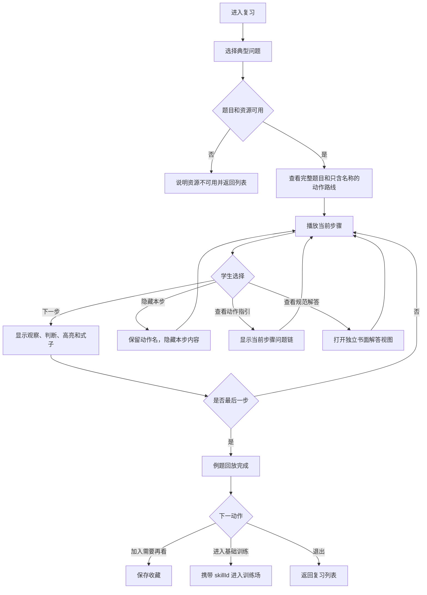

# PRD-01：学生复习播放器

## 文档状态

- 状态：Draft
- 优先级：P2
- 上位边界：[教师诊断驱动的复习、作业与训练系统](./README.md)
- 依赖：已审核典型题、动作链、规范解答、图形状态与技能映射

## 1. 产品定位

学生复习播放器不是按章节陈列概念的知识库，而是典型问题的“解题动作回放器”。它解决的问题是：学生课上听懂了，但独立开始时不知道第一步做什么。

## 2. 产品目标

- 学生从典型问题进入，而不是先浏览抽象知识点。
- 用 3—5 个主要步骤恢复规范解题路线。
- 每一步明确“观察什么、作出什么判断、图上发生什么、产生什么式子”。
- 把用于继续作答的动作指引与用于模仿书写的规范解答严格分开。
- 允许学生从典型题直接进入同一技能节点的基础训练。

## 3. 非目标

- 不自动判断学生为什么不会。
- 不提供对话式 AI 诊断。
- 不把所有微小动作都拆成问题或点击任务。
- 不以“章节—知识点—长篇讲解”为主导航。
- 不在播放器中完成正式作业提交或达标测试。

## 4. 核心内容模型

每个可播放的复习材料至少包含：

```ts
type ReviewExample = {
  id: string;
  version: string;
  title: string;
  skillIds: string[];
  problem: {
    stemLatex: string;
    diagramAsset?: string;
    diagramAlt?: string;
  };
  actionRoute: string[]; // 3—5 个动作名称
  steps: Array<{
    id: string;
    actionName: string;
    observe: string;
    judgment: string;
    diagramState?: string;
    equationLatex?: string;
    actionGuide?: string[];
  }>;
  keyMistakeReminder?: string; // 全题最多一个
  writtenSolutionLatex: string;
  relatedTrainingSkillIds: string[];
  sourceRefs: string[];
  status: "draft" | "approved" | "retired";
};
```

只有 `approved` 内容可以进入学生端。

## 5. 学生流程



刷新或返回页面时恢复当前例题、当前步骤、已展开内容和收藏状态。

## 6. 页面结构

### 6.1 复习列表

- 按近期课程、教师关联和“需要再看”提供入口。
- 卡片展示题目标题、缩略图、关联技能和上次看到的步骤。
- 不展示系统推测的“薄弱点”“掌握度”或诊断标签。

### 6.2 播放器主视图

- 顶部：完整题干。
- 主区域：题图及当前步骤高亮；切换步骤时仍使用同一数学对象。
- 路线区：默认只显示 3—5 个动作名称和当前位置。
- 当前步骤区：依次承载“观察—判断—图形变化—关键式子”。
- 操作区：上一步、下一步、隐藏／显示本步、只看动作名称。
- 辅助入口：动作指引、规范书面解答、需要再看、进入对应训练。

### 6.3 Action guide

Action guide 只帮助学生继续当前动作，例如：

- 现在应该寻找哪两个三角形？
- 由哪组角相等可以判定相似？

规则：

- 只针对当前步骤；
- 优先使用教师式问题链；
- 不直接拼接成完整解答；
- 查看行为被记录为客观事实。

### 6.4 Written solution

Written solution 是独立的规范书面解答视图：

- 保持完整、连续、可模仿的书写格式；
- 不夹入播放器按钮、提示等级或问答话术；
- 可从任一步打开，关闭后回到原步骤；
- 查看行为被记录，但不生成诊断。

### 6.5 窄屏与触摸布局

- 题干、题图、当前步骤按单列纵向排列。
- 动作路线可横向滚动，但页面不得产生整体横向滚动。
- 上一步／下一步固定在安全区内，不能覆盖式子或题图。
- 图形高亮必须同时提供文字说明，不能只依赖颜色。

## 7. 分步展示规则

| 状态 | 学生看到什么 | 可执行动作 | 保留内容 |
| --- | --- | --- | --- |
| 只看动作名称 | 完整题目、动作路线、当前动作名 | 上一步、下一步、展开本步 | 当前步骤位置 |
| 本步展开 | 观察对象、判断、图形高亮、关键式子 | 隐藏、前后移动、查看指引 | 已播放步骤与图形状态 |
| 动作指引展开 | 当前步骤的问题链 | 关闭、继续播放 | 当前步骤与题图 |
| 规范解答展开 | 独立完整解答 | 关闭、收藏、进入训练 | 播放器位置 |
| 回放完成 | 完整动作路线和关键提醒 | 重播、收藏、训练、退出 | 完成记录 |

每道例题全程最多展示一个关键易错提醒，且不得把它写成系统对当前学生的诊断。

## 8. 客观记录

播放器只记录：

- 进入和退出时间；
- 播放到哪个步骤；
- 是否查看动作指引；
- 是否查看规范解答；
- 是否加入“需要再看”；
- 是否进入关联训练。

这些记录可以供教师查看，但不能自动修改 `teacher_status`。

## 9. 异常与恢复

- 图资源缺失：保留题干和文字步骤，明确说明图暂不可用；若步骤依赖图上对象，则禁止继续播放并提供返回。
- 内容版本失效：已开始 session 固定原版本；新进入使用最新 approved 版本。
- 网络中断：保留本地当前位置，恢复后补写客观事件。
- session 冲突：以最近一次明确操作为准，提示学生选择继续当前设备或恢复远端位置。

## 10. 验收标准

1. 任一例题都能从完整题目开始，用 3—5 个主要步骤播放完毕。
2. 每一步同时支持观察、判断、图形状态和式子中的适用项，不出现一篇连续长讲解。
3. Action guide 与 Written solution 是两个独立入口和独立视图。
4. 上一步、下一步、隐藏／显示本步、只看动作名称、收藏和进入训练均可用。
5. 刷新后恢复当前题和当前步骤，不丢失收藏。
6. 学生界面和教师记录中不出现由系统生成的认知诊断。
7. 320px 宽度、触摸和键盘操作下可完成全部流程。

## 11. 待确认事项

- [ ] “需要再看”是否只由学生收藏，还是教师也可以把典型题加入学生列表。
- [ ] MVP 是否允许学生从任一步直接打开完整解答；当前草案允许并记录查看事实。
- [ ] 第一批复习材料是否从现有相似专题的 approved explanation 与题库中选取，而不是与训练场的数论主题同步首发。
