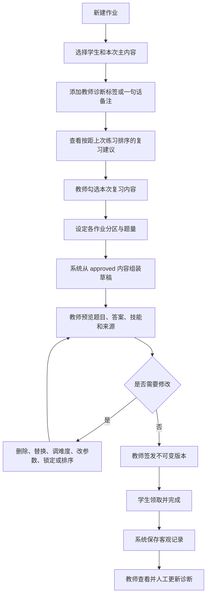

# PRD-02：教师配置作业／学生领作业

## 文档状态

- 状态：Draft
- 优先级：P1
- 上位边界：[教师诊断驱动的复习、作业与训练系统](./README.md)
- 依赖：技能目录、已批准题库、教师—学生关系、客观作答记录

## 1. 产品定位

本系统不是让 AI 随意生成一张卷子，而是把教师给出的内容范围、人工诊断、复习选择和结构约束转换成一份可预览、可修改、可签发的作业。

教师负责诊断与最终决定；系统负责编排候选内容和执行作业。

## 2. 产品目标

- 教师能在较短流程内表达本次主内容和人工诊断。
- 系统根据教师选择组装题目，而不是替教师判断学生的问题。
- 教师在签发前能检查每道题、答案、技能和来源。
- 学生只看到清晰的作业分区，不看到技能树、教师状态和诊断备注。
- 完成后只回传客观作答事实，供教师继续观察和更新判断。

## 3. 非目标

- 不自动生成学生的认知诊断。
- 不自动签发作业。
- 不在 MVP 建设通用 LMS、成绩册、家校通知或机构权限系统。
- 不允许学生在线请求 AI 临时生成题目。
- 不强迫教师接受全部到期复习建议。

## 4. 角色与权限

### 教师

- 选择学生或预先存在的学生组；
- 读取客观练习记录；
- 写入和修改教师状态、诊断标签与备注；
- 配置、预览、修改和签发作业；
- 查看答案、技能映射和学生提交结果。

### 学生

- 领取已签发作业；
- 完成题目、查看允许的提示并提交；
- 查看完成状态和教师允许展示的答案；
- 不读取教师备注、教师状态或内部技能编排信息。

## 5. 教师工作流



## 6. 第一步：选择主内容

教师选择一个或多个已学或正在学习的技能节点，例如：

- 分解质因数；
- 最大公因数和最小公倍数；
- 分数与比。

主内容决定作业的大部分题目。标记为“未学”的技能默认不可选；教师可先修改状态后再加入。

## 7. 第二步：添加教师诊断

诊断输入支持：

- 从预定义标签中多选；
- 写一句自由备注；
- 关联到一个或多个技能节点；
- 选择只用于本次作业，或同时保存到学生技能记录。

示例：

- 三个数最大公因数仍不稳定；
- 不会判断互质；
- 分解质因数容易遗漏重复因数；
- 列比例时对应量混乱。

系统不得根据近期错题自动勾选诊断标签。

## 8. 第三步：选择复习内容

系统展示候选项及客观依据：

```text
分解质因数 · 距上次练习 3 天
比例方程 · 距上次练习 8 天
一次函数图像 · 距上次练习 31 天
根据两点求解析式 · 上次被教师关联为错题
```

规则：

- 默认按到期日、距上次练习天数和教师标记排序；
- 不使用“已经遗忘”“掌握不足”等诊断性文案；
- 教师逐项勾选，系统不得静默加入全部建议；
- 教师可以跳过建议并记录本次不安排，不改变技能状态。

## 9. 第四步：设定作业结构

MVP 支持以下分区：

| 分区 | 内容来源 | 示例配置 |
| --- | --- | --- |
| 今日新练 | 本次主内容 | 12 题 |
| 日常保持 | 教师指定的固定基础技能 | 10 题 |
| 旧知识唤醒 | 教师勾选的到期技能 | 5 题 |
| 错题再练 | 教师关联的错题及同动作变式 | 3 题 |
| 限时训练 | 基础技能训练场配置 | 1 组 |

教师可以调整分区名称、顺序、题量和是否启用。

## 10. 第五步：预览、修改与签发

每道候选题必须显示：

- 题干和必要图形；
- 标准答案；
- 关联技能；
- 难度和题目类型；
- 来源题号、模板和版本；
- 是否为原题、改数、改图、改问法或近迁移。

教师可以：

- 删除题目；
- 替换同类题；
- 调整允许范围内的难度；
- 修改经过模板约束的数字；
- 锁定必做题；
- 调整题目和分区顺序；
- 重新生成某一分区，而不影响已锁定题目。

签发规则：

- 只有教师可以签发；
- 签发前进行答案键、资源和重复题校验；
- 签发后生成不可变 `publishedVersion`；
- 后续修改必须创建新版本，已开始学生继续原版本。

## 11. 学生领作业界面

学生只看到四类内容：

### 今日新练

与最近课程直接相关。

### 日常保持

教师设定的固定基础技能，不展示内部状态。

### 旧知识唤醒

来自较早内容；默认不提前展示章节或技能标签，避免把选法直接透露给学生。

### 错题再练

可包含：

- 原题重做；
- 改数；
- 改图；
- 改问法；
- 相同关键动作的近迁移题。

限时训练组作为作业中的独立段落进入训练场运行时，完成后返回作业。

## 12. 作业状态

```ts
type AssignmentStatus =
  | "draft"
  | "ready_for_review"
  | "published"
  | "in_progress"
  | "submitted"
  | "closed";
```

| 状态 | 允许的教师动作 | 允许的学生动作 |
| --- | --- | --- |
| draft | 配置、生成、修改、删除 | 不可见 |
| ready_for_review | 预览、修改、签发 | 不可见 |
| published | 查看、创建修订版 | 领取 |
| in_progress | 查看进度、创建修订版 | 作答、保存、提交 |
| submitted | 查看结果、写教师诊断 | 查看提交记录 |
| closed | 归档查看 | 只读查看 |

## 13. 核心数据模型

```ts
type TeacherDiagnosisInput = {
  studentId: string;
  skillIds: string[];
  tags: string[];
  note?: string;
  scope: "assignment_only" | "student_skill_record";
  authoredBy: string;
  authoredAt: string;
};

type AssignmentBlueprint = {
  id: string;
  studentIds: string[];
  primarySkillIds: string[];
  reviewSkillIds: string[];
  diagnosisInputIds: string[];
  sections: Array<{
    kind: "new" | "maintenance" | "review" | "wrong_variant" | "timed_drill";
    count: number;
    difficulty?: string;
  }>;
};

type AssignmentItem = {
  itemId: string;
  scenarioId?: string;
  templateId?: string;
  skillIds: string[];
  variantKind?: "original" | "numbers" | "diagram" | "wording" | "near_transfer";
  sourceVersion: string;
  required: boolean;
  position: number;
};
```

## 14. 客观结果记录

每次学生作答保存：

- 题目和版本；
- 对错；
- 用时；
- 是否查看提示；
- 是否查看步骤或答案；
- 尝试次数与第几次正确；
- 提交值和后端判定结果；
- 是否完成限时训练组。

系统可以汇总正确率、速度和未完成项，但不得输出“不会对应关系”等自动诊断。

## 15. 异常与恢复

- 题目不足：指出具体技能、题型和所缺数量，保留已生成草稿，不用其他技能静默补齐。
- 答案或资源校验失败：阻止签发并定位到具体题目。
- 教师修改参数导致题目失效：重新校验该题，并保留可撤销的上一个版本。
- 学生网络中断：保存本地草稿；恢复后与服务端 session 合并，已提交判定不可由前端覆盖。
- 作业版本更新：已开始学生继续原版本；未开始学生使用教师指定的最新版本。

## 16. 验收标准

1. 教师能完成“主内容—诊断—复习内容—结构—预览签发”的完整流程。
2. 系统只从 approved 内容组装，并且教师能看到每题答案、技能和来源。
3. 删除、同类替换、难度调整、改数、锁定和排序均不会改变已锁定题。
4. 未经教师签发的作业对学生不可见。
5. 学生界面只显示作业分区和完成状态，不显示教师诊断或技能状态。
6. 学生中断后可以恢复；签发版本和已提交判定保持不变。
7. 教师结果页只展示客观记录，并提供独立的人工诊断输入区。

## 17. 待确认事项

- [ ] MVP 作业对象是否只支持单个学生；当前数据结构允许多个学生，但不设计班级管理界面。
- [ ] “旧知识唤醒”是否始终隐藏章节与技能名；当前草案默认隐藏，教师可在预览中看到。
- [ ] 错题变式首版是否只支持“原题、改数、改问法”，把改图和近迁移留到题库能力成熟后。
- [ ] 签发后发现题目错误时，是否允许教师撤回未开始学生的版本；当前草案只定义创建修订版。
