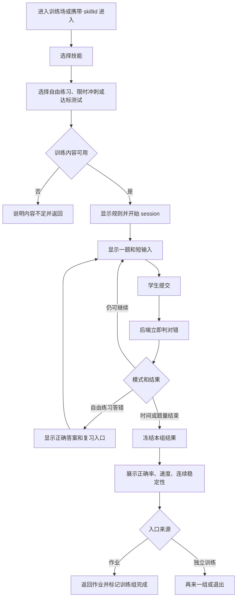

# PRD-03：基础技能训练场

## 文档状态

- 状态：Draft
- 优先级：P0
- 上位边界：[教师诊断驱动的复习、作业与训练系统](./README.md)
- 首批技能：分解质因数、最大公因数、最小公倍数

## 1. 产品定位

基础技能训练场训练的是一个可以快速调用的局部动作，而不是一道需要综合选法的完整问题。

每个训练项目必须同时满足：

1. 输入和答案足够短，可以连续快速作答；
2. 错误可以立即客观判定；
3. 连续题目训练同一动作。

## 2. 产品目标

- 学生能围绕单一技能进行低摩擦重复练习。
- 同时记录正确率、速度和连续稳定性。
- 支持从动作形成、速度提升到稳定达标的三个阶段。
- 与复习播放器、作业和教师状态共享同一个 `skill_id`。
- 系统自动判对错和达标，不解释深层错误原因。

## 3. 非目标

- 不训练长题阅读和综合选法。
- 不自动诊断学生为什么答错。
- 不把一次满分等同于稳定掌握。
- 不做学生之间的排行榜或公开排名。
- 不在学生请求时实时调用 AI 出题。

## 4. 首批技能范围

### 4.1 分解质因数

- 输入：一个在配置范围内的正整数。
- 输出：规范质因数分解式。
- 例：`60 = 2² × 3 × 5`。
- 判定：数学等价与格式归一化后判定，不依赖字符串完全一致。

### 4.2 最大公因数

- 输入：两个数或三个数。
- 输出：一个正整数。
- 可拆分的技能节点：
  - `gcf.two_numbers.basic`
  - `gcf.three_numbers.basic`
  - `gcf.coprime.judgment`

### 4.3 最小公倍数

- 输入：两个数或三个数。
- 输出：一个正整数。
- 可拆分的技能节点：
  - `lcm.two_numbers.basic`
  - `lcm.three_numbers.basic`

首版不把这些技能混在同一训练 session 中。

## 5. 入口与选择

训练可以从四个位置进入：

- 学生主动打开训练场；
- 从复习播放器携带 `skill_id` 进入；
- 从已签发作业中的限时训练组进入；
- 教师把某技能设为“当前加强”后安排训练。

学生主动进入时只看到可用训练项目、模式和自己的历史最佳，不看到 `teacher_status` 或教师备注。

## 6. 三种训练模式

### 6.1 自由练习

- 不限时；
- 单题提交后立即判定；
- 做错立即显示正确答案；
- 可以进入对应复习步骤；
- 不以达标作为结束条件，学生可随时结束。

适合动作刚形成时使用。

### 6.2 限时冲刺

- 可选 1、3 或 5 分钟；
- 记录完成数、正确数、正确率和平均正确用时；
- 只与学生自己的历史纪录比较；
- 结束后统一展示本组结果和错题，不展示同学排名。

适合已经基本正确、需要提高调用速度的技能。

### 6.3 达标测试

- 固定题量；
- 配置允许错误数和总时限；
- 示例规则：20 题、至少 18 题正确、4 分钟内完成；
- 单次达标只形成一次 `pass` 记录；
- 连续三次达标后形成 `stable_pass`，系统才建议降低训练频率。

系统生成的降低频率建议不得自动修改 `teacher_status`。

## 7. 学生流程



## 8. 训练页面结构

### 8.1 开始前

- 技能名称和一句动作说明；
- 模式选择；
- 题量或时长；
- 该模式的结果指标；
- “开始”主按钮。

### 8.2 训练中

- 顶部：技能名、进度；限时模式显示剩余时间。
- 中央：单个短题干，不同时展示下一题。
- 输入区：短答案输入和提交；数字技能默认自动聚焦。
- 反馈区：只显示客观对错、正确答案或下一题状态。
- 辅助入口：仅自由练习允许进入对应复习步骤。

### 8.3 训练结果

- 完成题数、正确数和正确率；
- 平均正确用时或中位正确用时；
- 本次是否达标；
- 当前连续达标次数；
- 与自己近期记录的变化；
- 再来一组、返回作业或退出。

结果页不得显示“你不理解……”“你已经掌握……”等诊断性结论。

## 9. 题目契约

```ts
type SkillDrillDefinition = {
  id: string;
  skillId: string;
  version: string;
  status: "draft" | "approved" | "retired";
  promptKind: "integer" | "integer_pair" | "integer_triple" | "short_expression";
  answerKind: "integer" | "boolean" | "factorization" | "short_expression";
  parameterConstraints: Record<string, unknown>;
  timeExpectationMs?: number;
  sourceRefs: string[];
};

type DrillItem = {
  itemId: string;
  definitionId: string;
  skillId: string;
  promptData: Record<string, unknown>;
  answerKey: Record<string, unknown>;
  sourceVersion: string;
};
```

要求：

- 训练题由已批准模板和受约束参数生成；
- 后端保存答案真值并判定；
- 前端只渲染题目、收集输入和展示后端结果；
- 同一 session 固定技能、模式、模板版本和判定规则。

## 10. 达标规则

```ts
type MasteryRule = {
  skillId: string;
  itemCount: number;
  minimumCorrect: number;
  maximumDurationMs: number;
  consecutivePassesRequired: number;
};
```

判定分三层：

1. 正确率：达到 `minimumCorrect / itemCount`。
2. 速度：在 `maximumDurationMs` 内完成。
3. 连续稳定性：连续 `consecutivePassesRequired` 次同时满足前两项。

只有三项同时满足才显示“连续达标”；该结果只影响系统训练频率建议，不直接修改教师状态。

一次未达标会把“连续达标次数”归零，但不会删除历史达标记录。

## 11. 客观事件与结果

```ts
type DrillAttemptEvent = {
  sessionId: string;
  itemId: string;
  skillId: string;
  attemptIndex: number;
  submittedAnswer: unknown;
  correct: boolean;
  elapsedMs: number;
  hintViewed: boolean;
  reviewOpened: boolean;
  occurredAt: string;
};

type DrillResult = {
  sessionId: string;
  skillId: string;
  mode: "free" | "sprint" | "mastery";
  completedCount: number;
  correctCount: number;
  accuracy: number;
  medianCorrectTimeMs?: number;
  passed?: boolean;
  consecutivePassCount?: number;
};
```

`recent_accuracy` 和 `recent_speed` 从这些不可变记录计算，不由前端写入。

## 12. 页面状态与恢复

| 状态 | 触发条件 | 页面表现 | 保留数据 | 可执行动作 |
| --- | --- | --- | --- | --- |
| 初始 | 进入技能 | 展示模式和规则 | 入口来源、skillId | 选择模式、开始 |
| 作答中 | 当前题未提交 | 单题和输入框 | session、题号、计时 | 输入、提交、结束自由练习 |
| 提交正确 | 后端判定正确 | 即时正确反馈后进入下一题 | 答案事件、用时 | 继续 |
| 提交错误 | 后端判定错误 | 保留错误输入；按模式展示反馈 | 错误事件、尝试次数 | 查看答案或继续 |
| 暂停不可用 | 页面失焦或设备休眠 | 限时模式继续使用服务端时间；提示状态 | 服务端开始时间 | 返回训练 |
| session 恢复 | 刷新或断网恢复 | 恢复剩余题量、服务端时间和已判定结果 | 已提交事件 | 继续或结束 |
| 训练完成 | 达到题量或时限 | 冻结结果并进入结果页 | 不可变 DrillResult | 再练、返回、退出 |
| 内容不足 | 无足够 approved 题目 | 不启动 session，说明原因 | 入口上下文 | 返回 |

限时 session 的权威时间来自服务端开始时间和截止时间，前端计时器只负责显示。

## 13. 输入、键盘与窄屏

- 进入新题后自动聚焦短答案输入框。
- Enter 提交，提交后不得重复创建两次事件。
- 数学表达式接受键盘可输入的等价格式，并在后端归一化。
- 320px 宽度下题目、输入和反馈保持单列，不出现横向滚动。
- 颜色不是唯一对错信号；反馈同时使用图标和文字。
- 计时结束时不吞掉已经在截止时间前到达服务端的答案。

## 14. 验收标准

1. 三个首批技能都能分别完成自由练习、1/3/5 分钟冲刺和达标测试。
2. 每个 session 只训练一个技能节点，题干和答案保持短小。
3. 自由练习答错后立即显示正确答案，并可进入关联复习。
4. 冲刺结果同时显示完成数、正确数、正确率和速度，只与本人历史比较。
5. 达标必须同时满足正确率、速度和连续稳定性；单次通过不显示稳定达标。
6. 刷新或断网后可以恢复，服务端时间和已提交判定不被前端重置。
7. 系统只展示客观结果和规则判定，不输出认知诊断，不修改教师状态。
8. 作业入口进入的训练完成后能返回原作业并记录训练组结果。

## 15. 待确认事项

- [ ] 限时冲刺答错后是否立即显示正确答案；当前草案建议只提示对错，整组结束后统一展示答案，避免打断节奏。
- [ ] 达标测试答题过程中是否隐藏逐题对错；当前草案建议提交后只确认已记录，结束后统一反馈。
- [ ] 分解质因数首版是否限制在 50 以内；当前草案把数值范围留给每个技能的已批准模板配置。
- [ ] 连续三次达标是否必须跨三个不同日期；当前草案只要求连续三个有效 session。
