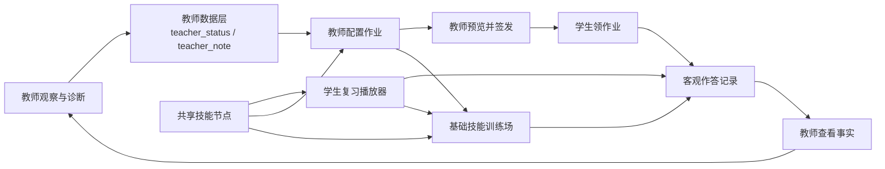

# 教师诊断驱动的复习、作业与训练系统

## 文档状态

- 状态：Draft
- 文档角色：三个学生可感知系统的共同产品边界
- 子 PRD：
  - [PRD-01：学生复习播放器](./PRD-01-review-player.md)
  - [PRD-02：教师配置作业／学生领作业](./PRD-02-homework-orchestration.md)
  - [PRD-03：基础技能训练场](./PRD-03-basic-skill-training.md)

## 1. 产品定义

教师负责判断学生哪里需要练，系统负责把这个判断变成可复习的步骤、结构化作业和可重复的基础训练。

产品严格收缩为三个学生可感知的系统，外加一个薄的教师数据层：

1. 学生复习播放器：把典型题的解题动作链重新播放出来。
2. 教师配置作业／学生领作业：教师输入诊断和内容约束，系统组装，教师最终签发。
3. 基础技能训练场：围绕一个狭窄动作进行短题、快速、重复训练。
4. 教师数据层：保存教师状态、教师备注和客观训练记录，不建立自动认知诊断模型。

## 2. 最高产品原则

### 2.1 教师诊断是权威输入

- 系统不得根据错题、用时或提示次数自动宣布学生“不理解”“遗忘”或“概念混乱”。
- 系统可以展示事实、计算复习间隔并给出到期提醒。
- `teacher_status` 与 `teacher_note` 只能由教师写入或修改。
- 学生行为可以触发“请教师查看”的提醒，但不能直接改变教师状态。

### 2.2 系统负责执行教学决定

教师选定主内容、需要加强的技能、旧知识复习范围和作业结构后，系统负责：

- 从已批准内容中选择或生成候选题；
- 安排顺序、题量和训练入口；
- 自动判定适合短答案判定的客观题；
- 保存学生作答事实；
- 按教师签发的版本向学生呈现。

### 2.3 三个系统共享技能节点

复习材料、完整作业题、错题变式和短技能训练都通过稳定的 `skill_id` 关联。例如：

```text
gcf.three_numbers.basic
```

同一技能可以同时关联：

- 一个典型题动作流程；
- 若干完整基础题和应用题；
- 若干训练场短题模板；
- 教师写入的当前状态与备注；
- 学生的客观练习记录。

## 3. 系统关系



箭头 `客观作答记录 → 教师查看事实 → 教师观察与诊断` 表示教师使用事实做判断；不表示系统从事实自动生成诊断。

## 4. 最小教师数据模型

每个“学生—技能节点”只保存以下核心字段：

```ts
type StudentSkillRecord = {
  studentId: string;
  skillId: string;
  teacherStatus:
    | "not_learned"
    | "learning"
    | "needs_reinforcement"
    | "mostly_stable"
    | "maintenance";
  teacherNote?: string;
  lastPracticedAt?: string;
  lastReviewedAt?: string;
  recentAccuracy?: number;
  recentSpeed?: number;
  hintCount: number;
  assignedReviewDate?: string;
  relatedWrongProblemIds: string[];
  updatedByTeacherAt?: string;
};
```

统计字段是客观记录的投影，不是认知结论。

## 5. 教师状态与系统行为

| 教师状态 | 学生可见文案 | 系统行为 |
| --- | --- | --- |
| 未学 | 不展示状态 | 不进入普通作业和训练推荐 |
| 正在学习 | 不展示状态 | 高频基础题，允许进入动作流程 |
| 需要加强 | 不展示状态 | 加入近期作业、错题变式和训练场 |
| 基本稳定 | 不展示状态 | 逐渐拉长复习间隔 |
| 定期保持 | 不展示状态 | 偶尔混入，不集中重复训练 |

系统可以提示“距上次练习 30 天”，但不得自行把“基本稳定”修改为其他状态。

## 6. 系统只记录的客观事实

所有学生系统统一记录：

- 是否正确；
- 用时；
- 是否查看提示；
- 是否查看解题步骤或完整解答；
- 第几次作答正确；
- 使用的题目、技能、模板和版本；
- session 是否完成、中断或恢复。

系统不得把这些事实改写成学生可见或教师可见的自动诊断结论。

## 7. 工程边界

### `teaching_skills`

负责教师侧内容生产：

- 提取标准动作链；
- 生成学生复习材料和规范书面解答；
- 根据技能和约束生成完整练习与短训练题；
- 生成 LaTeX、图形和题目资源；
- 保存题目、步骤与技能节点的对应关系；
- 校验并输出可审核、可追踪的内容包。

### `teaching-tools`

负责在线运行：

- 播放复习材料；
- 配置、签发、领取和提交作业；
- 执行提示、答案展示与自动判题；
- 执行计时训练和达标判定；
- 保存教师输入和学生客观记录；
- 向教师展示事实，不替教师下诊断结论。

在线学生请求只消费已批准内容，不直接调用 AI 生成临时题目。

## 8. MVP 顺序

1. 基础技能训练场：先支持分解质因数、最大公因数和最小公倍数。
2. 教师配置作业／学生领作业：先采用手动选技能、按数量组装和教师签发。
3. 学生复习播放器：接入已经审核的动作链、图形状态和规范解答。

## 9. 与现有主文档的关系

现有 `docs/01-product-spec.md` 把“教师后台”列为当前版本非目标，部分既有文档还允许运行时输出题型级诊断。本文提出的新边界与之不完全兼容。

在本文及三个子 PRD 获得明确确认前：

- 本组文档保持 Draft；
- 不修改现有产品代码和运行时契约；
- 不把旧文档中的范围声明视为已经被替换。

确认后需要单独执行一次文档对齐：回写产品范围、领域模型、API 契约、交互模型和实施计划，并明确区分“客观错误类型”与“教师诊断”。

## 10. 总体待确认事项

- [ ] 这组文档是否作为后续产品范围的权威来源，并据此替换“教师后台不在范围”的旧声明。
- [ ] MVP 是否只做单教师、固定学生名单，不在第一阶段建设班级、机构和权限体系。
- [ ] 在线系统是否始终只消费已批准题目；实时 AI 生成仅存在于教师侧内容生产链。
