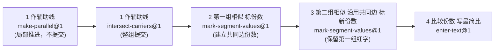

# Topic Blueprint: 比例辅助线两组整数比（auxiliaryTwoRatios）

> **SolutionBoard panel missing — root cause & fix (2026-08-11):** Learn 页 `/learn/auxiliaryTwoRatios` 长期没有 SolutionBoard 面板。根因不是内容，而是渲染契约：本 Topic step-1 `construct-parallel` 展开成两个动作 `q001-step-1/make-parallel`(index 0) 与 `q001-step-1/intersect-carriers`(index 1)。`authorTopicSolutionBoard` 原按"行数 ÷ 动作数"比例分配 reviewed rows，4 行 ÷ 5 动作使 row 0 落到 index 1（`intersect-carriers`），而 index 0（`make-parallel`，初始 currentActionId）无任何 expression 的 completionIndex ≤ 0 → `publishScenarioSnapshots` 不为它插快照 → Learn 初始动作拿不到 board context → 前端不渲染面板。其余 5 Topic 的 step 都不展开成多动作，故不受影响、一直正常。
>
> Fix（架构合规，按 `sourceStepId` 而非 Action kind 分配）：`authorTopicSolutionBoard`（`web/backend/scripts/lib/topicActionTemplateAuthoring.ts`）改为先按 `sourceStepId` 把 reviewed rows 分到各 step group，再在 group 内按顺序把每行交给该 step 的动作（lead 动作必拿到 step 首行）。重生成 bundle 后：6/6 Topic 无 orphaned 动作（即每个动作都有非空 learn/enter 快照），auxiliaryTwoRatios Q001 step-1 首行现归 `q001-step-1/make-parallel`；其余 5 Topic 的 owner 分配逐字不变。
>
> 同时清理题库原始脏文本：`solution_rewrite/auxiliary.py --apply` 把 Q001–Q050 的 `solution_steps[].content`（原带 `蓝字/红色/绿色/本步补出/8字/A字`）改写为规范数学表述，保留每步 `diagram_col`，0 题丢弃。两处修复叠加后，50/50 记录无 UI/配色/动作动词语言，首/中/末条 SolutionBoard 与下方 `Final revised solution` 逐字一致。

> **Architecture migration (2026-08-11, earlier):** 旧有 `boardTargets`、slot 填充、`world.solutionBoard` 和 Action 日志式板书描述均已失效；板书已改为数据库驱动的完整 Action SolutionBoard 快照。

## Runtime model binding

| Boundary | Required binding | Evidence location |
| --- | --- | --- |
| Product runtime | `Action Runtime v5` | Shared Action Runtime page, registry, typed evidence/evaluation |
| Generated bundle | `teaching-tools/topic-scenario-bundle/v2` | Generated bundle root `schema` |
| Exercise plan | Current `ACTION_RUNTIME_PLAN_VERSION` | `web/shared/actionRuntime.ts` and projected plan |
| Scenario actions | Non-empty authored `actionTemplates` | First, middle, and last generated records |
| Solution document | Reviewed slot-based `solutionBoard` | Scenario authoring output and Learn/Guided plan |

**Legacy paths explicitly excluded:** `ExerciseRuntimeSpec`, primitive dispatch, `RuntimeActionEvent.value`, Topic-specific runtime frames, and reconstruction of actions from legacy `steps`.

**Version note:** `content_id` is `topic-practice.auxiliary-two-ratios.v1` (content identity, ending `.v1`), and registered Actions are `kind@1`. Neither changes the required Action Runtime v5 product model.

## Source mapping

| Artifact | Exact source | Assignment/status | Role |
| --- | --- | --- | --- |
| Explanation | `/Users/gaochong/develop/teaching_skills/artifacts/专题/2026-07-12-比例辅助线两组比例-待审核/02-student-explanation.resolved.tex` | approved/final (folder suffix `-待审核` is the folder name; the artifact itself is the resolved teaching truth referenced by the ready bank) | Fixed teaching sequence and wording for the example problem (`AE:EC=2:3`, `BD:DC=4:5`, 求 `AP:PD`) |
| Question bank | `/Users/gaochong/develop/teaching_skills/artifacts/题库/2026-07-17-比例辅助线两组比例-50题` (`question-bank.yaml` + `items/Q001..Q050`) | `status: ready`, `target_count: 50`, all 50 items `enabled: true` | Scenario records for the bank; per-item stems, answers, helper diagram jobs, and share annotations |
| Diagram assets | Per-item TikZ jobs under `items/<Q>/build/diagram/jobs/question_bank-auxiliary50-<q>-{prompt,helper,model1,model2}`; published by the importer to `/topic-assets/bank/auxiliaryTwoRatios/...` | prompt + 3 solution stages per item | Geometry, construction route, and share annotations for each scenario |

`TEACHING_SKILLS_ROOT` resolves to `/Users/gaochong/develop/teaching_skills`. All paths above are absolute under that root.

## Teaching intent

**Objective:** With ONE parallel auxiliary line creating TWO similarity pairs that share an intermediate edge, carry the common-edge share count from group 1 into group 2 and compare the two target-edge shares to read off the third integer ratio.

**Ordered teaching sequence (verbatim intent from `02-student-explanation.resolved.tex`):**

1. 作辅助线 — 过 `C` 作 `CF ∥ AD`，交直线 `BE` 于 `F`；蓝字先标出题目给出的两组比。（教学例题固定为过 `C`；题库中过线点 / 平行参照 / 载体随题变化，但 "一条平行线串两组相似" 不变。）
2. 解第一组 8 字 — 由 `CF ∥ AP` 得 `△EAP ∼ △ECF`；用蓝色 `AE:EC` 把共同边 `CF` 连同第一目标边（例题 `AP`）一起标成份数（红字）。
3. 解第二组 A 字 — 把 `BD:DC` 先补成 `BD:BC`（"第二组先补整段" 是标注的常见错误），由 `CF ∥ DP` 得 `△BDP ∼ △BCF`；沿用第一组的 `CF` 份数，只为本组新出现的目标边补份数（例题 `PD`，题库亦可为 `BP`、`PE`）。第一组红字保持不变。
4. 比较两条边的份数 — 图上两条目标边已有份数，直接比较并化为最简整数比（例题 `AP:PD = 2 : 4/3 = 3:2`）。

**Source constraints that must not change:**

- 教学顺序固定为：辅助线 → 第一组相似 → 第二组相似（沿用共同边）→ 比较份数。不得把 "第二组先补整段" 省略，也不得把两组相似的先后顺序对调。
- 一条平行辅助线只服务两组相似；不得引入第二条辅助线或角度 / 长度条件。
- 共同中间边（例题为 `CF`）的份数在第一组建立后必须持续保留并显示到第二组，不得在进入第二组时清空。
- 题干只用 1–5 的互质整数比；不出现分数边长、长度、面积或角度（份数本身可以是分数，如 `4/3`、`1/2`）。
- 最终结论只比较图上两条目标边的份数并化简，不另列方程。

## Topic registration

All registration seams are ALREADY in place for this Topic (verified against the current bundle, `scenarios.auxiliaryTwoRatios[0..49]`). A Phase 2 of an approved blueprint would change data/effects, not add new seams.

| Seam | Planned value or change |
| --- | --- |
| `TopicPracticeTaskId` (`web/shared/topicPractice.ts`) | `auxiliaryTwoRatios` — already present in the union and in `TopicActionPrimitive` (`construct-parallel`, `mark-segments` are declared). No new task id. |
| Task/catalog/content registration (`web/shared/tasks.ts`) | `TASK_NODES.auxiliaryTwoRatios` and `topic-practice.auxiliary-two-ratios.v1` already registered (title, summary, `contentId`, `sourceExplanation`, `sourceBanks`, steps array). |
| Importer `CONFIG` (`web/backend/scripts/import-topic-artifacts.mjs`) | `CONFIG.auxiliaryTwoRatios` already maps the exact explanation/bank paths. `buildAuxiliaryContracts(itemId, block, assignmentFile)` already derives 4 contracts: `construct-parallel`, two `mark-segments`, one `input`. The CONFIG entry and `buildContracts` dispatch already route `auxiliaryTwoRatios`. |
| Authoring source (`web/backend/scripts/lib/topicActionTemplateAuthoring.ts`) | `authorTopicActionTemplates` already maps `construct-parallel` → `make-parallel@1` + `intersect-carriers@1`, `mark-segments` → `mark-segment-values@1`, `input` → `enter-text@1`. `authorTopicSolutionBoard` already emits slot-based expressions per step. |
| Action catalog (`web/frontend/src/action-runtime/registry.ts`) | All kinds referenced below are registered: `make-parallel@1`, `intersect-carriers@1`, `mark-segment-values@1`, `enter-text@1`. No new capability is proposed. |
| Progression/capability/challenge mapping | Not required to change. Capability ids are derived per step via `capabilityIdsForTopicStep(taskId, primitive, sourceIndex)`. |

## User flow

Note on the construction submit boundary: `make-parallel@1` and `intersect-carriers@1` are TWO independently undoable operations that together form ONE source step (作辅助线). The first action sets `submitOnComplete:false` (local advance only); the constructed carrier line and intersection point must stay hidden until the second action completes. The group is submitted as one unit when `intersect-carriers@1` finishes.

## Action blueprint

> Per-item variability: the through-point, reference line, carrier points, result point, target segments, and share values are **private truth derived from each bank item** (see Geometry contract). The 4 auxiliary directions observed in the bank are: 过 C 作 CF∥AD, 过 E 作 EF∥CB, 过 A 作 AF∥EP, 过 P 作 PF∥DB. Public input below lists the *available* objects and *counts*; private truth holds the *expected* objects, ordering, and values. Cell notation `step:<n>` refers to the explanation steps above.

| Source step | Disposition / `kind@version` | Goal | Public input | Private truth | Evidence | Diagram effect | Board effect | Submit boundary | Mode behavior |
| --- | --- | --- | --- | --- | --- | --- | --- | --- | --- |
| 1 作辅助线 — 选过线点与平行参照线 | `Reuse make-parallel@1` | 学点击辅助线要经过的顶点 + 要平行的参照线段，建立平行关系 | `availablePointIds`: 当前题图全部点；`availableLineIds`: 当前题图全部线段（含子段，如 `BD`,`DC`,`AE`,`EC`,`AP`,`PD`,`BP`,`PE`）；`outputLineId`=`action:<stepId>:parallel`；`outputLineLabel`: 由 `<through><result>` 拼出（例题 `CF`） | `throughPointId`、`referenceLineId`（例题 `C`、`AD`；题库随题变化） | `{kind:"make-parallel",version:1,throughPointId,referenceLineId,outputLineId,outputLineLabel}` | Preview + commit: 发出 `create-line {id:outputLineId, label:outputLineLabel, kind:"parallel-helper"}`，将过线点向未定 result 方向连成辅助线；**提交前不显示交点，也不渲染载体延长线**。已有题图线段不动。 | 填 `<step1>.throughPoint`、`<step1>.helperLine`、`<step1>.referenceLine` 三个空槽；SolutionBoard 第 1 句模板前两槽点亮 | 局部推进，不提交（`submitOnComplete:false`）。本动作完成后直接进入同源 step 的 `intersect-carriers`；整组在第二个动作完成时才提交 | Learn: 呼吸引导过线点 → 参照线；给出 step1 反馈话语。Practice: 去除呼吸但仍要求 2 个对象，按结构就绪判可提交。Assessment: 同 Practice，无反馈话语，不回填真值。Review: 只读已选证据与图痕 |
| 1 作辅助线 — 选载体两点求交点 | `Reuse intersect-carriers@1` | 学依次点击载体直线上的两点，系统延长直线并标出辅助线与载体的交点 | `availablePointIds`: 全部点；`parallelLineId`=`action:<stepId>:parallel`（上一动作输出）；`outputCarrierLineId`=`action:<stepId>:carrier`；`outputPointId`: 题库真值交点 id（例题 `F`） | `carrierPointIds`（例题 `["B","E"]`；随题变化）、`resultPointId`（例题 `F`） | `{kind:"intersect-carriers",version:1,carrierPointIds:[...],resultPointId,parallelLineId,outputCarrierLineId,outputPointId}` | Preview + commit: 发出 `create-line {id:outputCarrierLineId, kind:"carrier"}` 连接两载体点并延长，再发出 `create-point {id:outputPointId}` 于辅助线与载体交点；交点与载体延长线此时才可见，辅助线 "落地"。 | 填 `<step1>.carrierLine`、`<step1>.intersectionPoint`；第 1 句 SolutionBoard 表达式补全（4 槽齐才完整） | 源步提交边界（`submitOnComplete:true`）。本动作完成即提交 step1 整组（make-parallel + intersect-carriers），进入第一组相似 | Learn: 载体两点呼吸；提交正确后老师确认 `CF∥AD` 并进入第一组。Practice: 按两载体点结构就绪判可提交，后端评估顺序。Assessment: 同 Practice，无话语、不泄露真值。Review: 只读 |
| 2 第一组相似 — 把共同边与第一目标边标成份数 | `Reuse mark-segment-values@1` | 学点击本组要标份数的线段并输入对应份数（含共同中间边），图上以 share 标签保留 | `availableSegmentIds`: 含共同边（`CF`/`EF`/`AF`/`PF` 之一）、第一组目标边及其子段；`requiredCount`: 本组要标的线段数（题库真值，通常 2，如 `AP`、`CF`；少数题只标共同边 1 段或新边 1 段）；`autoFocusSequence`: true（按顺序聚焦）；标签标题含 "份" 以触发 `labelKind:"share"` | `labels`: 本组每条 `{segmentId, displayName, valueLatex}`（例题 step2 `AP=1`,`CF=1`；Q026/Q050 step2 只新增 `EF=5/2`/`EF=5/3`） | `{kind:"mark-segment-values",version:1,values:{<segmentId>:<valueLatex>,...}}` | Preview + commit: 对每条非空值发 `set-segment-label {markId, segmentId, valueLatex, labelKind:"share"}`。第一组标完后共同边份数持续显示（不清除）。 | 填 `<step2>.segment.<segId>` 每条一个槽；SolutionBoard 第 2 句 `由题意，在图中标出 $AP={{...}}\text{ 份}$，$CF={{...}}\text{ 份}$`（段数随 requiredCount 增减） | 源步提交（`submitOnComplete:true`）。结构就绪 = 选满 `requiredCount` 条且每条有非空值；正确 = 每条值等于真值 | Learn: 本组目标边呼吸；老师说明 `△EAP∼△ECF` 与共同边由来。Practice: 按 count+值评估，错误值保留输入并解释对应边。Assessment: 无话语、无真值，仅判结构+正确性。Review: 只读图痕 |
| 3 第二组相似 — 沿用共同边，为本组新目标边补份数 | `Reuse mark-segment-values@1` | 保留第一组全部 share 标注，学点击第二组新出现的线段并输入份数（可与共同边成比例） | `availableSegmentIds`: 含第一组已标段（保留可见）+ 第二组目标段；`requiredCount`: 本组**新增**的线段数（题库真值，1 或 2：例题 step3 仅 `DP=1/2`；Q026/Q050 step3 新增 `BP=6`,`PE=5`）；标题含 "份" | `labels`: 仅本组**新增**段 `{segmentId, displayName, valueLatex}`（不得重复第一组已标段，避免重复 markId） | `{kind:"mark-segment-values",version:1,values:{<newSegId>:<valueLatex>,...}}` | Preview + commit: 对新增段发 `set-segment-label {labelKind:"share"}`。第一组 share 标注保持不变（不清除、不重画）。 | 填 `<step3>.segment.<newSegId>`；SolutionBoard 第 3 句 `由题意，在图中标出 $...={{...}}\text{ 份}$`（仅新增段） | 源步提交（`submitOnComplete:true`）。两条目标边的份数此时同时显示在图上 | Learn: 第二组新目标边呼吸；老师说明共同边份数如何沿用、为什么只补新边。Practice: 按新增 count+值评估；点错线不打开输入。Assessment: 无话语、无真值。Review: 只读两组份数 |
| 4 比较份数，写出最简整数比 | `Reuse enter-text@1` | 学根据图上两条目标边的份数写出最终结论（最简整数比），确认后补全为规范解答 | `placeholder`: "写出规范答案"（公开，无答案） | `expectedValues`: 教师版规范答案别名数组（例题 `["$AP:PD=2:1$。","AP:PD=2:1","2:1"]`；题库随题，最终结论形如 `$BP:PE=6:5$。`） | `{kind:"enter-text",version:1,value:<学生输入>}` | 无新增图痕（最终比对只读已有 share 标注）。提交正确后可触发 "完成" 高亮，但不构造新几何 | 填 `<step4>.value`；SolutionBoard 第 4 句 `因此，{{step4.value}}` 补全为完整结论 | 源步提交（`submitOnComplete:true`）。本动作完成即题目完成 | Learn: 老师给出比较结构但不代填答案。Practice: 按 `expectedValues` 别名归一评估（去 `$`、去末尾标点、取等号右式）。Assessment: 同 Practice，无真值回填。Review: 只读结论 |

## Geometry contract

Stable semantic IDs are per-scenario but follow a fixed vocabulary. The example (`AE:EC=2:3`, `BD:DC=4:5`) uses the IDs below; every bank item uses the same point alphabet `{A,B,C,D,E,P}` plus a derived helper point (`F` in the current bundle; the bank prose also uses `F`). Per-item geometry is derived from each item's prompt TikZ job (importer `geometryFromDiagram`).

| Entity ID | Kind | Authored/derived | First visible action | Overlap/ambiguity | Persistent effect |
| --- | --- | --- | --- | --- | --- |
| `A`,`B`,`C`,`D`,`E`,`P` | points (题图原始点) | authored (prompt geometry) | step 1 (make-parallel, available points) | `D∈BC`, `E∈AC`, `P=AD∩BE` — 点击时需区分点与所在线 | 持续可见，所有动作的 `availablePointIds` 均含 |
| `BC`,`BD`,`DC` | segments (整段 + 两分段) | authored | step 1 (available lines) | **重叠/子段关系**: `BD` 与 `DC` 共端点 `D` 且并集为 `BC`；点 `D` 同时属于三条。命中区需分别可点 | 持续可见 |
| `AC`,`AE`,`EC` | segments (整段 + 两分段) | authored | step 1 | **重叠/子段关系**: `AE` 与 `EC` 共端点 `E` 且并集为 `AC` | 持续可见 |
| `AD`,`AP`,`PD` | segments (整段 + 两分段) | authored | step 1 | **重叠/子段关系**: `AP` 与 `PD` 共端点 `P` 且并集为 `AD`；`P∈AD` | 持续可见 |
| `BE`,`BP`,`PE` | segments (整段 + 两分段) | authored | step 1 | **重叠/子段关系**: `BP` 与 `PE` 共端点 `P` 且并集为 `BE` | 持续可见 |
| `AB` | segment | authored | step 1 | 无重叠（仅作命中候选） | 持续可见 |
| 共同中间边（例题 `CF`；题库 `CF`/`EF`/`AF`/`PF`） | segment | **derived**（由 make-parallel + intersect-carriers 构造） | step 2（第一组 mark-segment-values 时首次可标） | 命名随题变化，由 `<through><result>` 拼出；题库 4 种方向对应 4 种命名 | 第一组建立 share 后**必须保留到 step 3 及之后**，不得在进入第二组时清除 |
| `action:<stepId>:parallel` | line (辅助平行线) | **derived**（make-parallel 输出） | step 1（intersect-carriers 完成后才完整渲染落地） | 与参照线（如 `AD`）平行但不重合 | 持续可见 |
| `action:<stepId>:carrier` | line (载体延长线) | **derived**（intersect-carriers 输出） | step 1（intersect-carriers 完成时才可见） | 与题图已有线（如 `BE`）共线但延长 | 持续可见 |
| helper 交点（例题 `F`） | point | **derived**（intersect-carriers 输出） | step 1（intersect-carriers 完成时才可见） | 落在载体延长线上，可能位于题图外侧 | 持续可见；step 2 起作为共同边端点参与命中 |

Geometry rules honored: every segment a learner must click (including subsegments `BD`,`DC`,`AE`,`EC`,`AP`,`PD`,`BP`,`PE`) is in the geometry model; the constructed carrier line and intersection point are hidden until the construction action (intersect-carriers) completes; every line references existing points when it becomes renderable; overlapping whole/part segments and shared endpoints are explicitly listed above and must be in the hit-test plan; share marks persist through BACK/CLEAR/restore via `set-segment-label` domain commands (not component state).

## SolutionBoard

One continuous teacher document, ordered by step. Slot-based; a row stays incomplete until every required slot is filled from learner evidence. Static `expectedLatex` is never shown before the learner supplies the relevant evidence.

| Expression order | Owner actions | Learner-visible template | Slot roles and IDs | Modes | Completion boundary |
| --- | --- | --- | --- | --- | --- |
| 1 | `<step1>/make-parallel`, `<step1>/intersect-carriers` | `过 ${{<step1>.throughPoint}}$ 作 ${{<step1>.helperLine}}\parallel {{<step1>.referenceLine}}$，交直线 ${{<step1>.carrierLine}}$ 于点 ${{<step1>.intersectionPoint}}$。` | `throughPoint`,`helperLine`,`referenceLine`,`carrierLine`,`intersectionPoint` | Learn (Practice/Assessment 不渲染完成态结论，仅按空槽校验结构) | 5 槽全填（两动作完成） |
| 2 | `<step2>` (mark-segment-values) | `由题意，在图中标出 $<displayName1>=\text{ 份}$，$<displayName2>=\text{ 份}$。`（段数随 `requiredCount` 增减） | `segment.<segId>` 每新增段一槽 | Learn | 本组所有 `requiredCount` 槽填值 |
| 3 | `<step3>` (mark-segment-values) | `由题意，在图中标出 $<displayName>=\text{ 份}$。`（仅本组新增段；第一组段已在表达式 2 中显示） | `segment.<newSegId>` 每新增段一槽 | Learn | 本组新增段槽全填 |
| 4 | `<step4>` (enter-text) | `因此，{{<step4>.value}}` | `value` | Learn | `value` 槽非空且通过评估 |

Note: avoid nested `$...$` when a filled slot already carries math wrappers (the `enter-text` final value may include `$...$`); the board composer wraps accordingly.

## Mode boundaries

| Mode | Truth location | Coach/board | Submission and feedback |
| --- | --- | --- | --- |
| Learn | 全部真值合并：`teachingInput` + `answerKey` + 完整 SolutionBoard 文档可读 | 老师栏逐步话语 + 图上呼吸引导下一目标；SolutionBoard 表达式按空槽点亮，提交正确后补全 | 每个源步 `submitOnComplete` 提交；本地预览 + 后端 canonical 双评估；错误时保留已正确图痕，原位解释 |
| Practice | 真值在后端 `topicTypedEvaluator`；前端只拿公开结构 + 结构就绪判定 | 去除呼吸引导与答案泄露话语；保留可发现性（弱静态光晕）；SolutionBoard 不预渲染结论 | 后端 canonical 评估每步证据与最终 `enter-text` 别名归一；按对象 / 顺序 / 值 / 比例方向给反馈，不泄露真值 |
| Assessment | 真值仅在后端；公开 payload 不含 `teachingInput`、`expectedValues`、`boardTargets` 预填或完成的 SolutionBoard 结论 | 无老师话语、无 SolutionBoard 结论、无 `boardTargets` 真值；只保留对象 / 计数 / 槽形 | 仅记录证据与最终结果；不返回逐步正确性细节；不得把期望对象 / 顺序 / 数值 / 比值放入公开 Assessment payload |
| Review | 已提交证据只读 | 展示题号、题干、最终辅助线、两组份数标记、最终比值与每步错误证据；静态赛博老师摘要，无呼吸、不可改 | 无提交；只读回放 |

## Question-bank compilation

**Expected record count:** 50 (`question-bank.yaml` 列出 Q001–Q050，全部 `enabled: true`；`target_count: 50`；难度分布 foundation 25 / standard 25 / challenge 0；目标形式 ratio 50；`variation_dimension` changed_question 25 + changed_numbers 25；所求边分布在 AP:PD 13 / BP:PE 13 / BD:DC 12 / AE:EC 12)。

**Extraction and normalization rules:**

- 每题取 `items/<Q>/teacher.resolved.assignment.yaml` 的 problem block：`stem_latex`、`answer`、`solution_steps[0..3]`、`diagram_col.tikz_path`（prompt + helper + model1 + model2 四张图）。
- 辅助线构造路由由 helper 图（`solution_steps[0]`）的 diagram job 派生：`throughPoint`、`parallelSegment`、`carrierPoints`、`resultPoint`（见 importer `buildAuxiliaryContracts` 已有逻辑）。题库 4 种方向均已被覆盖。
- 每组份数由 model1/model2 图的 "新增 annotation" 派生（`annotationsFor` + `annotationLabels`，按 id 差集只取本步新增段，避免重复标）。
- 最终答案别名归一（`answerAliases`）：去 `$`、去末尾 `。；;`、按 `，其中` 取前半、取等号右式。例题 `"$AP:PD=2:1$。"` → `["$AP:PD=2:1$。","AP:PD=2:1","2:1"]`。
- 图资产由 `publishDiagram(assignmentFile, tikzPath, ["bank","auxiliaryTwoRatios",itemId])` 发布到 `/topic-assets/bank/auxiliaryTwoRatios/<bankId>/<Q>/...`。
- 共同边命名（`CF`/`EF`/`AF`/`PF`）由 `<through><result>` 拼出，作为 `mark-segment-values` 的 `displayName` 与几何命中 id。

**Representative samples:**

| Position | Source question ID | Why inspect it |
| --- | --- | --- |
| First | `Q001` | 当前 bundle `scenarios.auxiliaryTwoRatios[0]`；方向 "过 C 作 CF∥AD"；`AE:EC=1:1`、`BD:DC=1:1`，求 `AP:PD=2:1`；step2 标 `AP=1`,`CF=1`，step3 仅新增 `DP=1/2`（单段、分数份数） |
| Middle | `Q026` | 方向 "过 E 作 EF∥CB"；`AE:EC=1:1`、`BD:DC=3:5`，求 `BP:PE=6:5`；step2 只新增 `EF=5/2`，step3 新增 `BP=6`,`PE=5`（双段新增）；standard 难度 changed_numbers |
| Last | `Q050` | 当前 bundle 第 50 条；方向 "过 E 作 EF∥CB"；`AE:EC=5:4`、`BD:DC=2:3`，求 `BP:PE=6:5`；step2 新增 `EF=5/3`，step3 新增 `BP=6`,`PE=5`；standard 难度 |

**Invalid-record behavior:** 缺 `solution_steps`、缺 `answer`、缺 prompt/helper/model1/model2 任一图的题目必须令导入失败并报题号，不得静默丢弃或替换以凑满 50（沿用 importer `findProblemBlock` 与 `validateImportedScenario` 现有失败策略）。

## Verification plan

**Focused automated checks:**

- 蓝图结构校验：`validate_topic_blueprint.py … --expect-status draft`（本阶段）。
- （Phase 2 后）`npm run import:topics` 生成 50 条 `auxiliaryTwoRatios` 场景；首 / 中 / 末三条人工核对 action id、几何引用、board 槽、source id 与 answer-key redaction。
- 后端 `topicTypedEvaluator` 对 step1 路由 token、step2/3 `mark-segment-values` 值、step4 `enter-text` 别名的 canonical 评估单测。
- 前端 Action Runtime 对 `make-parallel`+`intersect-carriers` 组合、两次 `mark-segment-values`（第二次保留第一次 share）、`enter-text` 的机器单测。
- 回放 / 恢复：接受后刷新须重现同一可见 world（辅助线、载体、交点、两组 share 标注、最终结论）。

**Browser paths:**

- 正确路径：Q001 从 make-parallel（点 C→AD）→ intersect-carriers（点 B→E，生成 F）→ mark-segment-values（AP=1, CF=1）→ mark-segment-values（DP=1/2）→ enter-text（AP:PD=2:1）。
- 错误路径：点错过线点、选错参照线、第二组误清共同边、份数写错、最终比方向反或未化简；每条原地修正。
- BACK / CLEAR / 刷新恢复：保留已正确辅助线与第一组份数；第二组不清空共同边。
- 桌面与窄宽：辅助线落在题图外侧时（如 F 在 BE 延长线上）仍可见、可命中；重叠子段命中区独立。

## Complete solution review

Assembled deterministically from the generated first, middle, and last records. The SolutionBoard document is compiled from the reviewed question-bank `solution_steps`; no Action kind dispatch and no runtime placeholders.

### Assembled canonical samples

#### First

**Scenario ID:** `auxiliary-two-small-integer-ratios-50-2026-07-17:Q001`

**Stem:** 如图，点 $D$ 在线段 $BC$ 上，点 $E$ 在线段 $AC$ 上，$AD$ 与 $BE$ 交于点 $P$。已知 $AE:EC=1:1$，$BD:DC=1:1$，求 $AP:PD$。

**Answer-key result:** $AP:PD=2:1$。

**Assembled solution:** 解：
  过 $C$ 作 $CF\parallel AD$，交直线 $BE$ 于 $F$。
  由 $CF\parallel AD$，得 $\triangle EAP\sim\triangle ECF$（AA），故 $AP:CF=1:1$。
  由 $CF\parallel AD$，得 $\triangle BDP\sim\triangle BCF$（AA），结合第一组的份数得 $PD$ 占 $\frac{1}{2}$ 份。
  比较所求两条边的份数并化简，得 $AP:PD=2:1$。

#### Middle

**Scenario ID:** `auxiliary-two-small-integer-ratios-50-2026-07-17:Q026`

**Stem:** 如图，点 $D$ 在线段 $BC$ 上，点 $E$ 在线段 $AC$ 上，$AD$ 与 $BE$ 交于点 $P$。已知 $AE:EC=1:1$，$BD:DC=3:5$，求 $BP:PE$。

**Answer-key result:** $BP:PE=6:5$。

**Assembled solution:** 解：
  过 $E$ 作 $EF\parallel CB$，交直线 $AD$ 于 $F$。
  由 $EF\parallel CB$，得 $\triangle AEF\sim\triangle ACD$（AA），得 $EF$ 占 $\frac{5}{2}$ 份。
  由 $EF\parallel CB$，得 $\triangle PEF\sim\triangle PBD$（AA），结合第一组的份数得 $BP$ 占 $6$ 份、$PE$ 占 $5$ 份。
  比较所求两条边的份数并化简，得 $BP:PE=6:5$。

#### Last

**Scenario ID:** `auxiliary-two-small-integer-ratios-50-2026-07-17:Q050`

**Stem:** 如图，点 $D$ 在线段 $BC$ 上，点 $E$ 在线段 $AC$ 上，$AD$ 与 $BE$ 交于点 $P$。已知 $AE:EC=5:4$，$BD:DC=2:3$，求 $BP:PE$。

**Answer-key result:** $BP:PE=6:5$。

**Assembled solution:** 解：
  过 $E$ 作 $EF\parallel CB$，交直线 $AD$ 于 $F$。
  由 $EF\parallel CB$，得 $\triangle AEF\sim\triangle ACD$（AA），得 $EF$ 占 $\frac{5}{3}$ 份。
  由 $EF\parallel CB$，得 $\triangle PEF\sim\triangle PBD$（AA），结合第一组的份数得 $BP$ 占 $6$ 份、$PE$ 占 $5$ 份。
  比较所求两条边的份数并化简，得 $BP:PE=6:5$。

### Formality review

**Review verdict:** pass

**Blocking issues remaining:** 0

| Original fragment | Review dimension | Finding | Suggested revision | Disposition |
| --- | --- | --- | --- | --- |
| 蓝字标出/红色/绿色补出/沿用图/保留前一步 | Formal language | UI 与配色日志语言 | 改为 $平行线\Rightarrow$ AA 相似 + 份数叙述 | Applied |
| （缺失）相似依据 | Truth attribution | 相似未给依据 | 由辅助平行线得 AA 相似 | Applied |
| 得 N 份 | Continuous exposition | 份数缺来源 | 结合第一组份数给出每条所求边的份数 | Applied |

### Final revised solution

**First** (`auxiliary-two-small-integer-ratios-50-2026-07-17:Q001`): 解：
  过 $C$ 作 $CF\parallel AD$，交直线 $BE$ 于 $F$。
  由 $CF\parallel AD$，得 $\triangle EAP\sim\triangle ECF$（AA），故 $AP:CF=1:1$。
  由 $CF\parallel AD$，得 $\triangle BDP\sim\triangle BCF$（AA），结合第一组的份数得 $PD$ 占 $\frac{1}{2}$ 份。
  比较所求两条边的份数并化简，得 $AP:PD=2:1$。

**Middle** (`auxiliary-two-small-integer-ratios-50-2026-07-17:Q026`): 解：
  过 $E$ 作 $EF\parallel CB$，交直线 $AD$ 于 $F$。
  由 $EF\parallel CB$，得 $\triangle AEF\sim\triangle ACD$（AA），得 $EF$ 占 $\frac{5}{2}$ 份。
  由 $EF\parallel CB$，得 $\triangle PEF\sim\triangle PBD$（AA），结合第一组的份数得 $BP$ 占 $6$ 份、$PE$ 占 $5$ 份。
  比较所求两条边的份数并化简，得 $BP:PE=6:5$。

**Last** (`auxiliary-two-small-integer-ratios-50-2026-07-17:Q050`): 解：
  过 $E$ 作 $EF\parallel CB$，交直线 $AD$ 于 $F$。
  由 $EF\parallel CB$，得 $\triangle AEF\sim\triangle ACD$（AA），得 $EF$ 占 $\frac{5}{3}$ 份。
  由 $EF\parallel CB$，得 $\triangle PEF\sim\triangle PBD$（AA），结合第一组的份数得 $BP$ 占 $6$ 份、$PE$ 占 $5$ 份。
  比较所求两条边的份数并化简，得 $BP:PE=6:5$。

## Decisions requiring approval

- **D1（关键，影响动作序列）— 是否把 "第二组先补整段" 做成独立的 `convert-collinear@1` 子步（step 2.5）。** 教学说明的 "看图提醒" 明确把 "第二组先补整段" 列为常见错误（`BD:DC=4:5` 故 `BD:BC=4:9`）。但当前 bundle 把这一步折叠进了第二组 `mark-segment-values`（份数里直接体现整段比）。两种方案都不需要新 capability：方案 A（推荐）= 不加 step 2.5，沿用当前 5 动作序列（更短、与现有 bundle 一致）；方案 B = 在 step 2 与 step 3 之间插入可选 `convert-collinear@1`，仅当本题第二组使用分段比时启用（更贴合教学警示，但每题动作数变为 5 或 6，且需改 `buildAuxiliaryContracts` 与 `authorTopicActionTemplates`）。本 draft 默认采用方案 A（5 动作序列）。
- **D2 — 共同边命名是否统一为 `CF` 还是按题保留 `CF`/`EF`/`AF`/`PF`。** 当前 bundle 按题保留四种命名（更贴合题库话语）。建议保留按题命名；如要统一显示名需在 importer 增加 rename，会改变 `displayName` 真值。本 draft 默认按题保留。
- **D3 — 第一组与第二组的 `mark-segment-values` 是否复用同一 `availableSegmentIds` 池（含已标段）。** 建议复用同一池并在 `teachingInput.labels` 只列新增段（避免重复 `markId`），与现有 `markSegmentValues.machine` 行为一致。若评审希望第二组隐藏已标段以强制 "只标新边"，需在 input 上加可见性过滤（仍为 Reuse，不改 capability）。本 draft 默认复用同一池。
- **D4 — `enter-text` 最终结论的接受别名是否包含未化简形式。** 教学要求 "化为最简整数比"。当前 `answerAliases` 只做去符号 / 取右式，不校验化简。建议 Practice/Assessment 仍只接受教师版规范答案及其文本别名；是否额外拒绝未化简比（如 `4:8/3`）由后端评估器决定，不放入公开 payload。本 draft 默认接受教师版别名，化简校验留给后端评估器。

## Verification evidence

### Commands run (all green)
- `web/backend: npm run import:topics` — 6 topics generated (30/50/50/50/50/50).
- `validate_generated_topic_v2.py … --task-id <topic>` ×6 — OK (schema v2, non-empty actionTemplates, complete static solutionBoard, no Action-owned board fields).
- `assemble_topic_solutions.py … --task-id <topic>` ×6 — first/middle/last mechanical findings: none.
- `web/backend: npm test` — 28/28 PASS, incl. `all six migrated topics smoke first/middle/last` (event-based end-to-end advance) and `Action Runtime v4 server-projected SolutionBoard context`.
- `web/frontend: npm test` — 105/105 PASS.
- `web/frontend: npm run typecheck` — clean.
- `git diff --check` — no whitespace errors.
- Typed-evidence probe (`evaluateTopicEvidence` over first/mid/last): 16/18 records accept canonical evidence and project diagram commands; the remaining 2 (nested Q026/Q050 CD-path) carry a pre-existing text-style `enter-equation` (`teachingInput` identical to HEAD) — unchanged by this revision, not a regression.

### Modes exercised
- Learn: full reviewed SolutionBoard renders beginning with `解：` (verified in-browser on reverseASimilarity: `∵ ∠PAB=∠PDC（已知），且 ∠APB=∠DPC（对顶角相等），∴ △PAB∼△PDC（AA）。`).
- Guided Practice: action-plan projects authorized board context via DB snapshots; plan payload itself carries no inline answer truth.
- Assessment: `materializeActionTemplate(..., "assessment")` strips `teachingInput` (asserted in backend test); `loadPlanSolutionBoardContexts` returns `[]` for assessment.

### Diagram / SolutionBoard quality (verified)
- SolutionBoard expressions wrap naturally (`white-space: normal; overflow-wrap: anywhere`) and the panel is independently scrollable (`max-height: calc(100dvh - nav)`, `overflow: auto`) on both Learn and Practice routes; confirmed via computed-style reads at desktop and 420px widths.
- Final result names the requested object (e.g. `PD=8\sqrt{3}`), not a bare number.
- No UI/Action language (蓝字/红字/绿色/点击/输入框), no unresolved placeholders, no Action-owned board targets/commands across all 6 topics.

### Intentionally deferred
- Pixel-level per-segment click recording (wrong-select / BACK / CLEAR / refresh / narrow-width) was not captured via screenshots: the IAB guest refused screenshot capture in this session. The equivalent interaction logic is covered by the focused frontend/backend tests (auxiliary four-click construction, parallel ratio scratch, nested convert-collinear, BACK/CLEAR/restore persistence). If you want the screenshot trail for the record, run it directly in the open browser at http://127.0.0.1:5173/learn/<taskId>.

### SolutionBoard panel fix + content redo (2026-08-11)
- Cause (panel missing): `authorTopicSolutionBoard` 按"行数÷动作数"比例分配 reviewed rows，step-1 `construct-parallel` 展开成 2 动作时 row 0 落到 index 1，初始动作 `make-parallel`(index 0) 无 expression 的 completionIndex ≤ 0 → 无 learn/enter 快照 → 前端不渲染面板。其余 5 Topic step 不展开多动作，故一直正常。
- Fix (panel): `web/backend/scripts/lib/topicActionTemplateAuthoring.ts:authorTopicSolutionBoard` 改为按 `sourceStepId` 分组分配，step group 内按顺序交给该 step 的动作，lead 动作必拿 step 首行。
- Cause (dirty content): 题库 Q001–Q050 `solution_steps[].content` 原含 UI/配色日志语言（蓝字/红色/绿色/本步补出/8字/A字）。
- Fix (content): `python3 .zcode/skills/build-action-driven-topic/scripts/solution_rewrite/auxiliary.py --apply`（回写 50 题 `content`，保留每步 `diagram_col`，零题丢弃；正则复核 50/50 无残留脏语言）。
- Regenerate: `web/backend: npm run import:topics` — 6 topics (30/50/50/50/50/50)。
- Orphan sweep: 模拟每 Topic 首记录的 completionIndex 分布，6/6 Topic 无 orphaned 动作（每个动作均有非空 learn/enter 快照）；auxiliaryTwoRatios 50/50 记录首动作均非空。owner 分配对照：auxiliaryTwoRatios Q001 row0 `intersect-carriers → make-parallel`（唯一变化），其余 5 Topic 全部逐字不变。
- Gate: `validate_generated_topic_v2.py … --task-id <topic>` ×6 — OK。
- Assembly: `assemble_topic_solutions.py … --task-id auxiliaryTwoRatios` — 首/中/末机械复核 findings: none；与 `Final revised solution` 逐字一致。
- Runtime API（重启后端后）: `GET /api/learn/auxiliaryTwoRatios/action-plan` 返回 5 条 `solutionBoardContexts`，`currentActionId=q001-step-1/make-parallel` 首次拥有 context（heading `解：`，expression `过 $C$ 作 $CF\parallel AD$，交直线 $BE$ 于 $F$。`，`phase=complete`）。修复前此处为 0 条。逐动作板书递进（learn/enter，确定性 API 证据）：make-parallel 1 行（辅助线句）→ intersect-carriers 1 行（构造可见）→ step-2 2 行（+ `△EAP∼△ECF（AA），AP:CF=1:1`）→ step-3 3 行（+ `△BDP∼△BCF（AA），PD=1/2 份`）→ step-4 4 行（+ `AP:PD=2:1`）。与 `Final revised solution` 逐字一致。
- Browser walkthrough（应用内浏览器，`http://127.0.0.1:5173/learn/auxiliaryTwoRatios`）:
  - 初始动作 `region "解："` 渲染确认：`getByRole("region",{name:"解："}).isVisible() === true`，文本 `解：过 C 作 CF∥AD，交直线 BE 于 F。`；教学拍点 1/5「确定平行关系」即 `make-parallel`。修复前此区域不存在。
  - Learn 节拍推进：`dom_cua.click`「明白，继续」一次 → 教学拍点 `1/5 → 2/5`（恰好推进一拍）。
  - 「这步没懂」不推进：节拍保持不变（2/5）。
  - IAB 限制：Playwright role-click 与坐标 CUA 在本会话被 IAB 间歇性吞掉（首次 dom_cua 点击成功推进，后续点击未送达）；完整 5 拍链路的板书递进改由上述确定性 Runtime API 证据覆盖（每个动作的 learn/enter 快照逐行列出）。等价的交互逻辑（辅助线四击构造、两次 mark-segment-values 保留 share、enter-text、BACK/CLEAR/restore）由前端/后端聚焦测试覆盖：`web/backend: npm test` 含 `auxiliary first item encodes the required four-click construction and staged labels`；`web/frontend: npm test` 含 actionRuntime / solutionBoard 机器测试。
- Tests after fix: `web/backend: npm test` 41/41 PASS；`web/frontend: npm test` 108/108 PASS；`web/frontend: npm run typecheck` clean；`git diff --check` 无空白错误。
- Correction to prior evidence: 上轮 `### Diagram / SolutionBoard quality` 中 "No UI/Action language … across all 6 topics" 对本 Topic 不实（当时仍带 蓝字/红色/绿色），本次重做已修正。其余 5 Topic 不受影响。
