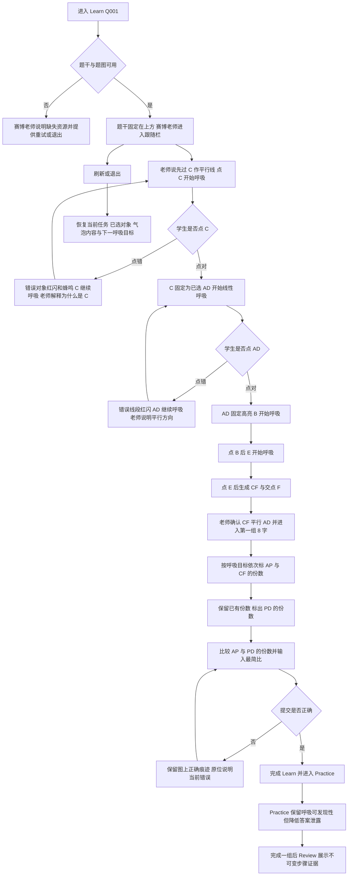

# 专题体验规格：比例辅助线两组比例

本轮在不改变 explanation 教学顺序的前提下，修正共享 `topic-practice` 学习壳的视觉比例、老师存在感、滚动跟随与交互可发现性。共享壳规则应复用于其他专题；本专题 Q001 作为“点—线—点—点”连续操作的首个验收场景。

## 内容来源

- explanation 的顺序固定为：过 `C` 作 `CF∥AD`，解第一组 8 字得到 `AP:CF`，保留共同边份数解第二组 A 字得到 `PD` 份数，最后比较 `AP:PD`。
- ready 题库含启用的 `Q001–Q050`。本轮以 `Q001` 验收：`AE:EC=1:1`、`BD:DC=1:1`，求 `AP:PD`；来源为 `/Users/gaochong/develop/teaching_skills/artifacts/题库/2026-07-17-比例辅助线两组比例-50题/items/Q001/teacher.resolved.assignment.yaml`。
- Q001 的辅助线动作真值为：先选过线点 `C`，再选平行参照边 `AD`，再依次选直线 `BE` 上的 `B`、`E`，生成 `CF∥AD` 且 `F` 在 `BE` 的延长线上。
- 当前页面在任务 1 使用了“第一组标共同边；第二组保留这些份数……”作为入口话语，但该内容属于后续步骤，不能指导当前的辅助线交互；本轮必须为每个局部动作提供与 explanation 对齐的老师话语和目标对象。

## 用户流程图

## 页面结构

### Learn

- 顶部题干使用紧凑单行或自然换行，不与老师栏争夺纵向空间。
- 桌面端主体采用约 `68% : 32%` 的“数学操作区 : 老师跟随栏”。老师栏宽度不小于 `360px`，不大于 `420px`；题图根据构型留白自适应，最大高度约为可视区的 `58%–62%`，不得把当前操作区推到首屏之外。
- 题图不再以“能放多大就放多大”为目标。点名、线段和当前呼吸目标清楚可辨即可；Q001 在常见桌面视口中应同时看见完整题图、赛博老师和当前操作入口。
- 老师栏由“老师身份 + 当前任务 + 单一话语气泡”组成。内层老师单元使用 `position: sticky`，顶部位于全局导航下方 `16px`，跟随滚动直到当前题目结束；不能把带 `grid-row` 的外层栏本身当作唯一 sticky 元素。
- 老师栏始终保留稳定占位。页面滚动、气泡内容更新或任务切换时，老师身份、气泡宽度和视口位置不跳动。
- 当前任务和老师话语仍只有一个文字出口，但视觉上不再像右上角注释。老师头像采用内置赛博教师形象：约 `64–76px`，带克制的青蓝—紫色光环、在线状态点和说话时的轻量波形；不依赖浏览器右侧的外部悬浮机器人。
- 气泡宽度占满老师栏，正文建议 `16–18px`、行高约 `1.7`，最小高度约 `132px`；短话也保持老师存在感，长讲解自然扩展。气泡使用半透明冷色玻璃底、细光边和朝向数学操作区的尾部，不做全页暗黑主题。
- 当前交互必须在气泡第一句同时说清“数学目的 + 立即动作”。例如：“先过 `C` 作一条与 `AD` 平行的辅助线。先点 `C`，确定辅助线经过哪里。”不得只显示后续步骤的概括性结论。
- 操作区只承载数学操作本身。像“点过线点”这种脱离题图且落在首屏下方的重复文字不再作为主要引导；主要引导由老师话语和图上呼吸目标共同完成。

### Practice

- 复用相同视觉比例、粘性老师栏与交互状态，避免 Learn 和 Practice 像两个产品。
- Practice 仍保证控件可发现：当前可操作的点或线有较弱的静态光晕；停顿或首次点错后再进入完整呼吸状态，并在气泡中说明对象类别。
- 不直接泄露比例结果或最终答案。呼吸只表达“这个对象可操作/当前应操作”，数学理由和错误解释仍由专题契约决定。

### Review

- 展示题号、题干、最终辅助线、两轮份数标记、最终比值和每步错误证据。
- Review 使用静态赛博老师摘要，不播放呼吸动画，也不允许修改历史作答。

### 窄屏与触摸布局

- 按“题干 → 紧凑赛博老师栏 → 题图与操作区”排列。老师栏在全局导航下方保持紧凑 sticky 状态；展开讲解后不得遮住当前呼吸目标。
- 触摸热区不小于 `44px`。点的呼吸环不能缩小命中区，线的呼吸光带不能改变几何真值或遮挡标签。
- `prefers-reduced-motion` 下取消缩放/扩散动画，改用稳定的青蓝光环、较粗焦点描边和同样完整的文字提示。

## 点线呼吸引导

- 任何需要点击的步骤必须由运行时给出“当前精确目标对象”，前端不得从标题文本猜测。目标可以是单一点、单一线段，或数学上同等合法的一组对象。
- Learn 默认只让“下一次正确动作”呼吸。Q001 的顺序固定为 `C → AD → B → E`；旧目标完成后立即停止，约 `160–240ms` 后下一目标开始。
- 点目标使用双层圆环：内环保持命中位置，外环以约 `1.5–1.8s` 周期进行轻微扩散和透明度变化；线目标使用沿整段的青蓝光带呼吸，不只闪线段中点。
- 呼吸是邀请，不是警报。默认幅度克制；悬停或键盘聚焦时冻结为实线焦点态；正确后转为稳定完成态；错误对象只短暂红闪，不参与循环动画。
- 第一次点错：错误对象红闪并蜂鸣，正确目标继续呼吸；第二次点错：老师补充对象类别；第三次或停顿约 6 秒：老师直接说出对象名，并允许短箭头从气泡侧边指向目标。
- 页面滚动后，如果当前目标离开视口，老师栏仍保持可见，并在气泡中提供“回到当前目标”的轻量动作；触发后只滚动到目标，不替学生点击。

## 交互规则

| explanation 来源步骤 | 学生看到什么 | 学生做什么 | 完成条件 | 正确后保留什么 | 错误时如何修正 | 下一状态 | 来源资源 |
| --- | --- | --- | --- | --- | --- | --- | --- |
| 作辅助线 | 完整题图；老师栏说明过 `C` 作 `CF∥AD`；`C` 呼吸 | 依次点 `C → AD → B → E` | 四个对象顺序正确并生成 `CF`、交点 `F` | `C`、`AD` 的选择证据与新辅助线 `CF` | 错误对象不改变答案；红闪、蜂鸣，正确目标继续呼吸，气泡逐级解释 | 解第一组 8 字 | explanation 第 1 步；Q001 helper 图 |
| 解第一组 8 字 | 保留 `CF`；当前目标线段呼吸；老师说明 `△EAP∽△ECF` | 依次选择并标记 `AP=1份`、`CF=1份` | 两条边及份数均正确 | 第一组份数持续显示 | 点错线不打开输入；数值错保留当前输入并解释对应边 | 解第二组 A 字 | Q001 `solution_steps/解第一组8字`；model1 图 |
| 解第二组 A 字 | 第一组份数保留；`DP` 呼吸；老师说明共同边份数如何沿用 | 标记 `PD=1/2份` | 对象与份数正确 | `AP`、`CF`、`PD` 份数同时保留 | 原位解释“边长、份数、整段比”的角色，不清空已有份数 | 比较份数 | Q001 `solution_steps/解第二组A字`；model2 图 |
| 比较份数 | 图上已有 `AP=1份`、`PD=1/2份`；老师给出比较结构但不代填答案 | 输入并化简 `AP:PD` | `AP:PD=2:1` | 最终比值和完整图上痕迹 | 指出比的方向或化简错误，保留图上正确结果 | Learn 完成 | Q001 `solution_steps/比较份数，写出答案` |

## 陪练讲题脚本

| 触发条件 | 学生已有结果 | 推理依据 | 严密讲解链 | 下一动作/填空 | 错误时如何解释 | 来源 |
| --- | --- | --- | --- | --- | --- | --- |
| 进入任务 1 | 已看到原图，尚未作辅助线 | explanation 指定“过 C 作 CF∥AD，交 BE 于 F” | “我们先作辅助线：过 `C` 作一条与 `AD` 平行的直线。先点 `C`，确定辅助线经过哪里。” | `C` 呼吸，学生点 `C` | “辅助线必须经过 `C`，所以当前先点 `C`；你点的对象还不能确定过线位置。” | explanation 第 1 步 |
| 已点 C | 已确定辅助线经过 C | 平行线还需要参照方向 `AD` | “对，辅助线经过 `C`。现在点 `AD`，把它作为平行方向。” | `AD` 整段呼吸 | “这里要选的是与新线平行的参照边，不是新线经过的点。” | explanation 第 1 步 |
| 已点 C、AD | 过线点与平行方向已确定 | `F` 位于直线 `BE` 上，需要用 B、E 确定该直线 | “方向确定了。接着点 `B`，再点 `E`，确定直线 `BE`；系统会得到交点 `F`。” | `B` 呼吸，点对后 `E` 呼吸 | “要确定的是直线 `BE`，所以使用这条直线上的 `B`、`E` 两点。” | explanation 第 1 步 |
| 辅助线完成 | 已生成 `CF∥AD` 且 F 在 BE 上 | `CF∥AP`，可推出 `△EAP∽△ECF` | “辅助线作好了：`CF∥AD`，而 `P` 在 `AD` 上，所以 `CF∥AP`。因此 `△EAP∽△ECF`，由 `AE:EC=1:1` 得 `AP:CF=1:1`。” | 依次标 `AP=1份`、`CF=1份` | 点错边时说明相似三角形的对应关系；数值错时保留当前标注 | Q001 第 1、2 步 |
| 第一组份数完成 | 已有 `AP=1份`、`CF=1份` | `△BDP∽△BCF` 且共同中间边 CF 已有份数 | “第一组的 `CF=1份` 保留。因为 `CF∥DP`，所以 `△BDP∽△BCF`。由 `BD:BC=1:2`，得到 `PD:CF=1:2`；既然 `CF=1份`，那么 `PD=1/2份`。” | 标 `PD=1/2份` | 说明 `1/2` 是相对于已保留 `CF=1份` 的份数，不是题干边长 | Q001 第 3 步 |
| 第二组份数完成 | 图上已有 `AP=1份`、`PD=1/2份` | 直接比较所求两边的份数并化简 | “现在图上两条目标边都有份数：`AP=1份`，`PD=1/2份`。所以比较 `1:1/2`，再化成最简整数比。” | 输入 `AP:PD` | 比例方向错时回到题目所求顺序；未化简时只提示同乘同一数 | Q001 第 4 步 |

## 页面状态说明

| 状态 | 触发条件 | 页面表现 | 可执行动作 | 保留的数据 | 退出条件 |
| --- | --- | --- | --- | --- | --- |
| 初始 | Learn Q001 加载完成 | 完整题干、适中题图、粘性赛博老师栏；`C` 呼吸 | 点 `C`、关闭声音、键盘聚焦目标 | 题号与 session | 有效点击或退出 |
| 当前点目标 | 下一动作是点 | 只有精确目标点呼吸；气泡说明数学目的与点名 | 点击目标或其他对象 | 既有正确步骤 | 点对、点错或停顿升级 |
| 当前线目标 | 下一动作是线 | 目标整段光带呼吸；44px 热区保持 | 点击或键盘确认 | 过线点和已有标记 | 点对、点错或停顿升级 |
| 点错/线错 | 点击非当前目标 | 错误对象红闪、蜂鸣；目标继续呼吸；气泡原位解释 | 重新点击 | 所有正确对象 | 当前目标点对 |
| 当前目标离屏 | 页面滚动使目标不可见 | 老师栏保持可见，提供“回到当前目标” | 滚回目标 | 当前任务和草稿 | 目标重新进入视口 |
| 局部动作正确 | 点对当前目标 | 当前对象转完成态，下一目标延迟后开始呼吸，气泡确认并衔接 | 点击下一目标 | 已完成对象 | 下一动作发生 |
| 当前步骤未完成 | 对象序列或输入未完成 | 不启用提交；老师与呼吸目标保持一致 | 继续操作或撤销 | 当前草稿 | 完成本步 |
| 提交错误 | 当前数学结果不满足契约 | 同一气泡说明对象/份数/方向错误，前面正确痕迹保留 | 原位修正 | 已完成辅助线与份数 | 再次正确提交 |
| session 恢复 | 刷新、返回或网络恢复 | 恢复任务编号、老师话语、已选对象和唯一下一呼吸目标 | 从原处继续 | 服务端快照与草稿 | 恢复成功或重置 |
| 减少动态效果 | 系统启用 reduced motion | 呼吸改为静态高对比光环和焦点描边 | 相同点击与键盘操作 | 全部状态 | 系统设置改变 |
| 资源或请求失败 | 场景、图或接口不可用 | 老师栏明确说明失败，不留下空白大画布 | 重试或退出 | 已保存 session | 重试成功或退出 |

## 待确认事项

- [ ] 是否确认把这套“约 68:32 布局 + 内置赛博老师 + 题内 sticky 跟随 + 精确点线呼吸”作为共享 `topic-practice` Learn/Practice 壳，并以辅助线 Q001 的 `C → AD → B → E` 作为第一条验收流程？
- [ ] 是否确认采用“局部赛博”视觉：赛博感集中在老师身份、气泡光边和当前目标，不把整个数学页面改成暗黑游戏界面？

## 实现与验收记录

规格确认后再填写。本轮草案阶段不修改前端、后端、共享契约、测试或生成包。
