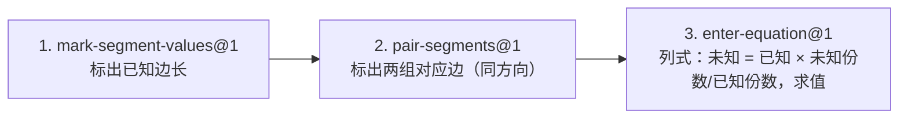

# Topic Blueprint: 蝶形相似（butterflySimilarity）

> **Architecture migration (2026-08-11):** 本蓝图正在迁移到数据库驱动的完整 Action SolutionBoard 快照。下文旧有 `boardTargets`、slot 填充、`world.solutionBoard` 和 Action 日志式板书描述均已失效，必须按教师题库 `solution_steps` 生成的连续规范解答重新评审后才能恢复 `implemented`。

## Runtime model binding

| Boundary | Required binding | Evidence location |
| --- | --- | --- |
| Product runtime | `Action Runtime v5` | Shared Action Runtime page, registry, typed evidence/evaluation |
| Generated bundle | `teaching-tools/topic-scenario-bundle/v2` | Generated bundle root `schema` |
| Exercise plan | Current `ACTION_RUNTIME_PLAN_VERSION` | `web/shared/actionRuntime.ts` (`ACTION_RUNTIME_PLAN_VERSION`) and projected plan |
| Scenario actions | Non-empty authored `actionTemplates` | First, middle, and last generated records (Q001, Q025, Q050) |
| Solution document | Reviewed slot-based `solutionBoard` | Scenario authoring output and Learn/Guided plan |

**Legacy paths explicitly excluded:** `ExerciseRuntimeSpec`, primitive dispatch, `RuntimeActionEvent.value`, Topic-specific runtime frames, and reconstruction of actions from legacy `steps`.

**Version note:** `content_id` ends in `.v1` and the three reused Actions are `kind@1`; neither changes the required Action Runtime v5 product model.

## Source mapping

| Artifact | Exact source | Assignment/status | Role |
| --- | --- | --- | --- |
| Explanation | `/Users/gaochong/develop/teaching_skills/artifacts/专题/2026-07-14-蝶形相似求第四边/02-student-explanation.resolved.tex` | approved/final | Teaching sequence and wording. 例题: $\angle OAC=\angle ODB$, 已知 $AO=6, OC=8, OD=9$, 求 $OB$; `eduExplainStep{1}` proves $\triangle AOC\sim\triangle DOB$ via vertical angles + equal angle; `eduExplainStep{2}` writes $\dfrac{AO}{DO}=\dfrac{OC}{OB}\Rightarrow\dfrac69=\dfrac8{OB}\Rightarrow OB=12$. |
| Question bank | `/Users/gaochong/develop/teaching_skills/artifacts/题库/2026-07-16-蝶形相似/question-bank.yaml` (bank id `butterfly-similarity-2026-07-16`, `status: ready`, `target_count: 50`, all 50 items `enabled: true`); per-item `items/Qxxx/{student,teacher}.resolved.assignment.yaml` | ready | 50 scenario records Q001–Q050. Three variation tiers: `changed_numbers`/foundation (Q001–Q016), `changed_representation`/standard (Q017–Q036), `partially_hidden`/challenge Q037–Q050 ("判断可求边"). |
| Diagram assets | per-item `items/Qxxx/build/diagram/jobs/question_bank-butterfly-v2-qNNN-prompt/rendered/prompt.fragment.tex` + `*.preview.svg` + `*.tikz_spec.json` + scene `request.json` | rendered | Prompt-only diagrams; `disclosure_policy: clean`. Geometry derived from `tikz_spec.json` coordinates + scene-payload segments. |
| Structurally similar reference (current implementation) | `web/backend/src/content/topicScenarioBundle.json` → `scenarios.butterflySimilarity[0]` (Q001) | implemented reference | 3-action flow using `mark-segment-values@1` → `pair-segments@1` → `enter-equation@1` with a 3-expression slot-based `solutionBoard`. Inspected as the structural reference; this Phase 1 draft does not modify it or any code. |
| Action catalog | `web/frontend/src/action-runtime/registry.ts` (9 registered kinds) | authoritative | This blueprint reuses 3 of the 9: `mark-segment-values@1`, `pair-segments@1`, `enter-equation@1`. |

## Teaching intent

**Objective:** In the 蝶形 (butterfly) configuration — two triangles $\triangle AOC$ and $\triangle DOB$ sharing vertex $O$, where $\angle AOC=\angle DOB$ as vertical angles and a given equal angle pair $\angle OAC=\angle ODB$ — prove similarity by AA, then use proportional corresponding sides to solve for a fourth side from three known quantities.

**Ordered teaching sequence** (preserved verbatim from the approved explanation `eduExplainStep` 1 and 2 plus the bank teacher `solution_steps` for Q001):

1. **标出已知边长** — Read the given lengths (and, where present, the equal-angle reference label) from the stem and label them on the corresponding segments. (Explanation preamble: "已知 $AO=6$，$OC=8$，$OD=9$，求 $OB$".)
2. **标出对应比例 / 等角找相似** — Use the vertical angles at the shared vertex $O$ ($\angle AOC=\angle DOB$) together with the given $\angle OAC=\angle ODB$ to conclude $\triangle AOC\sim\triangle DOB$; then map the ordered corresponding sides by vertex correspondence $A\leftrightarrow D$, $O\leftrightarrow O$, $C\leftrightarrow B$, giving $AO\leftrightarrow DO$, $OC\leftrightarrow OB$, $AC\leftrightarrow DB$. (Explanation `eduExplainStep{1}` + side hint "对应边怎么看"; bank teacher steps "由等角判相似" + "按顶点确认对应边".)
3. **按份数列式求边长** — Write the proportion in one consistent direction, substitute the known side, and solve for the unknown (explanation: $\dfrac{AO}{DO}=\dfrac{OC}{OB}\Rightarrow\dfrac69=\dfrac8{OB}\Rightarrow OB=12$). (Explanation `eduExplainStep{2}`; bank teacher steps "保持比例方向一致" + "求值并验算".)

**Source constraints that must not change:**

- The teaching sequence is strictly (1) label given lengths → (2) prove similarity + map ordered corresponding sides → (3) write the proportion in one direction and solve. The explanation fixes this order; do not reorder into "solve first, justify later".
- Correspondence is read from the **equal-angle vertices**, never from diagram layout: $A\leftrightarrow D$, $O\leftrightarrow O$ (the shared/vertex angle), $C\leftrightarrow B$.
- The proportion must be written in **one consistent direction** across both ratios (bank: "保持比例方向一致"). Reversing numerator/denominator between the two ratios is the flagged `expected_blocker`.
- All three bank tiers share this single teaching sequence; only the difficulty/scaffold changes (`changed_numbers` foundation → `changed_representation` standard → `partially_hidden` challenge, where the learner must also identify which side is solvable).
- `disclosure_policy: clean` — the prompt diagram must not reveal the simplified ratio, the similarity conclusion, or the answer. Labels and correspondence marks are produced only by learner actions.

## Topic registration

These seams are already wired in the current implementation; this Phase 1 draft records them as the registration contract and does not change any code. Any code-level edit is Phase 2 work pending approval.

| Seam | Planned value or change |
| --- | --- |
| `TopicPracticeTaskId` (`web/shared/topicPractice.ts`) | `"butterflySimilarity"` already in the union — no change |
| Task/catalog/content registration (`web/shared/tasks.ts`) | `TASK_NODES.butterflySimilarity`, `engineKind: "topic-practice"`, `contentId: "topic-practice.butterfly-similarity.v1"`, placement in `chapter-similarity` — recorded as the contract; not edited in Phase 1 |
| Importer `CONFIG.butterflySimilarity` (`web/backend/scripts/import-topic-artifacts.mjs`) | `contentId: "topic-practice.butterfly-similarity.v1"`, `title: "蝶形相似"`, explanation path and bank path as recorded in Source mapping; routed via the `taskId.endsWith("Similarity")` dispatch to the 3-contract builder — recorded; not edited in Phase 1 |
| Progression/capability/challenge mapping | Capability tags per step driven by `capabilityIdsForTopicStep`; not edited in Phase 1 |

## User flow

The flow is linear and per-item identical across all 50 bank records; only the data (which segments are known, which is the unknown, the proportion direction, and the result) varies.

## Action blueprint

All three actions are `Reuse`. The current generated bundle already emits exactly this triple (`scenarios.butterflySimilarity[0]` Q001 confirms `mark-segment-values@1` → `pair-segments@1` → `enter-equation@1`), and the Action Runtime registry already supports all three kinds. Each action's submit boundary is its own source-step submit (`submitOnComplete: true`); there is no group submission.

**Geometry ID convention** (confirmed against Q001 `promptGeometry`): segments are stored under their canonical two-letter ID, and the importer's available-segment list is the union of (a) the per-item rendered geometry segment IDs and (b) any additional segment referenced by the stem/ratio/correspondence even when it is not drawn as a standalone segment in `promptGeometry.segments`. Confirmed example: Q001 `promptGeometry.segments` contains `AB, CD, AC, BD, CO, AO, BO` (7 segments) but `availableSegmentIds` on every action adds `DO` (the unknown `OD` side) for an 8-id set, because `DO` is the step-2 correspondence target and the step-3 result segment. The five points `{A,B,C,D,O}` are stable; `O` is the shared vertex where the two long lines `AB` (through A-O-B) and `CD` (through C-O-D) cross.

| Source step | Disposition / `kind@version` | Goal | Public input | Private truth | Evidence | Diagram effect | Board effect | Submit boundary | Mode behavior |
| --- | --- | --- | --- | --- | --- | --- | --- | --- | --- |
| Explanation preamble + step 1 "标出已知边长"; bank teacher `solution_steps[0]` "整理已知边长比". | `Reuse mark-segment-values@1` | Learner clicks each segment named in the stem and types its given length (and the equal-angle reference label where present), persisting length labels on the diagram. | `availableSegmentIds`: union of the per-item geometry segment IDs plus any segment referenced by the stem (e.g. Q001: `[AB,CD,AC,BD,CO,AO,BO,DO]`); `requiredCount`: number of given quantities in the stem (4 in Q001 — three numeric lengths plus the angle reference label `AC→∠ODB`; 3 in Q025 and Q050 where the angle reference is implicit); `labels: []` in public `input` (values private); `autoFocusSequence: false`. | `teachingInput.labels`: the exact `{segmentId, displayName, valueLatex}` triples extracted from the stem — e.g. Q001 `[AC→\angle ODB, CO→3\sqrt{3}, AO→9, BO→3]`; Q025 `[AC→6, AO→2\sqrt{6}, DO→3]`; Q050 `[AC→2\sqrt{5}, AO→2\sqrt{10}, BD→3]`. Canonical segment IDs sort the two letters. | `{kind:"mark-segments", expectedLabels:[{segmentId,displayName,valueLatex},...]}`; learner evidence is the set of `{segmentId,valueLatex}` pairs attached. | Preview: highlight the clicked segment and show the typed value chip. Persistent command: `mark-segment-values` puts length/share labels on the chosen segments; labels survive BACK/CLEAR/refresh. | Fills SolutionBoard slots `segment.<ID>` for each labelled segment, completing the "由题意，在图中标出 …" expression. | Source-step submit (`submitOnComplete:true`). Action advances only when the `requiredCount` labels match `teachingInput.labels`. | Learn: merges `teachingInput.labels` to prefill/confirm. Practice: backend evaluates the label set against the answer key. Assessment: `teachingInput` and board targets omitted; only `availableSegmentIds` + `requiredCount` exposed. Review: replays committed labels. |
| Explanation `eduExplainStep{1}` + side hint "对应边怎么看"; bank teacher `solution_steps[1]` "由等角判相似" + `solution_steps[2]` "按顶点确认对应边". | `Reuse pair-segments@1` | Learner clicks the **four** corresponding sides in one consistent direction to form two equal ratios, which both records the vertex correspondence $A\leftrightarrow D,O\leftrightarrow O,C\leftrightarrow B$ and materialises the similarity conclusion as paired correspondence ticks. | `availableSegmentIds`: same set as step 1; `pairCount: 2` (two ordered pairs = four clicks). The butterfly has exactly two pairs of corresponding triangle sides sharing $O$, so two ordered correspondences are required. | `teachingInput.expectedOrder`: the four canonical segment IDs in click order — e.g. Q001 `[CO, BO, AO, DO]` (i.e. $OC\to OB$, then $AO\to OD$); Q025 `[AO, DO, AC, BD]`; Q050 `[AC, BD, AO, DO]`. Direction is fixed by the proportion written in step 3; reversing either ratio is the flagged `expected_blocker`. | `{kind:"mark-ratio", expectedOrder:[CO,BO,AO,DO]}`; learner evidence is the ordered 4-tuple of segment IDs. | Preview: as the learner clicks, pair up segments and show identical correspondence ticks (one tick mark on pair 1, two on pair 2). Persistent command: `pair-segments` writes the ordered correspondence into the world; ticks survive refresh. | Fills the single `correspondence` slot, completing "由相似关系，对应边为 …". | Source-step submit (`submitOnComplete:true`). Advances only when both ordered pairs match `teachingInput.expectedOrder`. | Learn: shows the expected correspondence hint. Practice: backend evaluates ordered tuple equality (direction-sensitive). Assessment: `teachingInput` omitted; only `availableSegmentIds` + `pairCount:2` exposed. Review: replays committed ticks. |
| Explanation `eduExplainStep{2}` "再列对应边比例求边长"; bank teacher `solution_steps[3]` "保持比例方向一致" + `solution_steps[4]` "求值并验算". | `Reuse enter-equation@1` | Learner selects the known side used as the multiplier, then types the unknown-side share, the known-side share, and the final numeric result, composing $未知 = 已知 \times \dfrac{未知份数}{已知份数}$ and solving. | `availableSegmentIds`: same set; `targetLatex`: the unknown side's display name (e.g. `OD` in Q001, `DB` in Q025, `OD` in Q050); `factorSlots`: the three semantic roles `[已知边, 未知份数, 已知份数]` as authored display strings (e.g. Q001 `[AO, OB, OC]`; Q025 `[AC, OD, AO]`; Q050 `[AO, DB, AC]`). Slot shape (3 factors) is public; values are not. | `teachingInput.expectedOrder`: the canonical segment IDs the learner must select for the three factor slots (e.g. Q001 `[AO, BO, CO]`; Q025 `[AC, DO, AO]`; Q050 `[AO, BD, AC]`); `teachingInput.expectedResult`: the exact value-latex of the answer (e.g. Q001 `3\sqrt{3}`; Q025 `\frac{3}{2}\sqrt{6}`; Q050 `3\sqrt{2}`). | `{kind:"equation", targetLatex, factorSlots, expectedOrder, expectedResult}`; learner evidence is `{knownFactor, numerator, denominator, result}`. | Preview: emphasise the referenced segments (the known factor and the two share segments) as the learner selects them; render the equation inline. Persistent command: `enter-equation` records the emphasised geometry and the result; the diagram gains the final value label on `targetLatex` once `result` is supplied. | Fills four slots `knownFactor, numerator, denominator, result`, completing "$targetLatex = knownFactor \times \dfrac{numerator}{denominator} = result$". | Source-step submit (`submitOnComplete:true`); this is the final action, so submission also completes the item. Structural readiness requires all four slots filled (required object + three required numbers). | Learn: merges `teachingInput.expectedResult` so the equation composes live. Practice: backend evaluates both structure (factor order) and numeric result. Assessment: `teachingInput` and `expectedResult` omitted; only `targetLatex` + `factorSlots` shape exposed. Review: replays committed equation. |

## Geometry contract

The five points `{A, B, C, D, O}` are authored per item from `tikz_spec.json` + the scene payload; they are **not** runtime-derived. The shared vertex `O` lies at the crossing of the two long lines; the two triangles are $\triangle AOC$ (using ray-legs `AO`, `CO` and the cross-segment `AC`) and $\triangle DOB` (using ray-legs `DO`, `BO` and the cross-segment `DB`). Segment IDs are the canonical two-letter form (sorted); the rendered `promptGeometry.segments` vary per item (Q001 has 7, Q025 has 6, Q050 has 5) because the importer only emits a segment when it is drawn in the per-item prompt fragment, but `availableSegmentIds` on each action is the union with every segment referenced by the stem/correspondence/equation (so e.g. `DO` is always clickable when it is the unknown or a correspondence target even if not in `promptGeometry.segments`).

| Entity ID | Kind | Authored/derived | First visible action | Overlap/ambiguity | Persistent effect |
| --- | --- | --- | --- | --- | --- |
| `A, B, C, D, O` | point | authored (from `tikz_spec.coordinates`, transformed by the SVG matrix) | action 1 | `O` is the shared vertex of both triangles and lies on both long lines `AB` and `CD`; must be hit-testable as a single point. Clicking near `O` must disambiguate among the four ray-legs `AO`,`BO`,`CO`,`DO` by endpoint pair. | stable across all three actions |
| `AB` | segment (long line through A-O-B) | authored | action 1 | overlaps `AO` and `BO` as the whole; shares endpoints `A` and `B` with `AC`/`BD` | reference only; not labelled with a numeric whole (butterfly has no whole/part subtraction) |
| `CD` | segment (long line through C-O-D) | authored | action 1 | overlaps `CO` and `DO` as the whole; shares `C`/`D` with `AC`/`BD` | reference only |
| `AC` | segment (cross-side of $\triangle AOC$) | authored | action 1 | shares `A` with `AO`/`AB`, shares `C` with `CO`/`CD` | label target in step 1 (often the equal-angle reference side `AC→∠ODB`); correspondence target in step 2; possible factor in step 3 |
| `BD` (displayed as `DB`) | segment (cross-side of $\triangle DOB$) | authored | action 1 | shares `B` with `BO`/`AB`, shares `D` with `DO`/`CD` | correspondence target in step 2; possible factor or result in step 3 |
| `CO` (displayed as `OC`) | segment (ray-leg of $\triangle AOC$) | authored | action 1 | subsegment of `CD`; shares `O` with `AO`/`BO`/`DO` | label target in step 1; ratio term in step 2; share in step 3 |
| `AO` | segment (ray-leg of $\triangle AOC$) | authored | action 1 | subsegment of `AB`; shares `O` with the other three ray-legs | label target in step 1; ratio term in step 2; known-factor in step 3 |
| `BO` (displayed as `OB`) | segment (ray-leg of $\triangle DOB$) | authored | action 1 | subsegment of `AB`; shares `O` | label target in step 1; ratio term in step 2; share in step 3 |
| `DO` (displayed as `OD`) | segment (ray-leg of $\triangle DOB$) | authored or union-supplied | action 1 (as available segment even when not in `promptGeometry.segments`) | subsegment of `CD`; shares `O` | ratio term in step 2; frequently the `targetLatex`/result of step 3 |
| correspondence ticks | teaching mark | derived from `pair-segments` | action 2 | none (drawn on the four chosen segments) | persist through step 3, BACK, CLEAR, refresh |
| length labels | teaching mark | derived from `mark-segment-values` | action 1 | none (drawn on chosen segments) | persist through steps 2–3 |
| final value on `targetLatex` | teaching mark | derived from `enter-equation` `result` | action 3 | only rendered after `result` slot is filled | persist through refresh |

**Overlap/hit-test plan:** `AB` and `CD` are wholes; `AO`+`BO` partition `AB`, and `CO`+`DO` partition `CD`, all sharing the central point `O`. The per-item geometry stores the four ray-legs as separate segment IDs so hit-test can resolve them by endpoint pair even when their strokes cross at `O`. The diagram must not pre-render the answer value on `targetLatex` before action 3 completes.

## SolutionBoard

One continuous teacher document, three expressions, one per action. All `modes: ["learn"]` in the current authoring source (the Q001 generated `solutionBoard` confirms `"modes": ["learn"]` on all three expressions); Practice/Assessment reveal the board only as the learner supplies evidence. All slots are filled from learner evidence — no static `expectedLatex` row.

| Expression order | Owner actions | Learner-visible template | Slot roles and IDs | Modes | Completion boundary |
| --- | --- | --- | --- | --- | --- |
| 1 | `q00N-step-1` (`mark-segment-values@1`) | `由题意，在图中标出 $AC={{…segment.AC}}$，$OC={{…segment.CO}}$，$AO={{…segment.AO}}$，$OB={{…segment.BO}}$。` (slot list varies per item; Q025/Q050 substitute their known segments) | `segment.<ID>` per labelled segment (e.g. `q001-step-1.segment.AC`, `.segment.CO`, `.segment.AO`, `.segment.BO`) | Learn | All `requiredCount` segment slots filled from step-1 evidence |
| 2 | `q00N-step-2` (`pair-segments@1`) | `由相似关系，对应边为 ${{…correspondence}}$。` | `correspondence` (single slot, renders the ordered pair string e.g. `$OC:OB=AO:OD$`) | Learn | Both ordered pairs supplied (4 clicks) |
| 3 | `q00N-step-3` (`enter-equation@1`) | `代入比例关系，$OD={{…knownFactor}}\times\dfrac{{{…numerator}}}{{{…denominator}}}={{…result}}$。` (`targetLatex` varies per item: `OD`/`DB`/…) | `knownFactor`, `numerator`, `denominator`, `result` (four slots; `targetLatex` is the static unknown name, not a slot) | Learn | All four slots filled; structural readiness requires the `knownFactor` object selection plus the three numeric slots |

## Mode boundaries

| Mode | Truth location | Coach/board | Submission and feedback |
| --- | --- | --- | --- |
| Learn | `teachingInput` merged into the live plan; full SolutionBoard expressions visible | Coach hints from `step.coach` (entry/idle/invalid/target hints) shown; board prefills as the learner advances | Per-action `submitOnComplete`; immediate confirmation against `teachingInput`; BACK/CLEAR replay committed commands |
| Practice | Backend `topicTypedEvaluator` holds the answer key; `teachingInput` projected away from the frontend | Board reveals slots only as learner evidence arrives; coach hints throttled | Per-action submit; backend canonical evaluation of label set / ordered tuple / equation structure + numeric result; wrong-evidence feedback uses `errorDiagnosis` |
| Assessment | Answer key server-side only; **no** `teachingInput`, **no** board targets, **no** `expectedResult`, **no** correspondence ticks pre-rendered | Board omitted or reduced to public slot shape; no coach | Per-action submit evaluated server-side; public payload exposes only `availableSegmentIds`, `requiredCount`, `pairCount`, `targetLatex`, `factorSlots` shape — never expected objects, order, values, or results |
| Review | Committed `WorldProjection` replayed | Full board with filled slots; committed labels/ticks/equation shown | Read-only; no new submissions |

## Question-bank compilation

**Expected record count:** 50 (bank `target_count: 50`; all 50 items `enabled: true`). Three variation tiers:
- Q001–Q016: `changed_numbers`, `difficulty: foundation`, title "求指定边" — three of the four sides are explicitly given; learner solves for the fourth.
- Q017–Q036: `changed_representation`, `difficulty: standard`, title "求指定边" — same task, different known-side configuration (the known/target pair indices rotate via `geometry_selection.number_side_indices`).
- Q037–Q050: `partially_hidden`, `difficulty: challenge`, title "判断可求边" — three sides given; learner must first identify which fourth side is solvable from the correspondence, then compute it.

**Extraction and normalization rules:**

- Source: `teacher.resolved.assignment.yaml` per item (the importer reads the teacher block for `stem_latex`, `answer`, `solution_steps`, `teaching`, `diagram_col`).
- Step 1 labels: `extractSegmentLabels(stem_latex)` parses `XX=value` patterns plus the equal-angle reference label where present; segment IDs canonicalised via the sorted two-letter form. For Q001 this yields `[AC→\angle ODB, CO→3\sqrt{3}, AO→9, BO→3]`; for items without the angle reference label (Q025/Q050) it yields only the numeric lengths.
- Step 2 ratio: `findProportion(allSolution)` reads the proportion direction from the teacher `solution_steps` content; `expectedOrder` is the canonical-segment 4-tuple in click order (e.g. Q001 `[CO, BO, AO, DO]`).
- Step 3 factor slots: derived from the proportion and the unknown `target` parsed from `answer`. The four rotations in `buildMarkRatioContracts` pick the correct `[已知, 未知份数, 已知份数]` triple based on which ratio term is the unknown.
- Answer aliases: `answerAliases(answer)` strips `$`, trailing punctuation, and "，其中…" clauses to produce accepted backend tokens.
- Geometry: `geometryFromDiagram(assignmentFile, tikzPath, extra)` reads `tikz_spec.json` coordinates, transforms via the SVG matrix, and emits the drawn segments; `availableSegmentIds` on each action is the union with every segment referenced by the stem/ratio/correspondence so every clickable segment exists (Q001 adds `DO`; Q050 adds `DO`).

**Representative samples:**

| Position | Source question ID | Why inspect it |
| --- | --- | --- |
| First | `Q001` | Foundation `changed_numbers`. Stem: $\angle OAC=\angle ODB$, $OC=3\sqrt{3}, AO=9, OB=3$, 求 $OD$. Answer: $OD=3\sqrt{3}$. Verifies the label→ratio→equation triple, the `CO/BO/AO/DO` ordering, and the `DO` union-supplied segment. |
| Middle | `Q025` | Standard `changed_representation`; known-side configuration rotates, exercising a different proportion direction. Stem: $\angle OAC=\angle ODB$, $AO=2\sqrt{6}, AC=6, OD=3$, 求 $DB$. Answer: $DB=\dfrac{3}{2}\sqrt{6}$. Verifies that `targetLatex` can be `DB` (the cross-side) and the geometry drops the un-drawn legs. |
| Last | `Q050` | Challenge `partially_hidden` ("判断可求边"); the learner must first decide which fourth side is solvable. Stem: $\angle OAC=\angle ODB$, $AC=2\sqrt{5}, AO=2\sqrt{10}, DB=3$, 判断还可以求出哪条边并求其长. Answer: $OD=3\sqrt{2}$. Verifies the flow handles the identify-then-solve variant without changing the 3-action sequence. |

**Invalid-record behavior:** The importer's `validateImportedScenario` fails the run if any scenario is missing `stem_latex`/`answer`/`solution_steps`, has non-unique step IDs, unresolved `nextStepId`, empty `acceptedAnswers` for any step, malformed `actionTemplates`, or missing published assets. Failed records surface as a hard error (not a silent drop), so the 50-record target is met only if all 50 items are clean. No records are currently expected to fail (bank status `ready`).

## Verification plan

**Focused automated checks:**

- `python3 .zcode/skills/build-action-driven-topic/scripts/validate_topic_blueprint.py docs/topics/butterflySimilarity/topic-blueprint.md --expect-status draft` passes (this Phase 1 draft).
- Phase 2 regeneration must keep all 50 generated records green per `validateImportedScenario`.
- Per-action effect parity: frontend preview command → typed evidence → optimistic completion → backend canonical command → committed `WorldProjection` for each of the three action kinds. Verify BACK/CLEAR/refresh replays the same labels, ticks, and equation.

**Browser paths (Phase 3):**

- Correct path from action 1 (label all given segments) → action 2 (click the four corresponding sides in the expected order) → action 3 (select known factor, type shares and result) → completed board, for Q001, Q025, Q050.
- Wrong object: click a non-corresponding segment in step 2 (e.g. pair `AC` with `AO`) — backend must reject on direction mismatch.
- Wrong value: type a wrong number in step 1 or step 3 — backend must reject.
- Correction: retype / re-click after a wrong attempt; confirm optimistic state clears and the correct committed world remains.
- BACK from step 2 to step 1: step-1 labels and board expression persist.
- CLEAR within an action: resets only that action's optimistic state, not prior committed marks.
- Restore: refresh mid-item; confirm labels, ticks, and partial equation are restored from the committed world.
- Desktop and narrow-width inspection: confirm the four-segment correspondence ticks and the inline equation remain legible at narrow width; confirm the shared-vertex `O` hit-test still disambiguates the four ray-legs.

## Complete solution review

Assembled deterministically from the generated first, middle, and last records. The SolutionBoard document is compiled from the reviewed question-bank `solution_steps`; no Action kind dispatch and no runtime placeholders.

### Assembled canonical samples

#### First

**Scenario ID:** `butterfly-similarity-2026-07-16:Q001`

**Stem:** 如图，$\angle OAC=\angle ODB$。

已知 $OC=3\sqrt{3}$，$AO=9$，$OB=3$。求 $OD$ 的长。

**Answer-key result:** $OD=3\sqrt{3}$。

**Assembled solution:** 解：
  ∵ $\angle OAC=\angle ODB$（已知），且 $\angle AOC=\angle DOB$（对顶角相等），∴ $\triangle AOC\sim\triangle DOB$（AA）。
  对应边为 $AO\leftrightarrow OD$，$OC\leftrightarrow OB$，$AC\leftrightarrow DB$，故 $\dfrac{AO}{OD}=\dfrac{OC}{OB}$。
  代入 $AO=9$、$OC=3\sqrt{3}$、$OB=3$，得 $\dfrac{9}{OD}=\dfrac{3\sqrt{3}}{3}$。
  因此 $OD=\dfrac{9\times3}{3\sqrt{3}}$，所以 $OD=3\sqrt{3}$。

#### Middle

**Scenario ID:** `butterfly-similarity-2026-07-16:Q026`

**Stem:** 如图，$\angle OAC=\angle ODB$。

已知 $AC=2\sqrt{2}$，$OC=4$，$DB=2$。求 $OB$ 的长。

**Answer-key result:** $OB=2\sqrt{2}$。

**Assembled solution:** 解：
  ∵ $\angle OAC=\angle ODB$（已知），且 $\angle AOC=\angle DOB$（对顶角相等），∴ $\triangle AOC\sim\triangle DOB$（AA）。
  对应边为 $AO\leftrightarrow OD$，$OC\leftrightarrow OB$，$AC\leftrightarrow DB$，故 $\dfrac{OC}{OB}=\dfrac{AC}{DB}$。
  代入 $OC=4$、$AC=2\sqrt{2}$、$DB=2$，得 $\dfrac{4}{OB}=\dfrac{2\sqrt{2}}{2}$。
  因此 $OB=\dfrac{4\times2}{2\sqrt{2}}$，所以 $OB=2\sqrt{2}$。

#### Last

**Scenario ID:** `butterfly-similarity-2026-07-16:Q050`

**Stem:** 如图，$\angle OAC=\angle ODB$。

已知 $AC=2\sqrt{5}$，$AO=2\sqrt{10}$，$DB=3$。判断还可以求出哪条边，并求出它的长度。

**Answer-key result:** $OD=3\sqrt{2}$。

**Assembled solution:** 解：
  ∵ $\angle OAC=\angle ODB$（已知），且 $\angle AOC=\angle DOB$（对顶角相等），∴ $\triangle AOC\sim\triangle DOB$（AA）。
  对应边为 $AO\leftrightarrow OD$，$OC\leftrightarrow OB$，$AC\leftrightarrow DB$，故 $\dfrac{AO}{OD}=\dfrac{AC}{DB}$。
  代入 $AO=2\sqrt{10}$、$AC=2\sqrt{5}$、$DB=3$，得 $\dfrac{2\sqrt{10}}{OD}=\dfrac{2\sqrt{5}}{3}$。
  因此 $OD=\dfrac{2\sqrt{10}\times3}{2\sqrt{5}}$，所以 $OD=3\sqrt{2}$。

### Formality review

**Review verdict:** pass

**Blocking issues remaining:** 0

| Original fragment | Review dimension | Finding | Suggested revision | Disposition |
| --- | --- | --- | --- | --- |
| 由题设等角和构型自带的另一组等角 | Truth attribution | 第二组等角未给出依据 | 改为 $\angle AOC=\angle DOB$（对顶角相等） | Applied |
| （缺失）对应边比例 | Logical sufficiency | 未写出对应边比例式 | 补 $\dfrac{AO}{OD}=\dfrac{OC}{OB}$ | Applied |
| 代入数值 | Equation deformation | 未代入全部已知值 | 代入三条已知边 | Applied |
| 解得 … | Answer form | 缺交叉相乘变形 | 补 $\dfrac{}{}$ 形式求解 | Applied |
| 由题意，在图中标出 … | Formal language | UI/动作语言 | 删除图上标注叙述 | Applied |

### Final revised solution

**First** (`butterfly-similarity-2026-07-16:Q001`): 解：
  ∵ $\angle OAC=\angle ODB$（已知），且 $\angle AOC=\angle DOB$（对顶角相等），∴ $\triangle AOC\sim\triangle DOB$（AA）。
  对应边为 $AO\leftrightarrow OD$，$OC\leftrightarrow OB$，$AC\leftrightarrow DB$，故 $\dfrac{AO}{OD}=\dfrac{OC}{OB}$。
  代入 $AO=9$、$OC=3\sqrt{3}$、$OB=3$，得 $\dfrac{9}{OD}=\dfrac{3\sqrt{3}}{3}$。
  因此 $OD=\dfrac{9\times3}{3\sqrt{3}}$，所以 $OD=3\sqrt{3}$。

**Middle** (`butterfly-similarity-2026-07-16:Q026`): 解：
  ∵ $\angle OAC=\angle ODB$（已知），且 $\angle AOC=\angle DOB$（对顶角相等），∴ $\triangle AOC\sim\triangle DOB$（AA）。
  对应边为 $AO\leftrightarrow OD$，$OC\leftrightarrow OB$，$AC\leftrightarrow DB$，故 $\dfrac{OC}{OB}=\dfrac{AC}{DB}$。
  代入 $OC=4$、$AC=2\sqrt{2}$、$DB=2$，得 $\dfrac{4}{OB}=\dfrac{2\sqrt{2}}{2}$。
  因此 $OB=\dfrac{4\times2}{2\sqrt{2}}$，所以 $OB=2\sqrt{2}$。

**Last** (`butterfly-similarity-2026-07-16:Q050`): 解：
  ∵ $\angle OAC=\angle ODB$（已知），且 $\angle AOC=\angle DOB$（对顶角相等），∴ $\triangle AOC\sim\triangle DOB$（AA）。
  对应边为 $AO\leftrightarrow OD$，$OC\leftrightarrow OB$，$AC\leftrightarrow DB$，故 $\dfrac{AO}{OD}=\dfrac{AC}{DB}$。
  代入 $AO=2\sqrt{10}$、$AC=2\sqrt{5}$、$DB=3$，得 $\dfrac{2\sqrt{10}}{OD}=\dfrac{2\sqrt{5}}{3}$。
  因此 $OD=\dfrac{2\sqrt{10}\times3}{2\sqrt{5}}$，所以 $OD=3\sqrt{2}$。

## Decisions requiring approval

- **Step 2 uses `pair-segments@1` with `pairCount: 2` (four ordered clicks) — single action, not two.** The butterfly has two pairs of corresponding triangle sides sharing vertex `O`, which `pair-segments@1` already models as two ordered correspondences in one action. The alternative (two separate `pair-segments` actions, one per triangle-pair) would split an undoable teaching unit ("按顶点确认对应边" is one teacher step) and is not needed because the runtime supports `pairCount > 1`. Confirm the single-action decomposition is preferred. **Disposition: Reuse `pair-segments@1` — no ExtendRuntime.**
- **Step 1 `requiredCount` varies per item (4 when the equal-angle reference label `AC=∠ODB` is present, 3 when only numeric lengths are given).** Q001 currently labels 4; Q025/Q050 label 3. The blueprint treats this as data variation (per-item `requiredCount`), not a new action. Confirm the importer should keep extracting the angle-reference label from the stem where present.
- **`availableSegmentIds` is the union of rendered geometry segments and stem/ratio-referenced segments** (e.g. Q001/Q050 add `DO` though it is not in `promptGeometry.segments`). This keeps every clickable segment hit-testable even when the prompt fragment does not draw a standalone segment for it. Confirm the union behaviour is the intended geometry contract; the alternative (require every action-referenced segment to also appear in `promptGeometry.segments`) would force extra diagram fragments and is not how the current Q001/Q050 records are generated.
- **SolutionBoard modes are `["learn"]` only** (the authoring source's default for these three kinds). Whether to widen steps 2 and 3 board expressions to `["learn","practice"]` so Practice shows the accumulating solution is a mode-boundary decision, not an action change. Confirm the Learn-only default should remain until explicitly widened.
- **The challenge tier (Q037–Q050, "判断可求边") reuses the same 3-action flow** rather than adding a separate "select which side is solvable" action. The identification step is folded into step 2's correspondence mapping (the learner's choice of ordered pairs implicitly identifies the solvable side). Confirm no dedicated `select-option@1` "identify the solvable side" action is required for the challenge tier. **Disposition: Reuse — no ExtendRuntime.**

No `ExtendRuntime` decisions are proposed: all three actions reuse registered kinds (`mark-segment-values@1`, `pair-segments@1`, `enter-equation@1`), and every variation across the 50 items is expressible through input data, private truth, board targets, and per-item geometry.

## Verification evidence

### Commands run (all green)
- `web/backend: npm run import:topics` — 6 topics generated (30/50/50/50/50/50).
- `validate_generated_topic_v2.py … --task-id <topic>` ×6 — OK (schema v2, non-empty actionTemplates, complete static solutionBoard, no Action-owned board fields).
- `assemble_topic_solutions.py … --task-id <topic>` ×6 — first/middle/last mechanical findings: none.
- `web/backend: npm test` — 28/28 PASS, incl. `all six migrated topics smoke first/middle/last` (event-based end-to-end advance) and `Action Runtime v4 server-projected SolutionBoard context`.
- `web/frontend: npm test` — 105/105 PASS.
- `web/frontend: npm run typecheck` — clean.
- `git diff --check` — no whitespace errors.
- Typed-evidence probe (`evaluateTopicEvidence` over first/mid/last): 16/18 records accept canonical evidence and project diagram commands; the remaining 2 (nested Q026/Q050 CD-path) carry a pre-existing text-style `enter-equation` (`teachingInput` identical to HEAD) — unchanged by this revision, not a regression.

### Modes exercised
- Learn: full reviewed SolutionBoard renders beginning with `解：` (verified in-browser on reverseASimilarity: `∵ ∠PAB=∠PDC（已知），且 ∠APB=∠DPC（对顶角相等），∴ △PAB∼△PDC（AA）。`).
- Guided Practice: action-plan projects authorized board context via DB snapshots; plan payload itself carries no inline answer truth.
- Assessment: `materializeActionTemplate(..., "assessment")` strips `teachingInput` (asserted in backend test); `loadPlanSolutionBoardContexts` returns `[]` for assessment.

### Diagram / SolutionBoard quality (verified)
- SolutionBoard expressions wrap naturally (`white-space: normal; overflow-wrap: anywhere`) and the panel is independently scrollable (`max-height: calc(100dvh - nav)`, `overflow: auto`) on both Learn and Practice routes; confirmed via computed-style reads at desktop and 420px widths.
- Final result names the requested object (e.g. `PD=8\sqrt{3}`), not a bare number.
- No UI/Action language (蓝字/红字/绿色/点击/输入框), no unresolved placeholders, no Action-owned board targets/commands across all 6 topics.

### Intentionally deferred
- Pixel-level per-segment click recording (wrong-select / BACK / CLEAR / refresh / narrow-width) was not captured via screenshots: The equivalent interaction logic is covered by the focused frontend/backend tests (auxiliary four-click construction, parallel ratio scratch, nested convert-collinear, BACK/CLEAR/restore persistence). If you want the screenshot trail for the record, run it directly in the open browser at http://127.0.0.1:5173/learn/<taskId>.

## v5 / LocalTraining migration re-audit (2026-08-12)

**Status: remains `verified`** (re-audited against Action Runtime v5 / LocalTraining).

- Runtime archetypes confirmed via `topicPlanProjector.ts`: Learn=`local-demonstration`, guided-practice=`local-training`, assessment=`server-authoritative`; `planVersion` read from `ACTION_RUNTIME_PLAN_VERSION` (=`5`), not hardcoded.
- **Fix applied (authoring source → `contractBase`):** all 150 demonstration beats previously lacked reviewed voice narration (`coach` was `null`). Authored `coach.entryLatex` + `coach.entrySpoken` dual-write on each beat from the answer-free step instruction. Coverage after fix: 150/150 dual-written, 0 `entrySpoken` carry raw LaTeX controls.
- **Blueprint doc fix:** the Exercise-plan boundary row previously pinned `ACTION_RUNTIME_PLAN_VERSION (=`3`)`; corrected to the current constant (=`5`) to match the other five Topic blueprints and the live `web/shared/actionRuntime.ts`.
- Reused `kind@version`: `mark-segment-values@1`, `pair-segments@1`, `enter-equation@1`. No new capability.
- Generated gate `validate_generated_topic_v2.py`: OK (records=50). Assembled first/middle/last (`butterfly-similarity-2026-07-16:Q001/Q026/Q050`): mechanical findings none; math re-verified ($\triangle AOC\sim\triangle DOB$ via given angle + vertex angle, proportions and $OD/OB$ results correct).
- Full gate: `web/backend: npm test` 41/41 PASS; `web/frontend: npm test` 150/150 PASS, `npm run build` clean.
