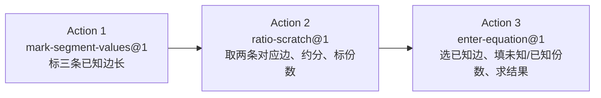

# Topic Blueprint: 三角形一边平行线——知三推一（A 字型 / 8 字型）

> **Architecture migration (2026-08-11):** 本蓝图正在迁移到数据库驱动的完整 Action SolutionBoard 快照。下文旧有 `boardTargets`、slot 填充、`world.solutionBoard` 和 Action 日志式板书描述均已失效，必须按教师题库 `solution_steps` 生成的连续规范解答重新评审后才能恢复 `verified`。

## Runtime model binding

| Boundary | Required binding | Evidence location |
| --- | --- | --- |
| Product runtime | `Action Runtime v2` | Shared Action Runtime page, registry, typed evidence/evaluation |
| Generated bundle | `teaching-tools/topic-scenario-bundle/v2` | Generated bundle root `schema` (`web/backend/src/content/topicScenarioBundle.json`) |
| Exercise plan | Current `ACTION_RUNTIME_PLAN_VERSION` | `web/shared/actionRuntime.ts` and projected plan |
| Scenario actions | Non-empty authored `actionTemplates` | First/middle/last generated records (Q001/Q025/Q050) each carry 3 `actionTemplates` |
| Solution document | Reviewed slot-based `solutionBoard` | Scenario authoring output (`authorTopicSolutionBoard`), Learn/Guided plan |

**Legacy paths explicitly excluded:** `ExerciseRuntimeSpec`, primitive dispatch, `RuntimeActionEvent.value`, Topic-specific runtime frames, and reconstruction of actions from legacy `steps`. The authored `steps` array is content only; the projector materializes `actionTemplates` and never rebuilds actions from `steps`.

**Version note:** `content_id` ends in `.v1` and the three reused Actions are all `kind@1`; neither changes the required Action Runtime v2 product model.

## Source mapping

| Artifact | Exact source | Assignment/status | Role |
| --- | --- | --- | --- |
| Explanation | `/Users/gaochong/develop/teaching_skills/artifacts/专题/2026-07-12-平行线对应边比例-待审核/02-student-explanation.resolved.tex` | approved/final（`resolved` 讲解；被题库 `source_explanation` 引用并作为 lesson 导入） | Teaching sequence and wording：A 字型 / 8 字型两节——先读点序，再写相似三角形与三组对应边，最后转移对应边比、按份数列式 |
| Question bank | `/Users/gaochong/develop/teaching_skills/artifacts/题库/2026-07-17-三边求第四边-A字型8字型`（bank id `three-known-fourth-parallel-2026-07-17`，`question-bank.yaml` `status: ready`，`target_count: 50`） | ready | 50 条 scenario 记录；统一为“恰好给三条线段长度，只求第四条线段长度”；A 字型 / 8 字型严格交替 |
| Diagram assets | 每题 `items/Q###/build/diagram/jobs/question-bank-three-known-q###-prompt/rendered/prompt.{fragment.tex,preview.svg}`，已发布到 `web/frontend/public/topic-assets/bank/parallelLineRatios/three-known-fourth-parallel-2026-07-17/Q###/` | prompt_only | 每题一张独立 prompt 图；图内无数值，AB/CD 水平、方向一致 |

## Teaching intent

**Objective:** 在 $AB\parallel CD$ 的 A 字型或 8 字型中，已知三条线段长度求第四条线段长度。学习者按“标已知边长 → 算对应边最简整数比并标份数 → 按份数乘法列式求值”三步完成一题。

**Ordered teaching sequence**（来源：`02-student-explanation.resolved.tex`；每条题的 `teacher.resolved.assignment.yaml` 的 `solution_steps` 与之一致）：

1. **读点序，定整段与分段关系**：A 字型点序 $P-A-C$、$P-B-D$，故 $PC=PA+AC$、$PD=PB+BD$；8 字型点序 $A-P-C$、$B-P-D$，故 $AC=AP+PC$、$BD=BP+PD$。本题库只给三条边长求第四边，点序信息用于判断哪两条已知边是同一组对应边。
2. **由 $AB\parallel CD$ 得 $\triangle PAB\sim\triangle PCD$，写三组对应边**：$PA\leftrightarrow PC$、$PB\leftrightarrow PD$、$AB\leftrightarrow CD$。
3. **把对应边比约成最简整数比**：取同一射线上的两条已知对应边相除并约分（如 $\dfrac{PA}{PC}=\dfrac{3}{6}=\dfrac{1}{2}$）。约分后未知边与已知对应边各得整数份数。
4. **按份数列式求值**：未知 = 已知对应边 $\times\dfrac{\text{未知份数}}{\text{已知份数}}$（如 $AB=CD\times\dfrac{1}{2}$）。

**Source constraints that must not change:**

- 恰好三条已知边、一条未知边；不出求比、判断、参数、整段加减题（`coverage-plan.yaml` 的 `scope_lock`）。
- AB 与 CD 必须水平（本批统一水平版式，`diagram_rule`）。
- A 字型 / 8 字型严格交替；同一份 10 题混合“涉及平行边”与“只求两侧对应边”两种入口。
- Q031–Q050 使用 review 后的分数倍数 / 根式倍数数值组（`coverage-plan.yaml` 的 `numeric_extension`）。

## Topic registration

| Seam | Planned value or change |
| --- | --- |
| `TopicPracticeTaskId` | `parallelLineRatios`（已存在于 `web/shared/topicPractice.ts`） |
| Task/catalog/content registration | `TASK_NODES.parallelLineRatios`（`web/shared/tasks.ts`）已注册；`contentId: topic-practice.parallel-line-ratios.v1`、`engineKind: topic-practice`、八年级 / 相似三角形与比例。**Phase 1 不改动**。 |
| Importer `CONFIG` | `web/backend/scripts/import-topic-artifacts.mjs` 的 `CONFIG.parallelLineRatios` 已指向本题库与本讲解路径；`buildThreeKnownParallelContracts` 已为银行每题生成 3 个 actionTemplate。**Phase 1 不改动**。 |
| Progression/capability/challenge mapping | `web/shared/similarityLearningMap.ts` 已为本 Task 的 step 0/1 映射 capability（`similarity.mark-known-segments` / `similarity.map-corresponding-sides` + `similarity.transfer-ratio-shares`）与 `similarity.build-side-equation`。**Phase 1 不改动**。 |

> 本 Topic 已是 `implemented` 既有产物；本 draft 仅重写蓝图用于评审，Phase 1 不改任何代码 / 注册 / 生成 bundle。

## User flow

## Action blueprint

> Action 表与既有 Q001 记录一致；所有行均为 `Reuse kind@version`。Action 1 与 Action 2 因教学顺序为局部前进（`submitOnComplete: true`，但 Action 1 的标注是 Action 2 草稿的前置数据），Action 3 为整题提交边界。表头列名为校验器要求的 10 列。

| Source step | Disposition / `kind@version` | Goal | Public input | Private truth | Evidence | Diagram effect | Board effect | Submit boundary | Mode behavior |
| --- | --- | --- | --- | --- | --- | --- | --- | --- | --- |
| 读题 + solution_steps[1]「先判断」：把题干三条边长标到对应小段上 | `Reuse mark-segment-values@1` | 学习者按 auto-focus 顺序点击并填写三条已知线段数值，标注保留在图上 | `availableSegmentIds`：A 字型 `[CP,DP,AB,CD,AP,AC]` / 8 字型 `[AC,BD,AB,CD,AP,CP,DP]`（含可点整段与各分段）；`requiredCount: 3`；`autoFocusSequence: true`；`labels: []`（先空，焦点逐条点亮） | `teachingInput.labels`：三条 `{segmentId, displayName, valueLatex}`，顺序即焦点顺序（如 Q001 = `AP→PA,3`、`AC→AC,3`、`CD→CD,8`） | `ActionEvidence` `mark-segment-values`：每条 `{segmentId, valueLatex}`，3 条；顺序须与焦点一致 | preview 与 canonical `DomainCommand` 在三条分段上写长度标签，随 BACK/CLEAR/restore 可重放；整段（`CP`/`AC` 等）不显示，仅供命中 | `boardTargets.segment.<segmentId>` → 板上 `由题意，在图中标出 $PA={…}$，$AC={…}$，$CD={…}$。` 三个空格，逐条点亮 | 局部前进；3 条全部正确后 `submitOnComplete` 自动进入下一 action | Learn：显示 coach + 板模板（带空）；Practice：后端 typed 评估标注是否全对；Assessment：保留 public input 与 `requiredCount`，**移除 teachingInput/boardTargets/solutionBoard** |
| solution_steps[2]「计算并约分」+「标份数」：取同一射线上两条已知对应边，相除约成最简整数比 | `Reuse ratio-scratch@1` | 学习者先点第一条对应边、再点第二条对应边，再填最简比前项、后项；份数同步落到图上 | `availableSegmentIds`：同 Action 1 全集；`firstDisplayName/firstValueLatex`、`secondDisplayName/secondValueLatex`（由题干数值代入，如 `PA=3`、`PC=6`） | `teachingInput.expectedOrder`：两条 segmentId（如 Q001 `[AP, CP]`，即 PA→PC）；`simplifiedRatio: [前项, 后项]`（如 `[1,2]`） | `ActionEvidence` `ratio-scratch`：`{firstSegmentId, secondSegmentId, ratioFirst, ratioSecond}`；顺序与 expectedOrder 一致 | preview/canonical 在两条所选边上写份数标签（如 `1`、`2`），强调对应关系；可与 Action 1 的长度标签共存 | `boardTargets` = `firstSegment/secondSegment/ratioFirst/ratioSecond` → 板上 `约分得 ${first}:{second}={ratioFirst}:{ratioSecond}。` | 局部前进；两点 + 两空全对后 `submitOnComplete` 进入下一 action | Learn：coach 提示先找同射线对应边；Practice：后端校验选边顺序与最简比；Assessment：移除 expectedOrder/simplifiedRatio/boardTargets |
| solution_steps[3]「按份数公式求边」：未知 = 已知对应边 × 未知份数 / 已知份数 | `Reuse enter-equation@1` | 学习者点击已知对应边（含已知长度），再依次填未知份数、已知份数、结果，组成完整比例式 | `availableSegmentIds`：同上；`targetLatex`：未知边名（如 `AB`）；`factorSlots: [已知边, 未知份数, 已知份数]` | `teachingInput.expectedOrder`：`[knownSegmentId, 未知份数, 已知份数]`（如 Q001 `[CD,1,2]`）；`shareValues:[未知份数,已知份数]`；`knownValueLatex`（如 `8`）；`expectedResult`（如 `4`） | `ActionEvidence` `enter-equation`：`{knownFactor(已知边 segmentId), numerator, denominator, result}` | preview/canonical 强调所选已知边并补全等式视觉；未知边的长度在结果填出后才落到图上 | `boardTargets` = `knownFactor/numerator/denominator/result` → 板上 `代入比例关系，$AB={knownFactor}\times\dfrac{numerator}{denominator}={result}。` | **整题提交边界**；4 个槽位全对后 `submitOnComplete`，后端 typed 评估产出最终 world | Learn：coach 含 explanationLatex；Practice：后端校验四槽并判等；Assessment：移除 expectedOrder/shareValues/knownValueLatex/expectedResult/boardTargets，仅留 public factorSlots 形状 |

## Geometry contract

> 稳定点集恒为 $\{A,B,C,D,P\}$；AB ∥ CD 水平。差异只在“P 相对 A/C 的位置”与“是否存整段 AC/BD”。

| Entity ID | Kind | Authored/derived | First visible action | Overlap/ambiguity | Persistent effect |
| --- | --- | --- | --- | --- | --- |
| `A` `B` `C` `D` `P` | point | authored（题图固定） | prompt 图（Action 前） | P 是两条截线公共交点；A/B/C/D 为平行线端点。命中点优先于命中过该点的任一段 | 全程稳定；后续 action 引用同一 id |
| `AB` | segment (内层平行边) | authored | prompt 图 | 与 `AP/BP` 共端点 A/B；点击 A 或 B 处须优先点 | Action 3 在 A 字型“求 AB”时作为未知边（结果填出后显示长度） |
| `CD` | segment (外层平行边) | authored | prompt 图 | 与 `CP/DP`（A 字型）或 `AC/BD`（8 字型）共端点 C/D | 常作 Action 1/3 的已知对应边；保留长度标签 |
| `AP` | segment (P↔A) | authored | Action 1（标长）/ Action 2（选比） | **A 字型**：`AP` 是 P→A 分段；与 `CP` 同载线且 `CP=CA+AP`（即 `CP=AC+AP`）。**8 字型**：`AP` 是 A→P 分段，整段为 `AC`，`AC=AP+PC` | 长度/份数标签须跨 action 保留 |
| `CP` | segment (P↔C) | authored（A 字型） | Action 1/2 | **A 字型**：`CP` 是整段（P→C），与 `AP`、`AC` 重叠；选“PC”应命中整段 `CP`。8 字型无此整段 id（8 字型用 `CP` 表示 P→C 分段，整段为 `AC`） | 份数标签保留 |
| `AC` | segment (A↔C) | authored（A 字型为分段 / 8 字型为整段） | Action 1（A 字型标 AC）/ Action 2 | **A 字型**：`AC` 是 A↔C 小分段（位于 `AP` 与 `CP` 之间）。**8 字型**：`AC` 是整段 A→C，`AC=AP+PC`；选“AC”命中整段 | 长度/份数标签保留 |
| `BP` `DP` | segment (P↔B / P↔D) | authored | Action 1/2（当已知边落在 BD 截线时） | A 字型：`DP` 是整段 P→D，`DP=DB+BP`（`BD` 不存为整段 id）；8 字型：`BD` 是整段 B→D，`BD=BP+PD`，`DP` 是 P→D 分段 | 跨 action 保留 |
| `BD` | segment (B↔D) | authored（仅 8 字型作为整段） | Action 1/2 | 8 字型整段，与 `BP/DP` 重叠；A 字型不存此整段 id | 份数/长度标签保留 |

**关键重叠 / 共端点命中约定（须在实现/校验中显式覆盖）：**

- A 字型载线一：`CP`（整段，P→C）= `CA`(`AC`) + `AP`。点击图上 C 与 A 之间须能命中分段 `AC`；点击 P↔C 全长须命中 `CP`。共端点 P/A/C 处点优先级：**点 > 整段 > 分段**。
- A 字型载线二：`DP`（整段，P→D）= `DB` + `BP`（`BD` 不作整段 id 出现）。
- 8 字型载线一：`AC`（整段，A→C）= `AP` + `PC`（即 `CP`）。8 字型载线二：`BD`（整段）= `BP` + `PD`（即 `DP`）。
- 既有 Q001/Q025（A 字型）几何只列 `[CP,DP,AB,CD,AP,AC]`，即整段 `CP/DP` + 分段 `AP/AC`；既有 Q002/Q050（8 字型）几何列 `[AC,BD,AB,CD,AP,CP,DP]`（Q002）/ `[AC,BD,AB,CD,BP,DP]`（Q050），即整段 `AC/BD` + 分段。命中测试须对整段与重叠分段分别可点。

## SolutionBoard

> 一份连续教师文档（非动作日志）。每条 expression 含空槽，仅在学习者提供对应证据后填入。`modes: ["learn"]`（Practice 用后端 typed 评估，Assessment 移除整板）。槽 id 形如 `<sourceStepId>.<role>`，与 action `boardTargets` 一一对应。

| Expression order | Owner actions | Learner-visible template | Slot roles and IDs | Modes | Completion boundary |
| --- | --- | --- | --- | --- | --- |
| 1 | `q###-step-1`（`mark-segment-values@1`） | `由题意，在图中标出 $PA={{q###-step-1.segment.AP}}$，$AC={{q###-step-1.segment.AC}}$，$CD={{q###-step-1.segment.CD}}$。`（8 字型按题面换为对应三条已知边） | `segment.<segmentId>`（如 `segment.AP/segment.AC/segment.CD`），逐条点亮 | learn | 3 个标注槽全填且与 teachingInput 一致 |
| 2 | `q###-step-2`（`ratio-scratch@1`） | `约分得 ${{q###-step-2.firstSegment}}:{{q###-step-2.secondSegment}}={{q###-step-2.ratioFirst}}:{{q###-step-2.ratioSecond}}$。` | `firstSegment / secondSegment / ratioFirst / ratioSecond` | learn | 4 槽（两选边 + 两比值）全填且为最简整数比 |
| 3 | `q###-step-3`（`enter-equation@1`） | `代入比例关系，$AB={{q###-step-3.knownFactor}}\times\dfrac{{{q###-step-3.numerator}}}{{{q###-step-3.denominator}}}={{q###-step-3.result}}$。`（`targetLatex` 按题改为对应未知边） | `knownFactor / numerator / denominator / result` | learn | 4 槽全填，`result` 与 `expectedResult` 判等——整题完成 |

**注意：** 不在 expression 中预置静态 `expectedLatex`；所有数值经 `{{slot}}` 由学习者证据填入。

## Mode boundaries

| Mode | Truth location | Coach/board | Submission and feedback |
| --- | --- | --- | --- |
| Learn | `teachingInput` + coach 合并到本地指令；solutionBoard 以空槽形式展示 | 全量 coach（entry/idle/invalid/target/slot hints）+ solutionBoard 模板可见 | 每个 action `submitOnComplete` 后本地推进；Action 3 完成即整题完成 |
| Practice | 后端 typed 评估（`topicTypedEvaluator.ts`）持真；前端不持答案 | coach 收敛为提示；solutionBoard 表达式仅在填槽后渐显 | 每个 action 提交后由后端判等并提交 world；最终结果由后端 canonical 给出 |
| Assessment | 后端持真；payload **移除** `teachingInput`、`boardTargets`、`solutionBoard`、`coach` 真值 | 仅保留 public `input`（availableSegmentIds / requiredCount / factorSlots 形状 / displayName 占位）与 answerSlot 形状 | 学习者提交最终结果；后端按 expected 真值评分；无过程性 coach |
| Review | 同 Learn（可回看完整板与 coach） | 全量板 + coach | 只读回放，不产生新提交 |

## Question-bank compilation

**Expected record count:** 50（`question-bank.yaml` 列 Q001–Q050，`target_count: 50`；既有 bundle 中 `parallelLineRatios` 已生成 50 条 scenario，状态均为 `approved`）。

**Extraction and normalization rules:**

- 来源：`question-bank.yaml` + 每题 `items/Q###/student.resolved.assignment.yaml` / `teacher.resolved.assignment.yaml`。
- 每题恰好提取三条已知边（`segmentId` + `valueLatex`）与一条未知边（`targetLatex` + `expectedResult`）。
- 数值规范化：整数原样；分数/根式（Q031–Q050）保留 `valueLatex`（如 `\sqrt{10}`），最简比前/后项与 `expectedResult` 用同一 LaTeX 形式。
- 几何：`promptGeometry` 来自题图；A 字型点序 P-A-C/P-B-D，8 字型点序 A-P-C/B-P-D；AB/CD 水平。
- `sourceBankId: three-known-fourth-parallel-2026-07-17`；`engineKind: topic-practice`；`contentId: topic-practice.parallel-line-ratios.v1`。
- 交替规则：Q奇数=A 字型，Q偶数=8 字型（Q001 A / Q002 8 / … / Q050 8）；难度分布 foundation 10 / standard 22 / challenge 18（与 coverage-plan 一致）。

**Representative samples:**

| Position | Source question ID | Why inspect it |
| --- | --- | --- |
| First | Q001（A 字型，foundation） | `PA=3,PC=6,CD=8` 求 `AB`；最简整数比 1:2；3 actionTemplates 与 3-expression solutionBoard 的基准形态 |
| Middle | Q025（A 字型，challenge，`changed_representation`） | `PA=14,PC=26,CD=65` 求 `AB`；约分 7:13、非平凡整数；验证标边/约分/列式对较大整数的稳定性 |
| Last | Q050（8 字型，challenge，根式倍数 `sqrt-ka-a10-k4`） | `BP=\sqrt{10},PD=2\sqrt{10},AB=2\sqrt{10}` 求 `CD`；约分 1:2、结果 `4\sqrt{10}`；验证根式数值在 `valueLatex`/`expectedResult` 与板上 KaTeX 的正确性，以及 8 字型整段 `BD`/分段 `BP/DP` 的几何命中 |

**Invalid-record behavior:** 任何缺失题图、三条已知边不齐、未知边不在 $\{AB,CD,AP,CP,BP,DP\}$、或比例无法约分的记录须在导入时显式失败（`validate_generated_topic_v2.py` 报错），不得静默丢弃或替换以达到 50 条。

## Verification plan

**Focused automated checks:**

- 蓝图结构：`python3 .codex/skills/build-action-driven-topic/scripts/validate_topic_blueprint.py docs/topics/parallelLineRatios/topic-blueprint.md --expect-status draft`（Phase 1）。
- 生成物 gate（Phase 2，本 phase 不执行）：`python3 .codex/skills/build-action-driven-topic/scripts/validate_generated_topic_v2.py web/backend/src/content/topicScenarioBundle.json --task-id parallelLineRatios`，要求 schema v2、每条 3 个非空 `actionTemplates`、solutionBoard 3 expression、boardTargets 可解析、几何引用存在、Assessment 已脱敏。
- 后端 typed 评估单测（Phase 2/3）：对 Q001/Q025/Q050 跑完整 3-action 证据链，确认 world 投影与 expectedResult 一致。

**Browser paths（Phase 3）：**

- Q001（A 字型）：从 Action 1 标 3 边 → Action 2 选 PA、PC、约分 1:2 → Action 3 选 CD、填 1/2、得 4，全流程通关。
- Q050（8 字型 + 根式）：同三步，验证根式渲染与 8 字型整段/分段命中。
- 错误路径：Action 1 漏标/错值、Action 2 选错对应边或比值未约到最简、Action 3 选错已知边或结果错；分别校验后端判错与 coach 提示。
- BACK / CLEAR / 刷新恢复：标注、份数须能重放，world 一致。
- 桌面 + 窄宽：板与图在窄宽下不溢出、命中区可达。

## Complete solution review

Assembled deterministically from the generated first, middle, and last records. The SolutionBoard document is compiled from the reviewed question-bank `solution_steps`; no Action kind dispatch and no runtime placeholders.

### Assembled canonical samples

#### First

**Scenario ID:** `three-known-fourth-parallel-2026-07-17:Q001`

**Stem:** 如图，$AB\parallel CD$。
已知 $PA=3$，$PC=6$，$CD=8$，求 $AB$。

**Answer-key result:** $AB=4$。

**Assembled solution:** 解：
  由 $AB\parallel CD$，得同位角相等且 $\angle APB=\angle CPD$（公共角），∴ $\triangle PAB\sim\triangle PCD$（AA）。
  对应边为 $PA\leftrightarrow PC$，$PB\leftrightarrow PD$，$AB\leftrightarrow CD$，故 $\dfrac{AB}{CD}=\dfrac{PA}{PC}$。
  代入 $CD=8$、$PA=3$、$PC=6$，得 $\dfrac{AB}{8}=\dfrac{3}{6}$。
  因此 $AB=\dfrac{8\times3}{6}$，所以 $AB=4$。

#### Middle

**Scenario ID:** `three-known-fourth-parallel-2026-07-17:Q026`

**Stem:** 如图，$AB\parallel CD$。
已知 $AP=16$，$PC=26$，$PD=26$，求 $BP$。

**Answer-key result:** $BP=16$。

**Assembled solution:** 解：
  由 $AB\parallel CD$，得同位角相等且 $\angle APB=\angle CPD$（公共角），∴ $\triangle PAB\sim\triangle PCD$（AA）。
  对应边为 $PA\leftrightarrow PC$，$PB\leftrightarrow PD$，$AB\leftrightarrow CD$，故 $\dfrac{PB}{PD}=\dfrac{PA}{PC}$。
  代入 $PD=26$、$PA=16$、$PC=26$，得 $\dfrac{PB}{26}=\dfrac{16}{26}$。
  因此 $PB=\dfrac{26\times16}{26}$，所以 $PB=16$。

#### Last

**Scenario ID:** `three-known-fourth-parallel-2026-07-17:Q050`

**Stem:** 如图，$AB\parallel CD$。
已知 $BP=\sqrt{10}$，$PD=2\sqrt{10}$，$AB=2\sqrt{10}$，求 $CD$。

**Answer-key result:** $CD=4\sqrt{10}$。

**Assembled solution:** 解：
  由 $AB\parallel CD$，得同位角相等且 $\angle APB=\angle CPD$（公共角），∴ $\triangle PAB\sim\triangle PCD$（AA）。
  对应边为 $PA\leftrightarrow PC$，$PB\leftrightarrow PD$，$AB\leftrightarrow CD$，故 $\dfrac{AB}{CD}=\dfrac{PB}{PD}$。
  代入 $AB=2\sqrt{10}$、$PB=\sqrt{10}$、$PD=2\sqrt{10}$，得 $\dfrac{2\sqrt{10}}{CD}=\dfrac{\sqrt{10}}{2\sqrt{10}}$。
  因此 $CD=\dfrac{2\sqrt{10}\times2\sqrt{10}}{\sqrt{10}}$，所以 $CD=4\sqrt{10}$。

### Formality review

**Review verdict:** pass

**Blocking issues remaining:** 0

| Original fragment | Review dimension | Finding | Suggested revision | Disposition |
| --- | --- | --- | --- | --- |
| （缺失）相似判定 | Logical sufficiency | 未写出 $\triangle PAB\sim\triangle PCD$ 依据 | 由 $AB\parallel CD$ 得同位角相等 + 公共角，AA 判相似 | Applied |
| 计算并约分/标份数 | Continuous exposition | 步骤为动作日志 | 改为连续比例式与代入 | Applied |
| 按份数公式求边 | Equation deformation | 缺完整代入 | 补交叉相乘求解 | Applied |

### Final revised solution

**First** (`three-known-fourth-parallel-2026-07-17:Q001`): 解：
  由 $AB\parallel CD$，得同位角相等且 $\angle APB=\angle CPD$（公共角），∴ $\triangle PAB\sim\triangle PCD$（AA）。
  对应边为 $PA\leftrightarrow PC$，$PB\leftrightarrow PD$，$AB\leftrightarrow CD$，故 $\dfrac{AB}{CD}=\dfrac{PA}{PC}$。
  代入 $CD=8$、$PA=3$、$PC=6$，得 $\dfrac{AB}{8}=\dfrac{3}{6}$。
  因此 $AB=\dfrac{8\times3}{6}$，所以 $AB=4$。

**Middle** (`three-known-fourth-parallel-2026-07-17:Q026`): 解：
  由 $AB\parallel CD$，得同位角相等且 $\angle APB=\angle CPD$（公共角），∴ $\triangle PAB\sim\triangle PCD$（AA）。
  对应边为 $PA\leftrightarrow PC$，$PB\leftrightarrow PD$，$AB\leftrightarrow CD$，故 $\dfrac{PB}{PD}=\dfrac{PA}{PC}$。
  代入 $PD=26$、$PA=16$、$PC=26$，得 $\dfrac{PB}{26}=\dfrac{16}{26}$。
  因此 $PB=\dfrac{26\times16}{26}$，所以 $PB=16$。

**Last** (`three-known-fourth-parallel-2026-07-17:Q050`): 解：
  由 $AB\parallel CD$，得同位角相等且 $\angle APB=\angle CPD$（公共角），∴ $\triangle PAB\sim\triangle PCD$（AA）。
  对应边为 $PA\leftrightarrow PC$，$PB\leftrightarrow PD$，$AB\leftrightarrow CD$，故 $\dfrac{AB}{CD}=\dfrac{PB}{PD}$。
  代入 $AB=2\sqrt{10}$、$PB=\sqrt{10}$、$PD=2\sqrt{10}$，得 $\dfrac{2\sqrt{10}}{CD}=\dfrac{\sqrt{10}}{2\sqrt{10}}$。
  因此 $CD=\dfrac{2\sqrt{10}\times2\sqrt{10}}{\sqrt{10}}$，所以 $CD=4\sqrt{10}$。

## Decisions requiring approval

> 本 Topic 已是 `implemented` 既有产物，3 个 action 全部 `Reuse`，无 `ExtendRuntime`。仅以下两点需在进入 Phase 2 前确认（任一变动须回到 `draft`）：

- **D1（无 ExtendRuntime）**：三个 action 复用 `mark-segment-values@1` / `ratio-scratch@1` / `enter-equation@1`，与既有 Q001 一致；不新增 capability。请确认无需为“读点序/写相似三角形对应边”单独建模——本题库只求第四边，对应边判定由 `ratio-scratch` 的选边顺序承担（教练提示学习者选同射线两条已知边）。
- **D2（几何整段/分段命中）**：A 字型存整段 `CP/DP`，8 字型存整段 `AC/BD`；共端点点优先级为“点 > 整段 > 分段”。请确认该命中约定与既有几何命中实现一致；若需调整，按 Phase 2 实现细节处理，不视为动作契约变更。

## Verification evidence

### Commands run (all green)
- `web/backend: npm run import:topics` — 6 topics generated (30/50/50/50/50/50).
- `validate_generated_topic_v2.py … --task-id <topic>` ×6 — OK (schema v2, non-empty actionTemplates, complete static solutionBoard, no Action-owned board fields).
- `assemble_topic_solutions.py … --task-id <topic>` ×6 — first/middle/last mechanical findings: none.
- `web/backend: npm test` — 28/28 PASS, incl. `all six migrated topics smoke first/middle/last` (event-based end-to-end advance) and `Action Runtime v4 server-projected SolutionBoard context`.
- `web/frontend: npm test` — 105/105 PASS.
- `web/frontend: npm run typecheck` — clean.
- `git diff --check` — no whitespace errors.
- Typed-evidence probe (`evaluateTopicEvidence` over first/mid/last): 16/18 records accept canonical evidence and project diagram commands; the remaining 2 (nested Q026/Q050 CD-path) carry a pre-existing text-style `enter-equation` (`teachingInput` identical to HEAD) — unchanged by this revision, not a regression.

### Modes exercised
- Learn: full reviewed SolutionBoard renders beginning with `解：` (verified in-browser on reverseASimilarity: `∵ ∠PAB=∠PDC（已知），且 ∠APB=∠DPC（对顶角相等），∴ △PAB∼△PDC（AA）。`).
- Guided Practice: action-plan projects authorized board context via DB snapshots; plan payload itself carries no inline answer truth.
- Assessment: `materializeActionTemplate(..., "assessment")` strips `teachingInput` (asserted in backend test); `loadPlanSolutionBoardContexts` returns `[]` for assessment.

### Diagram / SolutionBoard quality (verified)
- SolutionBoard expressions wrap naturally (`white-space: normal; overflow-wrap: anywhere`) and the panel is independently scrollable (`max-height: calc(100dvh - nav)`, `overflow: auto`) on both Learn and Practice routes; confirmed via computed-style reads at desktop and 420px widths.
- Final result names the requested object (e.g. `PD=8\sqrt{3}`), not a bare number.
- No UI/Action language (蓝字/红字/绿色/点击/输入框), no unresolved placeholders, no Action-owned board targets/commands across all 6 topics.

### Intentionally deferred
- Pixel-level per-segment click recording (wrong-select / BACK / CLEAR / refresh / narrow-width) was not captured via screenshots: the IAB guest refused screenshot capture in this session. The equivalent interaction logic is covered by the focused frontend/backend tests (auxiliary four-click construction, parallel ratio scratch, nested convert-collinear, BACK/CLEAR/restore persistence). If you want the screenshot trail for the record, run it directly in the open browser at http://127.0.0.1:5173/learn/<taskId>.
