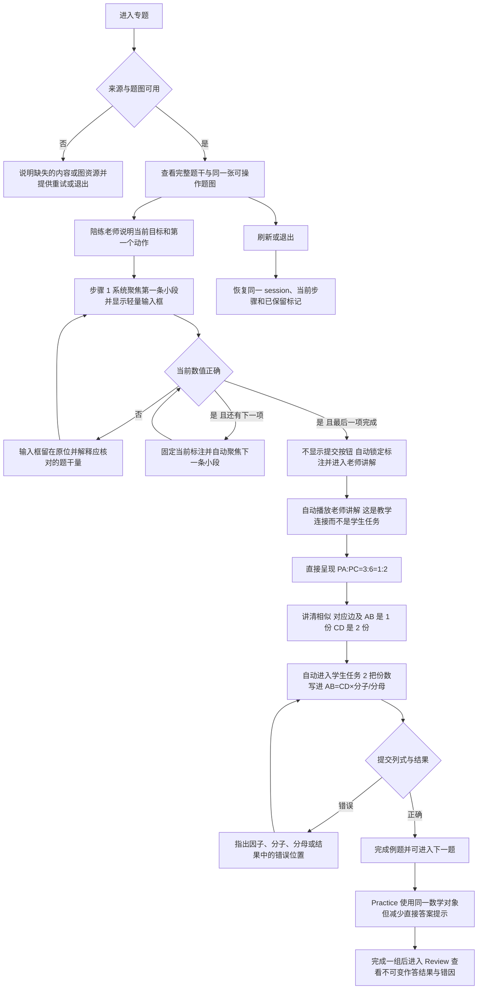

# 专题体验规格：三角形一边平行线——知三推一

本体验的产品角色是“规范解题流程脚手架”：把 explanation 已确认的解题步骤投影为学生完成的数学动作与老师直接讲解的教学连接；不得把老师讲解改造成“点这里、再点那里”的控件任务。

## 内容来源

- Learn 的 A 字型、8 字型讲解顺序来自 `02-student-explanation.resolved.tex`：先读点序，再写相似三角形和三组对应边，最后转移对应边比。
- Practice 题目只使用 ready 题库 `2026-07-17-三边求第四边-A字型8字型` 中启用的稳定题号和对应 prompt 图。
- 本次截图中的例题是 `Q001`：`PA=3`、`PC=6`、`CD=8`，求 `AB`；来源为 `/Users/gaochong/develop/teaching_skills/artifacts/题库/2026-07-17-三边求第四边-A字型8字型/items/Q001/teacher.resolved.assignment.yaml`。
- `Q001` 教师版讲解包含四次课堂引导：“标边长 → 讲清对应边并算比 → 说明 AB、CD 各占几份 → 要求学生按份数列式”。本轮界面只把“填小段”和“按份数列式”计为两个学生任务；中间的比例式与份数推理作为老师板书保留，但不计成任务，也不要求学生提交。

## 用户流程图

## 页面结构

### Learn

- 顶部始终显示完整题干；中央始终保留同一张题图，已完成步骤的标记不消失。
- 学生任务只计两项：“任务 1/2 · 填小段”和“任务 2/2 · 按份数列式”。两项之间的老师讲解是教学连接，不计入任务数，不显示“任务 2/3”。
- 任务 1“标已知边长”的最后一个动作正确后，系统自动进入老师直接讲解；讲解阶段不出现可点击线段、草稿输入框或提交按钮，讲解结束后自动激活学生任务 2“按份数列式”。
- 任务 1 也不要求学生点击线段或点击“提交答案”。进入页面时系统直接聚焦第一条待填小段并显示输入；当前数值正确后自动固定标注、移动到下一条，最后一项正确后立即进入老师讲解。
- `Q001` 的点序是 `P-A-C`，所以 `PC` 是整段，不能把输入框或数值标签压在 `PC` 上。第一条射线只在小段上保留标注：`PA=3`，并由 `PC=6`、`PA=3` 得到另一小段 `AC=3`；`PC=6` 仍保留在题干和老师讲解的比例式中。另一侧保留小段 `CD=8`。
- 取消独立步骤区和独立任务栏。任务指示、当前任务名、进度、老师讲解、正确确认和错误解释全部使用同一个讲解气泡，不在气泡外再放一套标题或说明。
- 气泡在学生操作阶段先用弱化眉题标明“任务 1/2 · 填小段”或“任务 2/2 · 按份数列式”，正文再给老师当前要说的话；进入纯讲解阶段时眉题只写“老师讲解”，不出现任务编号。
- 气泡尾部朝向题图与操作区，使用轻量半透明底色、细边界和足够留白，不使用厚边框、重阴影或多层嵌套卡片。
- 所有老师话语只进入这一个固定的讲解气泡：任务进入说明、中间的完整讲解、当前填空提示、正确确认、错误解释和下一步衔接都在同一气泡内替换显示，不得同时散落在题图下方、动作区、页面底部或额外错误卡中。
- 桌面端讲解区固定在题图右侧的同一列，可随题图区域保持可见；内容更新时位置和宽度不跳动。题干区域只放题目，图上只放数学对象与轻量输入浮层，动作区只放当前需要学生填写的式子或数值。
- 讲解气泡每次只显示一段当前话语，不把历次提示连续堆叠。需要回看时使用气泡旁的轻量“重播”动作，仍在原位置播放，不在页面新增讲解块。
- 当前动作区放在题图下方且不得被固定提交栏遮挡。每一步同时显示“为什么做”“现在点哪里或填什么”“完成到哪了”。
- `Q001` 的中间阶段是老师讲解，不是学生任务。陪练使用课堂语言直接说：“你会发现三条已知边中，`PA`、`PC` 是一组对应边，它们的比是 `PA:PC=3:6=1:2`。”界面同步高亮对应边并展示这条计算，但不说“先点 PA”“再点 PC”“在前项填 1”等控件操作。
- 同一段讲解继续补全推理链：“因为 `AB∥CD`，所以 `△PAB∽△PCD`，对应边满足 `PA/PC=AB/CD=1/2`。因此 `AB:CD=1:2`，也就是 `AB` 是 1 份，`CD` 是 2 份。”讲解结束后直接激活结构化算式 `AB = CD × [ ]/[ ]`；学生从这里重新开始操作，亲自把 `1`、`2` 写入分子和分母。
- 任务 1 的线段选择由系统完成，不再把“点中哪条线段”作为学生任务。学生只填写当前聚焦位置的数值；输入错误时不换焦点、不清空其他正确标注，并说明当前小段与题干已知量的关系。
- 当前步骤的全部数学对象必须完整位于可见画布内；像 `Q001` 的 `CD` 不得被画布下缘、动作区或固定提交栏裁掉。进入步骤 1 时应自动调整题图视区，使 `PA`、`AC`、`CD` 及其端点同时可见；后续步骤仍保持整张构型可见。
- 数值输入框不得直接叠在线段、端点或字母上。使用与目标小段保持约 12–16px 间距的浮动标注，通过细引导线指回目标；普通状态边框不超过 1px，背景采用约 72%–82% 不透明度，聚焦时只增强目标线段和细描边，不使用遮挡图形的粗实色边框。
- Learn 桌面布局不得用固定视口高度配合 `overflow:hidden` 截断题图。题图、点名、所有可操作线段和线段旁输入框必须位于画布内边距之内；空间不足时页面纵向滚动，不能裁掉数学对象。
- 答错时，错误卡片使用当前动作专属诊断，不再显示“核对题干中的线段和数值”这种可用于任何步骤的通用文案。

### Practice

- 保留完整题干、同一题图和三项书面痕迹结构。
- 保留“陪练老师”，但不直接替学生完成推理：先描述下一动作的对象类别，连续错误或停顿后再指出具体对象和值。
- 不直接给出本题的最简比或份数答案；步骤 2 提示“先从三条已知边中找出一组对应边并约成最简整数比”，步骤 3 通过算式分子、分母让学生自己表达未知边和已知边的份数。
- Practice 也由系统聚焦待填对象，学生不需要为了打开输入框而点击线段；直接提示的具体程度可以渐隐，但不得把操作控件的方法当成数学提示。

### Review

- 展示题号、题干、最终图上标记、各步提交值、正确值与错误诊断。
- 对当前缺口至少区分：“截线对应关系取错”“比例未约成最简比”“列式的份数方向颠倒”“已知边因子选错”。
- Review 从不可变结果读取，不允许修改历史作答。

### 窄屏与触摸布局

- 窄屏按“题干 → 单一讲解气泡 → 题图与当前动作”排列。气泡内部同时承载任务眉题和老师话语，始终占用同一个槽位，尾部朝向下方操作区；提示或错误只替换气泡内容。
- 画布缩放以“当前步骤所有候选对象完整可见”为下限，不要求学生先滚动画布寻找被裁掉的目标线段。
- 线段点击热区不小于 44px；候选线段要有可见高亮。非候选线段仍可接收点击以触发蜂鸣和纠错提示，但不能进入编辑状态或改变答案。
- 键盘用户可按 Tab 聚焦所有可辨认线段，Enter 触发与点击相同的判定；错误对象不得打开输入框，文字反馈通过 `role=alert` 宣读。声音关闭或设备无声时，视觉与文字反馈必须完整表达同一信息。

### 动态陪练规则

- 陪练的目标不是增加聊天感，而是保证学生沿 explanation 的规范顺序完成“识别对象 → 建立关系 → 计算或标记 → 列式 → 得出结果”。跳过必要动作时，系统应把学生带回缺失环节，而不是只判最终答案对错。
- 陪练老师由运行时事件驱动，而不是只在提交后显示一段固定提示。它至少观察：进入步骤、点击对象、打开输入、完成一个局部动作、删除或撤销、提交、连续点错和一段时间没有操作。
- 中间的老师讲解不是控件教学。进入时直接按老师讲题口径说明对应边、数值比和最简比；允许配合图上高亮，但不得要求学生点击线段、选择对象或填写比例。
- 学生点错对象时执行三级反馈；学生输错数值时保留输入框并针对该值提示。反馈必须引用当前数学对象，例如“你选的是 `CD`，但现在要先用同一组相似三角形中的截线对应边算比”。
- 当前步骤有未完成项但 6 秒没有操作时，给一句轻提示并突出当前目标；再停顿 6 秒，展示更具体的“下一步点哪里”。任何有效操作都会重置停顿计时。
- 任务 1 完成后由陪练按照“已标小段 → 相似依据 → 对应边等式链 → 份数解释 → 下一填空”完成教学连接。不得只说“对应边的比相同”，不得把份数讲解变成问答，也不得先要求学生在图上重复标一次份数。
- 每次陪练反馈都必须包含足够的动作信息：刚才的动作是否正确、接下来使用什么动作、作用于哪个数学对象。禁止只说“再想想”“检查一下”“继续完成”这类无法指导操作的空泛话术。
- 陪练内容只有一个渲染出口。步骤标题、动作区占位文案、toast 和底部错误面板不得重复讲解区的话；短暂视觉反馈可以出现在目标对象上，但完整文字解释必须回到固定讲解区。
- 陪练只提供当前所需的教学连接和下一动作。在老师已经讲清比例后，可以明确解释 `AB`、`CD` 的份数；但不得自动把 `1/2` 填入算式或展示最终结果。学生仍需亲自填写份数、计算结果并提交，系统保留可复盘的步骤轨迹。
- Learn 使用主动脚手架：进入步骤就给出第一个具体动作，每个局部动作后立即衔接。Practice 使用渐隐脚手架：默认先给动作类别，停顿或连续错误后再逐级指出具体对象；数学动作顺序和判定真值保持一致。
- 陪练话术来自步骤契约中的“进入提示、正确动作确认、下一个动作、对象错误提示、数值错误提示、停顿提示和步骤衔接”，框架负责事件监听、提示升级、焦点/箭头联动与状态恢复。

动态陪练的最低验收标准：学生无需猜测控件含义；在任一时刻都能从陪练卡片回答“我刚才做得对不对”“我现在应该做什么”“我要在哪个对象上做”；出现错误后，不需要教师在场也能通过逐级提示回到规范流程。

## 交互规则

| explanation 来源步骤 | 学生看到什么 | 学生做什么 | 完成条件 | 正确后保留什么 | 错误时如何修正 | 下一状态 | 来源资源 |
| --- | --- | --- | --- | --- | --- | --- | --- |
| 小段边长标注 | 完整题干、题图；系统依次聚焦 `PA`、`AC`、`CD` | 只在当前半透明浮层中填写数值；无需点击线段或提交 | `PA=3`；由 `PC-PA` 得 `AC=3`；`CD=8`，且最后一项即时校验正确 | 三条小段标注以轻量样式保留，`PC=6` 不压在整段上 | 错误输入留在当前浮层，说明应读取已知量还是由整段减小段得到；不清空其他标注 | 自动播放老师讲解，无提交动作 | Q001 题干、点序 `P-A-C` 与 prompt 图 |
| 老师直接讲解对应边比 | 高亮 `PA↔PC`，展示 `PA:PC=3:6=1:2` | 无学生操作；只听讲并观察题图与式子 | 讲解卡完整呈现对应边、代值和约分 | 老师板书式保留在步骤 3 上方 | 无作答错误分支；可重播讲解 | 自动进入按份数列式 | Q001 `solution_steps/计算并约分` |
| 按份数公式求边 | `AB = CD × [未知边份数]/[已知边份数]` 的结构化算式，`CD` 已作为结构项显示 | 把 `1`、`2` 直接填入分子分母，再输入结果 | `AB=CD×1/2=8×1/2=4` 的结构和值正确 | 完整列式和结果；不额外生成图上份数标记 | 精确标出分子、分母或结果中的错误，不清空前面正确槽位 | 例题完成 | Q001 `solution_steps/标份数` 与 `solution_steps/按份数公式求边` |

## 陪练讲题脚本

| 触发条件 | 学生已有结果 | 推理依据 | 严密讲解链 | 下一动作/填空 | 错误时如何解释 | 来源 |
| --- | --- | --- | --- | --- | --- | --- |
| 任务 1 的三条小段标注正确 | 图上已有 `PA=3`、`AC=3`、`CD=8`，题干保留 `PC=6` | `AB∥CD`，所以 `△PAB∽△PCD`；`PA↔PC`、`AB↔CD` | “你会发现三条已知边中，`PA`、`PC` 是一组对应边，`PA:PC=3:6=1:2`。因为 `AB∥CD`，所以 `△PAB∽△PCD`，因此 `PA/PC=AB/CD=1/2`。也就是 `AB:CD=1:2`，所以 `AB` 是 1 份，`CD` 是 2 份。” | 讲解结束后直接展示 `AB=CD×□/□`；此时才进入学生下一项任务 | 本段没有学生答错分支；学生有疑问时可重播，并重新高亮两组对应边 | Q001 explanation 对应边规则；Q001 `solution_steps/计算并约分`、`标份数` |
| 学生在分子填入 1 | 已确认 `AB` 是 1 份 | `AB/CD=1/2` 的分母对应 `CD` | “对，分子 1 表示 `AB` 的 1 份。分母表示 `CD` 的份数；刚才得到 `CD` 是 2 份。” | 将焦点移到分母并说“分母填 2” | 若填错，不清空分子；说明“这里填的是 `CD` 的份数，不是边长 8” | Q001 `solution_steps/标份数` |
| 学生在分母填入 2 | 已形成 `AB=CD×1/2` | 未知量 = 对应已知量 × 未知份数 / 已知份数 | “对，`AB=CD×1/2`。现在把已知的 `CD=8` 代入并算出结果。” | 聚焦已知边数值或结果空格 | 若把 8 填入分母，说明“8 是 `CD` 的边长，分母 2 是 `CD` 的份数，它们作用不同” | Q001 `solution_steps/按份数公式求边` |

## 页面状态说明

| 状态 | 触发条件 | 页面表现 | 可执行动作 | 保留的数据 | 退出条件 |
| --- | --- | --- | --- | --- | --- |
| 初始 | 进入新的 Learn 例题或 Practice 题 | 完整题干、题图；第一条目标小段已经高亮，半透明输入浮层已经获得焦点 | 直接输入数值 | session 与题号 | 输入第一个字符 |
| 进入步骤 | 当前步骤刚激活 | 陪练老师解释本步目的并指出第一个具体动作；题图同步高亮目标 | 按提示操作或查看步骤概览 | 当前步骤和此前正确结果 | 发生第一个有效动作 |
| 正确局部动作 | 点中正确对象或完成一个正确输入 | 就地确认当前结果，更新完成度，并立即告诉学生下一步点什么或填什么 | 执行下一动作、修改刚才输入或撤销 | 当前正确局部结果 | 下一动作发生或整步完成 |
| 当前小段输入错误 | 当前自动聚焦输入框失焦或即时校验失败 | 浮层保持原位；目标小段和错误值轻量标红，解释该数值来自题干还是整段减小段 | 原位修改数值 | 其他正确小段、当前输入和此前步骤 | 当前值正确后自动移到下一项 |
| 任务 1 自动完成 | 最后一条小段数值校验正确 | 固定三条轻量标注；不显示或等待“提交答案”，同一气泡切换为“老师讲解” | 听讲、重播讲解 | 三条小段标注与题干 | 讲解结束后自动进入学生任务 2 |
| 气泡内容更新 | 进入学生任务、局部动作正确、输入错误或开始老师讲解 | 单个讲解气泡原位替换眉题和当前话语；学生任务眉题显示 `n/2`，老师讲解眉题不显示任务编号 | 继续输入或重播本步讲解 | 当前数学结果、讲解阶段和焦点 | 下一次教学事件替换内容 |
| 操作停顿 | 当前步骤未完成且 6 秒没有有效操作 | 第一次停顿给轻提示并突出当前对象；继续停顿再指出具体下一动作 | 继续操作、关闭声音或查看步骤概览 | 当前草稿和提示等级 | 有效操作、重置或进入下一步 |
| 当前步骤未完成 | 必填对象或输入尚未齐全 | 显示完成度与缺少的对象；提交按钮不可用或提交后指出缺项 | 继续点击、输入、撤销 | 当前草稿和已完成步骤 | 必填项齐全 |
| 可以提交 | 当前步骤的必填动作齐全 | 提交按钮可用，当前候选对象保持可见 | 提交或原位修改 | 当前草稿 | 获得判定 |
| 提交正确 | 当前步骤满足后端契约 | 正确反馈短暂出现，结果固定在图上 | 进入下一步 | 当前及此前正确结果 | 下一步激活 |
| 提交错误 | 当前步骤不满足后端契约 | 标红具体错误输入或算式槽位；显示当前步骤专属的原因、修改动作与保留说明 | 原位修改错误值、撤销或重新提交 | 此前正确步骤和当前草稿 | 当前步骤重新正确提交 |
| session 恢复 | 刷新、返回或网络恢复 | 恢复题号、当前步骤、图上标记、错误状态与草稿 | 从原处继续或主动重置 | 服务端 session 快照 | 恢复成功或用户重置 |
| 资源或请求失败 | 题图、场景或接口不可用 | 明确说明缺失资源或请求失败；不得留下空白画布或无响应按钮 | 重试、退出；必要时复制错误编号 | 已成功保存的 session | 重试成功或退出 |

## 待确认事项

- 本轮替代：任务 1 不再让学生点击线段，系统直接聚焦目标小段；因此原来的“错误线段三级反馈”不用于任务 1。
- 已确认：题图必须完整显示，空间不足时页面滚动，不得以固定高度裁掉当前数学对象。
- 已确认：引导应是事件驱动的“陪练老师”，在每个局部动作后确认结果并告诉学生下一步，而不是静态步骤清单或只在提交后报错。
- 已确认：Teaching Tool 的核心价值是把 explanation 的规范解题流程变成可操作、可纠偏、可复盘的脚手架；陪练反馈必须服务于这一流程，而不是单纯增加提示文案。
- 本轮替代：比例计算与份数说明由老师在中间讲解阶段直接完成，不计为学生任务；学生随后进入任务 2，填写 `AB=CD×几分之几`。
- 已确认：Learn 主动提示当前要做的动作，但不直接公布学生尚未得到的比例或结果；学生正确操作后再确认并衔接。Practice 使用同一规范流程并更晚揭示具体对象和值。
- 已确认：草稿区采用结构化公式录入，学生先选择对应边，再填写最简整数比；界面保留完整纸面计算痕迹，并能分别诊断对象与约分错误。
- 已确认：任务 2 完全取消学生点击和比例填空，改为老师直接讲解并自动进入列式任务；`PA:PC=3:6=1:2` 作为老师板书保留，而不是学生提交结果。
- 已确认：`Q001` 不在整段 `PC` 上放标注；系统依次聚焦小段 `PA`、小段 `AC` 和 `CD`，其中学生根据 `PC=6`、`PA=3` 填出 `AC=3`。最后一项正确后无需提交，自动进入老师讲解。
- 已确认：所有老师讲解、填空提示和错误解释集中在唯一固定讲解区，其他页面区域不重复或追加讲解内容。
- 已确认：采用方案 B，取消独立步骤区与独立任务栏；所有任务指示和老师讲解都进入同一个轻量半透明对话气泡。
- 已确认：老师讲解不是学生任务。Q001 只计两个学生任务；操作阶段气泡显示“任务 1/2”或“任务 2/2”，纯讲解阶段只显示“老师讲解”。
- 已确认：以上完整修订稿按此实施。

## 实现与验收记录

> 2026-07-20：本轮确认稿已按“两项学生任务 + 中间老师讲解 + 单一老师气泡”实现并完成真实页面验收。

- 框架级 `topic-practice` 讲解出口收敛为固定老师气泡：任务说明、老师讲解、正确确认与错误解释原位替换；独立步骤列表和底部纠错面板不再渲染。
- Learn Q001 只投影两项学生任务。任务 1 自动依次聚焦 `PA`、`AC`、`CD`，正确后自动锁定并换焦点，最后一项正确后无需提交即进入老师讲解；整段 `PC` 不生成标注框。
- 中间气泡显示“老师讲解”，完整呈现 `PA:PC=3:6=1:2`、平行推出相似、`PA/PC=AB/CD=1/2` 以及 `AB`/`CD` 的份数解释；随后任务 2 由学生填写 `AB=CD×□/□` 和结果。
- 输入浮层采用半透明细边框、离开线段的法向偏移与细引导线，并根据附近其他线段选择净空更大的方向；错误数值保留原位，通过蜂鸣与同一气泡说明当前小段。
- 自动验证：`npm run import:topics`、backend `npm run build`、`node dist/backend/src/services/runtime/__tests__/topicPracticeEngine.test.js`、frontend `npm run build`、`git diff --check` 均通过。
- 浏览器验收：真实走通 Q001 的 `PA=3 → AC=3 → CD=8` 自动推进；确认气泡依次显示“任务 1/2 → 老师讲解 → 任务 2/2”，错误值只在固定气泡解释，且第二任务直接显示结构项 `CD`、不要求点击线段。

> 2026-08-07：在不改变上述 verified 体验行为的前提下，完成 Scenario Bank v2 架构迁移。

- `parallelLineRatios` 的 50 条 ready-bank 题目全部迁为 versioned approved `ScenarioRecord`，原 stable id、题号、来源 assignment、题图与步骤契约保持不变。
- `acceptedAnswers` 与标准答案 `expectedLatex` 只存在于 backend `answerKey`；Learn 的交互提交改由 backend `/api/learn/runtime-action` 判定，未完成 runtime projection 不再携带答案键。
- session 固定 `scenarioId + scenarioVersion + scenario snapshot`，恢复不会因 bank 更新换题；旧 topic state 继续走兼容读取。
- 验收：全量 importer 对账 50 条；backend 全量测试、该 topic 首/中/尾完成流、Q001 专项测试、frontend build 与 `git diff --check` 均通过。
