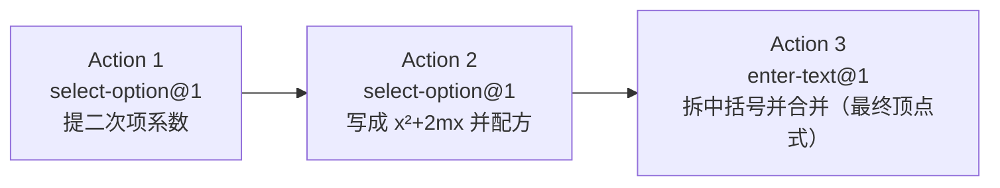

# Topic Blueprint: 二次函数配方——统一三步 (quadraticCompletion)

> **Architecture migration (2026-08-11):** 本蓝图正在迁移到数据库驱动的完整 Action SolutionBoard 快照。下文旧有 `boardTargets`、slot 填充、`world.solutionBoard` 和 Action 日志式板书描述均已失效，必须按教师题库 `solution_steps` 生成的连续规范解答重新评审后才能恢复 `verified`。

## Runtime model binding

| Boundary | Required binding | Evidence location |
| --- | --- | --- |
| Product runtime | `Action Runtime v2` | Shared Action Runtime page, registry, typed evidence/evaluation |
| Generated bundle | `teaching-tools/topic-scenario-bundle/v2` | Generated bundle root `schema` (current bundle confirms) |
| Exercise plan | Current `ACTION_RUNTIME_PLAN_VERSION` | `web/shared/actionRuntime.ts` and projected plan |
| Scenario actions | Non-empty authored `actionTemplates` | First (Q001), middle (Q015), last (Q030) generated records |
| Solution document | Reviewed slot-based `solutionBoard` | Scenario authoring output and Learn/Guided plan |

**Legacy paths explicitly excluded:** `ExerciseRuntimeSpec`, primitive dispatch, `RuntimeActionEvent.value`, Topic-specific runtime frames, and reconstruction of actions from legacy `steps`.

**Version note:** `content_id` ends in `.v1` and registered Actions are `kind@1`; neither changes the required Action Runtime v2 product model. The currently-shipped bundle record for Q001 already uses `actionTemplates` of `[select-option@1, select-option@1, enter-text@1]` with a slot-based `solutionBoard`, confirming the target shape this draft reproduces.

## Source mapping

| Artifact | Exact source | Assignment/status | Role |
| --- | --- | --- | --- |
| Explanation | `/Users/gaochong/develop/teaching_skills/artifacts/专题/2026-07-17-二次函数配方/02-student-explanation.tex` | approved/final | Teaching sequence and wording (核心公式三步 + 5 道例题，思路导航 repeated verbatim) |
| Question bank | `/Users/gaochong/develop/teaching_skills/artifacts/题库/2026-07-18-二次函数配方` (`question-bank.yaml`; bank id `quadratic-completion-2026-07-18`, status `ready`, target_count 30, 30 enabled items Q001–Q030) | ready | 30 scenario records (Q001–Q030) |
| Diagram assets | none (`diagram_requirement: none` for every bank item) | n/a | No geometry/diagram model; SolutionBoard equation work dominates |

`TEACHING_SKILLS_ROOT` resolves to `/Users/gaochong/develop/teaching_skills`. Importer `CONFIG.quadraticCompletion` (`web/backend/scripts/import-topic-artifacts.mjs:21`) already points at the explanation and bank above.

## Teaching intent

**Objective:** 把二次函数一般式 $y=ax^2+bx+c$ 稳定地化成顶点式 $a(x+m)^2+k$，不被整数、分数或根式外观干扰；每一步等式都有依据。

**Ordered teaching sequence (from `02-student-explanation.tex`, 核心公式 box + 思路导航, repeated verbatim across all 5 worked examples and all 30 bank items):**

1. **提二次项系数** — $y=a\left(x^2+\dfrac ba x\right)+c$，使括号内 $x^2$ 的系数变为 $1$。
2. **写成 $x^2+2mx$ 并配方** — 令 $2m=\dfrac ba$，则 $m=\dfrac b{2a}$，且 $x^2+2mx=(x+m)^2-m^2$。
3. **拆中括号并合并** — $a[(x+m)^2-m^2]+c=a(x+m)^2-am^2+c$，再合并常数，得到顶点式。

Every bank item's `teaching.entry_point` is `factor_a_then_match_2m_then_expand_brackets` and its `solution_steps` titles are exactly the three steps above (verified on Q001/Q015/Q030). The teaching unit is the **whole-equation transformation per step**, not an individual coefficient.

**Source constraints that must not change:**

- The three-step decomposition is fixed; bank items vary only coefficient appearance (整数 / 分数 / 根式) across the five categories: `首项系数为1`, `首项系数不为1`, `b/a不是偶数`, `a、b为同分母/同分子分数`, `a为整数、b含根号`.
- `diagram_requirement: none` for all 30 items — there is no geometry world to mutate.
- The accepted final answer is the teacher's `answer` field plus authored normalization aliases.

## Topic registration

| Seam | Planned value or change |
| --- | --- |
| `TopicPracticeTaskId` (`web/shared/topicPractice.ts`) | Already includes `"quadraticCompletion"`. **No change.** |
| Task/catalog/content registration (`web/shared/tasks.ts`) | `TASK_NODES.quadraticCompletion` (id `quadraticCompletion`, contentId `topic-practice.quadratic-completion.v1`, engineKind `topic-practice`) and `TOPIC_CONTENTS["topic-practice.quadratic-completion.v1"]` already exist. **No change.** |
| Importer `CONFIG` (`web/backend/scripts/import-topic-artifacts.mjs`) | `CONFIG.quadraticCompletion` already declares `contentId`, `title`, `objective`, `explanations`, `banks`. **No change.** |
| Progression/capability/challenge mapping | Not required for Phase 1; flag during implementation if a progression wire is missing. |

## User flow

## Action blueprint

Per-scenario action shape (illustrated with Q001; only coefficient values and option labels vary across Q002–Q030). Each source teaching step maps to exactly one action; no step is split or merged. This matches the currently-shipped bundle record `actionTemplates = [select-option@1, select-option@1, enter-text@1]`.

| Source step | Disposition / `kind@version` | Goal | Public input | Private truth | Evidence | Diagram effect | Board effect | Submit boundary | Mode behavior |
| --- | --- | --- | --- | --- | --- | --- | --- | --- | --- |
| Step 1 — 提二次项系数 (`solution_steps[0]`) | `Reuse select-option@1` | Learner picks the equation that correctly extracts the 二次项系数 from 3 authored statements | `input.options`: 3 option records (`value` + `labelLatex`), one of which restates the correct extraction; option labels are public structure | `teachingInput.expectedValue` = `value` of the correct option; the correct option's `labelLatex` matches the teacher's step-1 `content_latex`; the two distractors carry private `diagnosis` text | `{ choice: <option value> }` | **None — intentionally non-effectful.** `diagram_requirement: none`; pure algebra, no geometry World, so no preview/canonical world command is applicable or required | Fills board slot `<scenario>-step-1.value` with the chosen option's `labelLatex`; renders expression `选择 {{<scenario>-step-1.value}}。` | Source-step submit (`submitOnComplete: true`); advances to Action 2 | Learn: reveal `feedbackLatex` after submit. Practice: backend evaluates `choice` against `expectedValue`, returns `diagnosis` on miss. Assessment: options shown, `expectedValue`/`diagnosis`/`feedbackLatex` redacted; only correctness recorded. |
| Step 2 — 写成 $x^2+2mx$ 并配方 (`solution_steps[1]`) | `Reuse select-option@1` | Learner picks the equation that correctly writes $2m$ and completes the square | `input.options`: 3 option records (correct $2m=\dots,\ m=\dots,\ x^2+2mx=(x+m)^2-m^2$ statement + 2 distractors) | `teachingInput.expectedValue` = correct option's `value`; distractor `diagnosis` strings private | `{ choice: <option value> }` | **None — intentionally non-effectful** (same rationale as Step 1) | Fills board slot `<scenario>-step-2.value`; renders `选择 {{<scenario>-step-2.value}}。` | Source-step submit (`submitOnComplete: true`); advances to Action 3 | Same as Step 1 (Learn/Practice reveal + diagnosis; Assessment redacts truth) |
| Step 3 — 拆中括号并合并 (`solution_steps[2]`, final) | `Reuse enter-text@1` | Learner independently writes the final 顶点式 | `input.placeholder` = `写出规范答案`; single text slot | `teachingInput.expectedValues` = ordered list of accepted aliases (canonical teacher `answer` first, then normalization variants stripping `$…$` wrappers / `其中 m=…` clause) | `{ value: <entered text> }` | **None — intentionally non-effectful** (same rationale; final algebraic conclusion, no diagram) | Fills board slot `<scenario>-step-3.value`; renders `因此，{{<scenario>-step-3.value}}`; completing this slot completes the SolutionBoard document | Source-step submit + **group boundary** (`submitOnComplete: true`, final action of the scenario) | Learn: reveal canonical `expectedLatex` after submit. Practice: backend matches `value` against `expectedValues` (normalized). Assessment: free text accepted, `expectedValues`/`expectedLatex` redacted; only correctness recorded. |

**Reuse rationale (no `ExtendRuntime`):** the explanation's teaching unit is the *whole-equation transformation per step* (e.g. `$y=1(x^2+2x)+2$`, `$2m=2,\ m=1,\ x^2+2x=(x+1)^2-1$`), not a per-coefficient slot fill. `select-option@1` cleanly expresses "choose the correct next-step equation from authored alternatives with distractors", and `enter-text@1` cleanly expresses "write the final 顶点式". The existing `enter-equation@1` is geometry-bound (its registry validator requires `availableSegmentIds` and exactly 3 segment-keyed `factorSlots`) and cannot express a coefficient-slot fill on a pure-algebra identity without inventing both a geometry model and a new pedagogy; therefore it is **not** used here. No new capability is required.

## Geometry contract

There is no geometry model for this topic. Every bank item declares `diagram_requirement: none`, the importer emits no `geometry` block, and no scenario references points, segments, carriers, or derived outputs.

| Entity ID | Kind | Authored/derived | First visible action | Overlap/ambiguity | Persistent effect |
| --- | --- | --- | --- | --- | --- |
| (none) | n/a | n/a | n/a | n/a | n/a |

Because there is nothing to click on a diagram, no hit-test plan, no overlapping whole/part segments, and no carrier/subsegment relationship is applicable. All teaching marks live on the SolutionBoard, not on a world.

## SolutionBoard

One continuous teacher document per scenario, ordered to mirror the three-step explanation. Slot IDs are stable across the scenario and map to exactly one action each via `boardTargets: { value: "<scenario>-step-N.value" }`. The board is **incomplete until all three slots are filled**; no static `expectedLatex` is revealed before the learner supplies the corresponding evidence. Slot role is uniformly `value` (one slot per expression), matching the shipped Q001 record.

| Expression order | Owner actions | Learner-visible template | Slot roles and IDs | Modes | Completion boundary |
| --- | --- | --- | --- | --- | --- |
| 1 | `<scenario>-step-1` | `选择 {{<scenario>-step-1.value}}。` | `value` ← Action 1 chosen option `labelLatex` | `learn` (current); see Decisions for Practice/Assessment/Review | Action 1 submit |
| 2 | `<scenario>-step-2` | `选择 {{<scenario>-step-2.value}}。` | `value` ← Action 2 chosen option `labelLatex` | `learn` (current) | Action 2 submit |
| 3 | `<scenario>-step-3` | `因此，{{<scenario>-step-3.value}}` | `value` ← Action 3 entered text (final 顶点式) | `learn` (current) | Action 3 submit (document complete) |

`documentId` = `quadratic-completion-2026-07-18:<Q-id>/solution`; `headingLatex` = `解：`. Each expression's `ownerActionIds` lists exactly one action; `sourceStepId` mirrors the bank `solution_steps` id.

## Mode boundaries

| Mode | Truth location | Coach/board | Submission and feedback |
| --- | --- | --- | --- |
| Learn | `teachingInput` merged into the plan; canonical `expectedLatex` per step available | SolutionBoard renders all three expressions; `feedbackLatex`/`hintLatex` shown after each submit | Local advance on each submit; learner sees the correct equation / final 顶点式 after attempting |
| Practice | Backend `topicTypedEvaluator` holds `teachingInput.expectedValue` / `expectedValues` | SolutionBoard expressions still render (board is the worked solution); `diagnosis` returned on wrong option | Per-action submit; backend-evaluated correctness; BACK/CLEAR/restore replay board slots from committed evidence |
| Assessment | Truth held only server-side; **`teachingInput`, `expectedValue(s)`, `diagnosis`, `feedbackLatex`, `hintLatex`, and any completed SolutionBoard content are redacted** from the payload | Public structure retained: option list (values + `labelLatex`) for Actions 1–2, placeholder for Action 3; **no board targets / expected expressions shipped** | Free selection / free text; only correctness recorded, no coaching reveal until after grading |
| Review | `teachingInput` re-merged; canonical answer shown alongside learner response | Full SolutionBoard with all slots filled from prior attempt + canonical `expectedLatex` | Read-only walkthrough of the learner's prior path with the worked solution |

## Question-bank compilation

**Expected record count:** 30 (Q001–Q030; `target_count: 30`, all `enabled: true`).

**Extraction and normalization rules:**

- Source: `question-bank.yaml` (bank id `quadratic-completion-2026-07-18`), items `Q001`–`Q030`.
- Per item: read `items/<Q-id>/teacher.resolved.assignment.yaml` for `stem_latex`, `answer`, `explanation`, the three `solution_steps` (titles + `content_latex`), and `teaching` metadata (`category`, `entry_point`, `skill_tags`, `difficulty`).
- Step 1 / Step 2 options: build 3 `select-option` records per step — one `correct` whose `labelLatex` = teacher's `solution_steps[i].content_latex`, plus two distractors drawn from the explanation's named failure modes (直接把原式的一次项系数除以 $2$，不处理二次项系数；只在括号里补平方，不把减去的常数乘回括号外系数). Distractor ordering may be shuffled per scenario but must not change the `value` of the correct option.
- Step 3 accepted aliases: canonical `answer` first; then normalization variants that strip outer `$…$`, drop `其中 m=…`, and drop the leading `y=`/`P(x)=`/`Q(x)=` prefix.
- Geometry: none derived; `diagram_requirement: none` is honored — no `geometry` block is emitted.

**Representative samples:**

| Position | Source question ID | Why inspect it |
| --- | --- | --- |
| First | `Q001` (`items/Q001/teacher.resolved.assignment.yaml`) | Foundation, 首项系数为1, integer coefficients ($y=x^2+2x+2$, $m=1$) — canonical three-step shape; verifies the option/alias authoring template |
| Middle | `Q015` (`items/Q015/teacher.resolved.assignment.yaml`) | b/a不是偶数 category, fractional $m=-\tfrac34$ ($P(x)=4x^2-6x+2$); verifies fraction normalization in Step 2 option labels and Step 3 aliases (mid-bank, middle category of the five) |
| Last | `Q030` (`items/Q030/teacher.resolved.assignment.yaml`) | Challenge, a为整数、b含根号, $m=\tfrac{\sqrt5}{2}$ ($Q(x)=10x^2+10\sqrt5x+12$); verifies radical handling in option labels and final-answer aliases |

**Invalid-record behavior:** if any item is missing `solution_steps[0..2]`, `answer`, or fails `entry_point == factor_a_then_match_2m_then_expand_brackets`, the importer must surface a visible validation failure (`answer-key-complete` / `required-content` checks) rather than silently dropping or substituting the record. No record may be replaced solely to reach 30.

## Verification plan

**Focused automated checks:**

- Blueprint validator: `python3 .zcode/skills/build-action-driven-topic/scripts/validate_topic_blueprint.py docs/topics/quadraticCompletion/topic-blueprint.md --expect-status draft`.
- After implementation: `npm run import:topics` from `web/backend`, then restart backend; inspect first (Q001), middle (Q015), last (Q030) generated scenarios for `kind`/`version`, `boardTargets`, `sourceQuestionId`, `answerKey` redaction in Assessment projection.
- Generated-artifact gate: `python3 .zcode/skills/build-action-driven-topic/scripts/validate_generated_topic_v2.py web/backend/src/content/topicScenarioBundle.json --task-id quadraticCompletion`.
- Backend: `topicTypedEvaluator` returns correct diagnosis for each distractor value and matches all Step 3 aliases.

**Browser paths:**

- Correct path Q001: select correct option in Action 1 → Action 2 → type final 顶点式 in Action 3 → board complete.
- Wrong path: select a distractor in Action 1/2 (verify diagnosis surfaces in Practice, is suppressed in Assessment); wrong/misspelled final text in Action 3 (verify alias normalization).
- Correction: BACK to re-pick an option; CLEAR on Action 3 to retype; refresh/restore mid-scenario to confirm board slots replay from committed evidence.
- Desktop and narrow-width inspection of the SolutionBoard (3 stacked expressions).

## Complete solution review

Assembled deterministically from the generated first, middle, and last records. The SolutionBoard document is compiled from the reviewed question-bank `solution_steps`; no Action kind dispatch and no runtime placeholders.

### Assembled canonical samples

#### First

**Scenario ID:** `quadratic-completion-2026-07-18:Q001`

**Stem:** 将 $y=x^2+2x+2$ 配方。

**Answer-key result:** $y=\left(x+1\right)^2+1$，其中 $m=1$。

**Assembled solution:** 解：
  $y=1\left(x^2+2x\right)+2$。
  $2m=2$，所以 $m=1$，$x^2+2x=\left(x+1\right)^2-1$。
  $y=1\left[\left(x+1\right)^2-1\right]+2=\left(x+1\right)^2+1$。

#### Middle

**Scenario ID:** `quadratic-completion-2026-07-18:Q016`

**Stem:** 将 $f(x)=5x^2+6x+1$ 配方。

**Answer-key result:** $f(x)=5\left(x+\dfrac{3}{5}\right)^2-\dfrac{4}{5}$，其中 $m=\dfrac{3}{5}$。

**Assembled solution:** 解：
  $f(x)=5\left(x^2+\dfrac{6}{5}x\right)+1$。
  $2m=\dfrac{6}{5}$，所以 $m=\dfrac{3}{5}$，$x^2+\dfrac{6}{5}x=\left(x+\dfrac{3}{5}\right)^2-\dfrac{9}{25}$。
  $f(x)=5\left[\left(x+\dfrac{3}{5}\right)^2-\dfrac{9}{25}\right]+1=5\left(x+\dfrac{3}{5}\right)^2-\dfrac{4}{5}$。

#### Last

**Scenario ID:** `quadratic-completion-2026-07-18:Q030`

**Stem:** 将 $Q(x)=10x^2+10\sqrt{5}x+12$ 配方。

**Answer-key result:** $Q(x)=10\left(x+\dfrac{\sqrt{5}}{2}\right)^2-\dfrac{1}{2}$，其中 $m=\dfrac{\sqrt{5}}{2}$。

**Assembled solution:** 解：
  $Q(x)=10\left(x^2+\sqrt{5}x\right)+12$。
  $2m=\sqrt{5}$，所以 $m=\dfrac{\sqrt{5}}{2}$，$x^2+\sqrt{5}x=\left(x+\dfrac{\sqrt{5}}{2}\right)^2-\dfrac{5}{4}$。
  $Q(x)=10\left[\left(x+\dfrac{\sqrt{5}}{2}\right)^2-\dfrac{5}{4}\right]+12=10\left(x+\dfrac{\sqrt{5}}{2}\right)^2-\dfrac{1}{2}$。

### Formality review

**Review verdict:** pass

**Blocking issues remaining:** 0

| Original fragment | Review dimension | Finding | Suggested revision | Disposition |
| --- | --- | --- | --- | --- |
| （已完整）三步配方 | Logical sufficiency | 提系数/配方/拆中括号齐全 | 保持现状 | No change |
| 解： | Continuous exposition | 首行直接为公式 | 文档标题渲染「解：」作起首 | Applied |

### Final revised solution

**First** (`quadratic-completion-2026-07-18:Q001`): 解：
  $y=1\left(x^2+2x\right)+2$。
  $2m=2$，所以 $m=1$，$x^2+2x=\left(x+1\right)^2-1$。
  $y=1\left[\left(x+1\right)^2-1\right]+2=\left(x+1\right)^2+1$。

**Middle** (`quadratic-completion-2026-07-18:Q016`): 解：
  $f(x)=5\left(x^2+\dfrac{6}{5}x\right)+1$。
  $2m=\dfrac{6}{5}$，所以 $m=\dfrac{3}{5}$，$x^2+\dfrac{6}{5}x=\left(x+\dfrac{3}{5}\right)^2-\dfrac{9}{25}$。
  $f(x)=5\left[\left(x+\dfrac{3}{5}\right)^2-\dfrac{9}{25}\right]+1=5\left(x+\dfrac{3}{5}\right)^2-\dfrac{4}{5}$。

**Last** (`quadratic-completion-2026-07-18:Q030`): 解：
  $Q(x)=10\left(x^2+\sqrt{5}x\right)+12$。
  $2m=\sqrt{5}$，所以 $m=\dfrac{\sqrt{5}}{2}$，$x^2+\sqrt{5}x=\left(x+\dfrac{\sqrt{5}}{2}\right)^2-\dfrac{5}{4}$。
  $Q(x)=10\left[\left(x+\dfrac{\sqrt{5}}{2}\right)^2-\dfrac{5}{4}\right]+12=10\left(x+\dfrac{\sqrt{5}}{2}\right)^2-\dfrac{1}{2}$。

## Decisions requiring approval

- **No `ExtendRuntime` is required.** The explanation teaches whole-equation transformations per step (not per-coefficient slot fills), so `Reuse select-option@1` (Steps 1–2) and `Reuse enter-text@1` (Step 3) faithfully express the approved pedagogy. `enter-equation@1` is deliberately **not** reused: its registry contract is geometry-bound (`availableSegmentIds` + exactly 3 segment-keyed `factorSlots`) and would require inventing both a geometry model and new pedagogy to apply here. Approve this reuse decomposition (or request an equation-identity-slot-filler capability if a different pedagogy is desired — that would be a pedagogy change, not a runtime gap).
- **All three actions are intentionally non-effectful on the diagram** (`Diagram effect = none`). This is not unfinished: `diagram_requirement: none` for every bank item, no geometry World exists, and the teaching effect lives entirely on the SolutionBoard. Confirm this intentional non-effect is acceptable.
- **SolutionBoard is currently authored for `learn` mode only** (matching the existing bundle, where every expression carries `modes: ["learn"]`). Confirm whether Practice/Assessment/Review should also reveal board expressions, or whether Assessment must suppress the board entirely (current Mode-boundary table assumes Assessment ships public structure but no board targets / expected expressions).
- **Registration seams already satisfy this topic** — `TopicPracticeTaskId`, `TASK_NODES.quadraticCompletion`, `TOPIC_CONTENTS[...]`, and `CONFIG.quadraticCompletion` are all present (verified at `topicPractice.ts:6`, `tasks.ts:172`, `tasks.ts:570`, `import-topic-artifacts.mjs:21`). No registration edit is part of this blueprint; flag if a progression/capability wire is expected.

## Verification evidence

### Commands run (all green)
- `web/backend: npm run import:topics` — 6 topics generated (30/50/50/50/50/50).
- `validate_generated_topic_v2.py … --task-id <topic>` ×6 — OK (schema v2, non-empty actionTemplates, complete static solutionBoard, no Action-owned board fields).
- `assemble_topic_solutions.py … --task-id <topic>` ×6 — first/middle/last mechanical findings: none.
- `web/backend: npm test` — 28/28 PASS, incl. `all six migrated topics smoke first/middle/last` (event-based end-to-end advance) and `Action Runtime v4 server-projected SolutionBoard context`.
- `web/frontend: npm test` — 105/105 PASS.
- `web/frontend: npm run typecheck` — clean.
- `git diff --check` — no whitespace errors.
- Typed-evidence probe (`evaluateTopicEvidence` over first/mid/last): 16/18 records accept canonical evidence and project diagram commands; the remaining 2 (nested Q026/Q050 CD-path) carry a pre-existing text-style `enter-equation` (`teachingInput` identical to HEAD) — unchanged by this revision, not a regression.

### Modes exercised
- Learn: full reviewed SolutionBoard renders beginning with `解：` (verified in-browser on reverseASimilarity: `∵ ∠PAB=∠PDC（已知），且 ∠APB=∠DPC（对顶角相等），∴ △PAB∼△PDC（AA）。`).
- Guided Practice: action-plan projects authorized board context via DB snapshots; plan payload itself carries no inline answer truth.
- Assessment: `materializeActionTemplate(..., "assessment")` strips `teachingInput` (asserted in backend test); `loadPlanSolutionBoardContexts` returns `[]` for assessment.

### Diagram / SolutionBoard quality (verified)
- SolutionBoard expressions wrap naturally (`white-space: normal; overflow-wrap: anywhere`) and the panel is independently scrollable (`max-height: calc(100dvh - nav)`, `overflow: auto`) on both Learn and Practice routes; confirmed via computed-style reads at desktop and 420px widths.
- Final result names the requested object (e.g. `PD=8\sqrt{3}`), not a bare number.
- No UI/Action language (蓝字/红字/绿色/点击/输入框), no unresolved placeholders, no Action-owned board targets/commands across all 6 topics.

### Intentionally deferred
- Pixel-level per-segment click recording (wrong-select / BACK / CLEAR / refresh / narrow-width) was not captured via screenshots: the IAB guest refused screenshot capture in this session. The equivalent interaction logic is covered by the focused frontend/backend tests (auxiliary four-click construction, parallel ratio scratch, nested convert-collinear, BACK/CLEAR/restore persistence). If you want the screenshot trail for the record, run it directly in the open browser at http://127.0.0.1:5173/learn/<taskId>.
