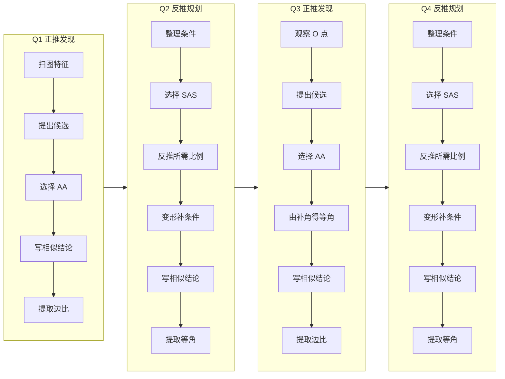

# Topic Blueprint: 反 A 一图四相似——发现候选、规划证明

> **纠错修订（2026-08-15）：** 经用户复核，原蓝图错误地把“识别相似候选”和“证明指定目标”统一成机械流程，并加入了学生不会执行的“点击对应边”动作。此次修订由用户明确授权：Q1/Q3 保持发现式，Q2/Q4 保持目标式；移除全部 4 个 `pair-segments@1` / `mark-ratio` 动作；重写题干、正式解答和 Coach 文案。当前共 23 个动作（5+6+6+6），没有对应边点击、刻痕或持久图形命令。

## Runtime model binding

| Boundary | Required binding | Evidence |
| --- | --- | --- |
| Product runtime | `Action Runtime v2` | Shared Action Runtime page and typed evaluator |
| Generated bundle | `teaching-tools/topic-scenario-bundle/v2` | `web/backend/src/content/topicScenarioBundle.json` |
| Scenario actions | Authored, non-empty `actionTemplates` | Four generated records |
| Solution document | Database-backed `solutionBoard` | Question-bank `content_latex` projected into board expressions |

Legacy v1 runtime、Topic 专属页面、手改 generated bundle、由 action log 临时拼解答均不允许。

## Source mapping

| Artifact | Source | Status | Role |
| --- | --- | --- | --- |
| Explanation | `/Users/gaochong/develop/teaching_skills/artifacts/2026-08-14-相似模型混合32题/02-student-explanation.tex` | approved/final | 四组相似的数学真值与关系链 |
| Question bank | `/Users/gaochong/develop/teaching_skills/artifacts/题库/2026-08-15-反A一图四相似证明` | ready，4 题，teacher/student assignments 均已生成 | 题干、答案、步骤、Coach 的唯一编辑源 |
| Diagram | `2026-08-14-相似模型混合32题/build/diagram/jobs/explanation-reverse-a-four-prompt/rendered/` | rendered/final | 四题共用的只读构型图 |

## Topic registration

| Seam | Planned value or change |
| --- | --- |
| `TopicPracticeTaskId` | 复用已注册的 `reverseAFourSimilarity` |
| Task/catalog/content registration | 复用 `topic-practice.reverse-a-four-similarity.v1` 与现有目录节点 |
| Importer `CONFIG` | 从上述 explanation 与 ready bank 重新生成 4 条场景记录 |
| Progression/capability/challenge mapping | 保留模型识别与证明规划能力；删除对应边点击后，不再由 `mark-ratio` 产生证据 |

## Teaching intent

本 Topic 训练两个不同能力：

1. **模型识别（正推）**：看结构与已知条件，产生“哪两个三角形可能相似”的猜想。
2. **证明规划（反推）**：从指定目标出发，比较判定路线，找出缺口，再调用前问结论补齐。

对应关系、规范书写和提取新结论属于证明执行层。四问认知节奏为：

| 问 | 方向 | 核心任务 | 结论 |
| --- | --- | --- | --- |
| Q001 | 正推发现 | 从已知等角和公共角识别反 A | $\triangle ADE\sim\triangle ACB$（AA）→ 边比 |
| Q002 | 反推规划 | 从目标比较路线，用 Q1 边比补 SAS | $\triangle ADC\sim\triangle AEB$（SAS）→ 等角 |
| Q003 | 正推发现 | 从 O 点对顶角和 Q2 等角的补角识别蝶形 | $\triangle ODB\sim\triangle OEC$（AA）→ 边比 |
| Q004 | 反推规划 | 从目标反推 SAS 所需比例，用 Q3 边比变形 | $\triangle ODE\sim\triangle OBC$（SAS）→ 等角 |

约束：Q1/Q3 题干不直接点名待发现的相似对；Q2/Q4 明确给出证明目标；Q2–Q4 把上一问的可用结论写入题干，保证单题抽取时仍自洽。

## User flow

## Action blueprint

共 23 个 `Reuse` 动作：19 个 `select-option@1`、4 个 `enter-text@1`。不扩展 Runtime，不使用 `pair-segments@1`，不让学生点对应边，也不在图上累积对应刻痕。

| Source step | Disposition / `kind@version` | Goal | Public input | Private truth | Evidence | Diagram effect | Board effect / Solution visibility | Submit boundary | Mode behavior |
| --- | --- | --- | --- | --- | --- | --- | --- | --- | --- |
| Q001 `q1-scan/hypothesis/route/conclusion/yield` | 4× `Reuse select-option@1` + 1× `Reuse enter-text@1` | 识别反 A、AA 验证、规范写结论并提取边比 | 轮换选项；相似结论输入框 | 期望选项 ID；保持正确顶点对应的相似式 | typed select/text evidence | 无 | accepted 后依次显示板书 0–4 行 | 每步提交，第 5 步完成本问 | Learn 演示；Practice 评估；Assessment 隐藏私有真值 |
| Q002 `q2-inventory/route/subgoal/derive/conclusion/yield` | 5× `Reuse select-option@1` + 1× `Reuse enter-text@1` | 由目标反推 SAS 缺口、变形比例、完成证明 | 轮换选项；相似结论输入框 | 期望路线、比例与相似式 | typed select/text evidence | 无 | accepted 后依次显示板书 0–5 行 | 每步提交，第 6 步完成本问 | 同上 |
| Q003 `q3-scan/hypothesis/route/derive/conclusion/yield` | 5× `Reuse select-option@1` + 1× `Reuse enter-text@1` | 识别蝶形、用补角补齐 AA、完成证明 | 轮换选项；相似结论输入框 | 期望对顶角、补角关系与相似式 | typed select/text evidence | 无 | accepted 后依次显示板书 0–5 行 | 每步提交，第 6 步完成本问 | 同上 |
| Q004 `q4-inventory/route/subgoal/derive/conclusion/yield` | 5× `Reuse select-option@1` + 1× `Reuse enter-text@1` | 由目标反推 SAS 缺口、变形比例、完成证明 | 轮换选项；相似结论输入框 | 期望路线、比例与相似式 | typed select/text evidence | 无 | accepted 后依次显示板书 0–5 行 | 每步提交，第 6 步完成本问 | 同上 |

对应关系通过相似式的顶点顺序、判定所需比例以及后续对应角/边比体现，不再单独制造“标对应边”的交互。相似成立后，对应角相等和对应边成比例都成立；`yield` 只要求选择当前题目或下一问真正需要的结论，不再错误暗示 AA 只能推出边比、SAS 只能推出等角。

## Geometry contract

四个场景共用同一 `promptGeometry` 和图资产。图形只承担观察公共角、对顶角、共线和补角关系的作用；所有选择与输入动作均无 domain command。保留的教学子段 ID 仅为几何语义和兼容性数据，不构成点击目标，不生成刻痕，BACK/CLEAR/restore 无需重放任何对应标记。

## SolutionBoard

每题是一份连续、可独立阅读的正式解答，共 23 行。`content_latex` 是板书真值，不写“猜想、武器、入库、锁定、顺排”等 action-log 话术；每个 action 只控制对应表达式何时可见。

| Expression order | Owner actions | Complete learner-visible prose/math | Modes | Accepted visibility boundary |
| --- | --- | --- | --- | --- |
| Q001 0–4 | `q1-*` | 公共角、第二组等角、顶点对应、AA 结论、对应边比例 | Learn / Guided Practice | 对应 owner action accepted |
| Q002 0–5 | `q2-*` | 已有比例、公共角、比例子目标、等积变形、SAS 结论、对应角 | Learn / Guided Practice | 同上 |
| Q003 0–5 | `q3-*` | 对顶角、前问等角、两组共线补角、AA 结论、对应边比例 | Learn / Guided Practice | 同上 |
| Q004 0–5 | `q4-*` | 对顶角、已有比例、比例子目标、等积变形、SAS 结论、对应角 | Learn / Guided Practice | 同上 |

## Complete solution review

本节来自最终 generated bundle 的拼装结果；代表样本由脚本固定抽取为 Q001、Q003、Q004，Q002 另行逐行连读。

### Assembled canonical samples

#### First

**Scenario ID:** `reverse-a-four-similarity-2026-08-14:Q001`

**Stem:** 观察分别以 $\angle ADE$ 和 $\angle ACB$ 为内角的两个三角形，找出一组可能相似的三角形，写出猜想并证明，再写出对应边比例。

**Answer-key result:** $\triangle ADE\sim\triangle ACB$（两角分别相等），并得到对应边比例。

**Assembled solution:**

**Q001**

> 解：因为点 $D$、$E$ 分别在 $AB$、$AC$ 上，所以 $\angle DAE=\angle CAB$。又因为 $\angle ADE=\angle ACB$，所以在 $\triangle ADE$ 和 $\triangle ACB$ 中已有两组对应角分别相等。上述两组等角确定 $A\leftrightarrow A$、$D\leftrightarrow C$、$E\leftrightarrow B$。因此 $\triangle ADE\sim\triangle ACB$（两角分别相等）。由相似三角形的对应边成比例，得 $\dfrac{AD}{AC}=\dfrac{AE}{AB}=\dfrac{DE}{CB}$。

#### Additional Q002 audit

**Scenario ID:** `reverse-a-four-similarity-2026-08-14:Q002`

**Stem:** 由第①问的相似与边比，求证 $\triangle ADC\sim\triangle AEB$，并说明指定两角的关系。

**Answer-key result:** $\triangle ADC\sim\triangle AEB$（两边成比例且夹角相等），并得 $\angle ADC=\angle AEB$。

**Assembled solution:**

**Q002**

> 证明：由第①问，$\dfrac{AD}{AC}=\dfrac{AE}{AB}$。因为点 $D$、$E$ 分别在 $AB$、$AC$ 上，所以 $\angle DAC=\angle EAB$。为了使用两边成比例且夹角相等的判定，需要把已有比例化为夹角 $A$ 两边的对应比例。由 $AD\cdot AB=AC\cdot AE$，得 $\dfrac{AD}{AE}=\dfrac{AC}{AB}$。因此 $\triangle ADC\sim\triangle AEB$（两边成比例且夹角相等），从而 $\angle ADC=\angle AEB$。

#### Middle

**Scenario ID:** `reverse-a-four-similarity-2026-08-14:Q003`

**Stem:** 由第②问的等角，观察 $O$ 点交叉结构及其补角，找出一组可能相似的三角形并证明，再写出对应边比例。

**Answer-key result:** $\triangle ODB\sim\triangle OEC$（两角分别相等），并得到对应边比例。

**Assembled solution:**

**Q003**

> 解：因为 $BE$ 与 $CD$ 相交于点 $O$，所以 $\angle DOB=\angle EOC$。由第②问，$\angle ADC=\angle AEB$。又因为 $A,D,B$ 共线且 $C,D,O$ 共线，所以 $\angle ODB$ 与 $\angle ADC$ 互补；因为 $A,E,C$ 共线且 $B,E,O$ 共线，所以 $\angle OEC$ 与 $\angle AEB$ 互补。等角的补角相等，故 $\angle ODB=\angle OEC$。因此 $\triangle ODB\sim\triangle OEC$（两角分别相等）。由相似三角形的对应边成比例，得 $\dfrac{OD}{OE}=\dfrac{OB}{OC}=\dfrac{DB}{EC}$。

#### Last

**Scenario ID:** `reverse-a-four-similarity-2026-08-14:Q004`

**Stem:** 由第③问的相似与边比，求证 $\triangle ODE\sim\triangle OBC$，并写出两组对应角关系。

**Answer-key result:** $\triangle ODE\sim\triangle OBC$（两边成比例且夹角相等），并得到两组对应角。

**Assembled solution:**

**Q004**

> 证明：因为 $BE$ 与 $CD$ 相交于点 $O$，所以 $\angle DOE=\angle BOC$。由第③问，$\dfrac{OD}{OE}=\dfrac{OB}{OC}$。为了使用两边成比例且夹角相等的判定，需要把已有比例化为夹角 $O$ 两边的对应比例。由 $OD\cdot OC=OB\cdot OE$，得 $\dfrac{OD}{OB}=\dfrac{OE}{OC}$。因此 $\triangle ODE\sim\triangle OBC$（两边成比例且夹角相等），从而 $\angle ODE=\angle OBC$，$\angle OED=\angle OCB$。

### Formality review

**Review verdict:** pass

**Blocking issues remaining:** 0

| Original fragment | Review dimension | Finding | Suggested revision | Disposition |
| --- | --- | --- | --- | --- |
| Q1 原 action-log 式“锁定、入库、武器” | Language / formality | 不属于规范解答，学生无法从中读出完整证明 | 改成条件—判定—结论的连续书面证明 | Applied |
| Q2/Q4 原比例“直接换位” | Reasoning | 缺少合法变形依据 | 写出交叉相乘的等积式，再得到目标比例 | Applied |
| Q3 原补角说明 | Truth attribution | 若只写“取补角”会缺少共线依据 | 明写两组共线关系及“等角的补角相等” | Applied |
| 原 yield 暗示 AA 只得边比、SAS 只得角 | Correctness | 会造成错误概念 | 说明相似成立后两类性质都成立，只提取题目所需结论 | Applied |

- 结论与题干所问完全对应，无缺失对象。
- 每一步均给出依据；Q3 的补角关系写明共线条件，Q2/Q4 的比例变形写出等积中间式。
- 相似式顶点顺序、比例顺序和对应角顺序一致。
- 无占位符、无未定义记号、无把图形直观当作证明依据的语句。
- 拼装脚本对 first/middle/last 的 mechanical review 均无发现；Q002 另行完整复核通过。

### Final revised solution

最终连续解答即本节四份 `Assembled solution`。每份均由最终 `solutionBoard.expressions` 按顺序拼装，开头为“解/证明”，中间无 unresolved placeholder，末行回答题干要求的相似结论与边比/对应角。

## Coach contract

Coach 不是正式解答的口语复述，而是按当前认知任务连续引导：

- Q1：从已知等角缩小候选 → 找公共角 → 提出相似猜想 → 用 AA 验证 → 按顶点顺序写结论 → 提取边比。
- Q2：先读目标和已有条件 → 比较 AA/SAS/SSS → 确定 SAS → 反推所需夹边比 → 变形已有比例 → 写结论并提取下一问需要的等角。
- Q3：观察 O 点交叉结构 → 找对顶角 → 调用 Q2 等角 → 用“等角的补角相等”补第二组角 → AA → 提取边比。
- Q4：先读目标和已有条件 → 确定 SAS → 反推夹角两边比例 → 变形 Q3 比例 → 写结论 → 按题意写两组对应角。

每条 Coach 必须承接上一条已经完成的工作，点明“现在有什么、这一小步要得到什么、为什么这么做”；避免“锁定、入库、武器、扫一眼就知道”等学生无法执行或不知道所指的措辞。

## Question-bank compilation

- `question_type: problem`；每题同时有 teacher/student resolved assignment。
- `solution_steps` 数量分别为 5/6/6/6，与生成后的 actions 和 board expressions 一致。
- `primitive` 仅含 19 个 `select` 和 4 个 `input`。
- `enter-text` 接受相似号变体和保持同一对应关系的顶点循环重排；错误对应顺序仍拒绝。
- 四题复用同一 clean 图，不在题干或图面提前泄露 Q1/Q3 的目标相似对。

## Mode boundaries

| Mode | Input/evaluation | Solution visibility |
| --- | --- | --- |
| Learn | 系统按 authored action 节拍演示 | 当前及此前完成的 board expression 渐进可见 |
| Practice | 后端按 `expectedValue` / `expectedValues` 评估 | 不预填答案，accepted 后显示该行 |
| Assessment | 不下发私有答案、Coach 或 board 上下文 | 仅题干、图和公开输入结构 |

## Verification plan

**Focused automated checks:**

- 题库与四份 teacher assignment schema 校验；student assignment 可重复派生。
- 从源题库重新运行 importer，确认 4 条记录的 action/board 数量为 5/6/6/6，且不存在 `pair-segments`。
- 运行 v2 bundle gate 与 SolutionBoard 拼装脚本；逐行复核额外的 Q002。
- 运行后端 build/test 与前端 typecheck/test，修正任何仍假定旧 6/7/7/7 动作数的测试。

**Browser paths:**

- Learn/Practice 从 Q1 到 Q4 走正确路径，确认 Q1/Q3 是发现式、Q2/Q4 是目标式。
- 验证错误相似顺序、错误判定路线、错误比例变形能给出清楚诊断并可纠正。
- BACK、CLEAR、刷新恢复后不出现已删除的对应边点击或刻痕状态。
- 桌面与窄屏连读 Coach 和 SolutionBoard，确认没有断句、重复标题或不知所指的代词。

## Decisions requiring approval

- **D1：四问必须异构。** Q1/Q3 是发现式，Q2/Q4 是目标式；不再套用统一“找等角—选判定—写格式”。
- **D2：删除对应边标注交互。** 学生无需点击对应边；证明中的对应关系由相似式顺序和比例/角结论自然校验。
- **D3：正式解答与 Coach 分层。** `content_latex` 只写规范证明；`coach_latex` 解释当前决策和下一步，不混入正式答案的板书口吻。
- **D4：不制造错误数学印象。** AA、SAS 都是在证明相似；相似一旦成立，同时具有对应角相等和对应边成比例两类性质。

## Verification evidence

2026-08-15 本轮纠错已完成：

- 题库 validator：`QUESTION BANK VALID`，4 份 teacher assignment validator 均通过，4 份 student assignment 已重新派生。
- `npm run import:topics`：bundle 可由题库源重新生成，`reverseAFourSimilarity` 为 4 条记录。
- `validate_generated_topic_v2.py --task-id reverseAFourSimilarity`：通过，4 条记录，动作数 5/6/6/6，无 `pair-segments`。
- `assemble_topic_solutions.py --task-id reverseAFourSimilarity`：first/middle/last 均 `Mechanical review findings: none`；Q002 另行连读复核通过。
- Blueprint validator：`--expect-status implemented` 通过。
- Backend：`npm run build` 通过；`npm test` 全部通过。测试已由旧的“Q1 六步且含对应边点击”改为断言“Q1 五步且无 `pair-segments`”。
- Frontend：`npm run typecheck` 通过；Vitest `37` 个文件、`219` 项测试全部通过；`npm run build` 通过（仅保留依赖包 `eval` 与 chunk size 的既有 warning）。
