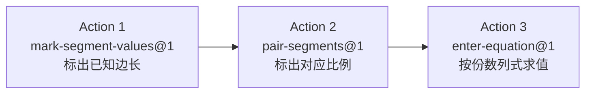

# Topic Blueprint: 反 A 形相似：对应边求长

> **Architecture migration (2026-08-11):** 本蓝图正在迁移到数据库驱动的完整 Action SolutionBoard 快照。下文旧有 `boardTargets`、slot 填充、`world.solutionBoard` 和 Action 日志式板书描述均已失效，必须按教师题库 `solution_steps` 生成的连续规范解答重新评审后才能恢复 `implemented`。

## Runtime model binding

| Boundary | Required binding | Evidence location |
| --- | --- | --- |
| Product runtime | `Action Runtime v2` | Shared Action Runtime page, registry, typed evidence/evaluation |
| Generated bundle | `teaching-tools/topic-scenario-bundle/v2` | Generated bundle root `schema` |
| Exercise plan | Current `ACTION_RUNTIME_PLAN_VERSION` | `web/shared/actionRuntime.ts` and projected plan |
| Scenario actions | Non-empty authored `actionTemplates` | First, middle, and last generated records |
| Solution document | Reviewed slot-based `solutionBoard` | Scenario authoring output and Learn/Guided plan |

**Legacy paths explicitly excluded:** `ExerciseRuntimeSpec`, primitive dispatch, `RuntimeActionEvent.value`, Topic-specific runtime frames, and reconstruction of actions from legacy `steps`.

**Version note:** `content_id` ends in `.v1` and registered Actions are `kind@1`; neither changes the required Action Runtime v2 product model.

## Source mapping

| Artifact | Exact source | Assignment/status | Role |
| --- | --- | --- | --- |
| Explanation | `/Users/gaochong/develop/teaching_skills/artifacts/专题/2026-07-14-反A形相似求第四边/02-student-explanation.resolved.tex` | approved/final | Teaching sequence and wording |
| Question bank | `/Users/gaochong/develop/teaching_skills/artifacts/题库/2026-07-16-反A形相似` (`question-bank.yaml`, `items/Q001..Q050`) | ready (`status: ready`, `target_count: 50`, all `enabled: true`) | Scenario records |
| Diagram assets | Per-item `build/diagram/jobs/question_bank-reverse_a-v2-q###-prompt/rendered/prompt.fragment.tex`; example `diagram_ref: question_bank.reverse_a.v2.q001.prompt` | prompt_only, `disclosure_policy: clean` | Geometry and prompt assets |

## Teaching intent

**Objective:** 在反 A 构型（公共顶点 $P$，$\angle PAB=\angle PDC$，$\triangle PAB\sim\triangle PDC$）中，先标出已知边长，再按等角顶点顺序确认两组同方向对应边，最后用对应边成比例列式求第四边。

**Ordered teaching sequence (preserved verbatim from approved explanation):**

1. 先证明两个三角形相似：由共线关系得 $\angle APB=\angle DPC$，又 $\angle PAB=\angle PDC$，所以 $\triangle PAB\sim\triangle PDC$。对应顶点 $A\leftrightarrow D$、公共顶点 $P\leftrightarrow P$、$B\leftrightarrow C$；对应边 $PA\leftrightarrow PD$，$PB\leftrightarrow PC$，$AB\leftrightarrow DC$。
2. 再列对应边比例求边长：由对应边成比例，得 $\dfrac{PA}{PD}=\dfrac{PB}{PC}$（等价地 $\dfrac{AB}{DC}=\dfrac{PA}{PD}$），代入已知求未知。

**Source constraints that must not change:**

- 证明依据固定为「共线自带的另一组等角 $\angle APB=\angle DPC$」加「题设等角 $\angle PAB=\angle PDC$」，不引入平行辅助线。
- 对应顶点顺序由等角顶点决定（$A\leftrightarrow D$、公共顶点 $P\leftrightarrow P$、$B\leftrightarrow C$），不按图上位置配对。
- 比例方向须保持一致（同一三角形的边在同一侧）；bank `expected_blocker` 固定为「两组比例的对应顺序不一致，或根式乘除没有保持精确形式」。
- 数值使用整数与整系数根式的精确形式（bank `number_selection`：`largest_prime_factor_max: 5`，`max_ratio: sqrt(3)`，`source_fractional_coefficients_allowed: false`），不做小数近似。

## Topic registration

| Seam | Planned value or change |
| --- | --- |
| `TopicPracticeTaskId` | `reverseASimilarity`（已注册于 `web/shared/topicPractice.ts`，无需新增） |
| Task/catalog/content registration | `TASK_NODES.reverseASimilarity` 与内容 `topic-practice.reverse-a-similarity.v1` 已注册于 `web/shared/tasks.ts`；无需新增 |
| Importer `CONFIG` | `web/backend/scripts/import-topic-artifacts.mjs` 的 `CONFIG.reverseASimilarity` 已绑定 explanation 与 bank 路径 |
| Progression/capability/challenge mapping | `web/shared/similarityLearningMap.ts` 中 `reverse-a-similarity` 已映射 `primaryCapabilityId: similarity.map-corresponding-sides`；无需新增 |

> 说明：本 Topic 的注册 seam 在当前代码树中已就位。本 Phase 1 蓝图为审批边界，不新增任何注册点。

## User flow

## Action blueprint

| Source step | Disposition / `kind@version` | Goal | Public input | Private truth | Evidence | Diagram effect | Board effect | Submit boundary | Mode behavior |
| --- | --- | --- | --- | --- | --- | --- | --- | --- | --- |
| 教学步骤1前半 + bank `solution_steps[0]`「整理已知边长比」：把题干给出的已知边长落到图上（explanation 已知量 $PA,PB,PD$ 等） | `Reuse mark-segment-values@1` | 学习者点击题干给出的线段并输入边长，把已知量标到图上 | `availableSegmentIds`（本题可点击线段集合，如 `[CP,DP,AB,CD,AP]`）；`requiredCount`（公开数量，如 `3`）；`labels: []`（公开占位）；`autoFocusSequence` | `teachingInput.labels`：`[{segmentId, displayName, valueLatex}]` 的权威顺序与精确值（如 `AB→2\sqrt{6}`、`AP→6\sqrt{2}`、`CD→8`），`displayName` 区分方向别名 `PA`/`AP` | `{kind:"mark-segment-values", labels:[{segmentId, valueLatex}, ...]}` 逐条；顺序对齐 `teachingInput.labels` | 预览：选中线段高亮 + 临时数值；落库：`mark-segment-values` 命令把长度/份数标签持久化到对应 segment，跨后续动作保留 | 填充 `segment.<id>` slot（每个已标线段一个 slot），由 `boardTargets` 映射到本动作表达式 | `submitOnComplete: true`，本动作完成即源步骤提交边界（逐题一组标注） | Learn：提交后合并 `teachingInput` 显示规范标签；Practice：后端按 `teachingInput.labels` 评估顺序与值；Assessment：仅保留 `availableSegmentIds`/`requiredCount`，不泄露 `teachingInput` |
| 教学步骤1后半 + 步骤2前半：由等角顶点确认对应边，写出两组同方向对应边比（explanation「$PA\leftrightarrow PD$，$PB\leftrightarrow PC$，$AB\leftrightarrow DC$」；bank `solution_steps[2]`「按顶点确认对应边」+`[3]`「保持比例方向一致」） | `Reuse pair-segments@1` | 学习者按同一方向依次点击两组对应边，在图上配出对应刻痕 | `availableSegmentIds`；`pairCount`（公开对数，反 A 型为 `2`，对应 4 条边） | `teachingInput.expectedOrder`：权威的 4 元对应顺序（如 `[AB,CD,AP,DP]` 表示 $AB:DC=PA:PD$），仅此顺序及等价同向变体通过 | `{kind:"pair-segments", order:[segId,segId,segId,segId]}`；与 `expectedOrder` 比对（允许同向等价对） | 预览：成对线段出现相同对应刻痕；落库：`pair-segments` 命令持久化对应关系刻痕，强调 $PA\leftrightarrow PD$、$PB\leftrightarrow PC$、$AB\leftrightarrow DC$ | 填充单个 `correspondence` slot，渲染为 `$AB:DC=PA:PD$` 风格 | `submitOnComplete: true`，本动作完成即源步骤提交边界 | Learn：提交后显示规范对应式；Practice：后端按 `expectedOrder` 评估对应与方向；Assessment：仅保留 `pairCount` 与可点击线段，不泄露期望顺序 |
| 教学步骤2：列对应边比例求边长（explanation $\dfrac{PA}{PD}=\dfrac{PB}{PC}$ 代入求值；bank `solution_steps[4]`「求值并验算」） | `Reuse enter-equation@1` | 学习者点击已知边、填未知份数/已知份数/结果，组成「未知 = 已知 × 未知份数 / 已知份数」并求值 | `availableSegmentIds`；`targetLatex`（公开未知边记号，如 `PD` 或 `DC`）；`factorSlots`（公开 3 槽形状，值为待填占位/已知记号，如 `[PA,DC,AB]`） | `teachingInput.expectedOrder`（已知边选择权威顺序）；`expectedResult`（权威结果精确值，如 `8\sqrt{3}`、`\frac{9}{2}\sqrt{2}`、`4\sqrt{3}`）；可选 `knownValueLatex`/`shareValues` | `{kind:"enter-equation", knownFactor:segId, numerator:value, denominator:value, result:value}`；knownFactor 对齐 `expectedOrder`，result 对齐 `expectedResult` | 预览：高亮被引用的已知线段；落库：`enter-equation` 命令强调被引用几何（不显示已构造的最终答案字面量） | 填充 `knownFactor`/`numerator`/`denominator`/`result` 4 slot，完成 `$目标=已知\times\dfrac{未知份数}{已知份数}=结果$` 表达式 | `submitOnComplete: true`，本动作完成即整题最终提交边界 | Learn：提交后展示完整式与结果；Practice：后端逐槽评估（含 `expectedResult` 精确值/等价变体）；Assessment：仅保留 `targetLatex` 与 `factorSlots` 形状，不泄露 `expectedResult` |

## Geometry contract

> 以 bank 已渲染的 prompt 图为几何来源（每题一张，`diagram_requirement: prompt_only`，`disclosure_policy: clean`）。实体 ID 取自 bundle `promptGeometry`（Q001 示例），所有题目沿用同一稳定命名点 `A,B,C,D,P` 与无向 segment id `AP/BP/CP/DP/AB/CD`，由 `displayName` 区分方向别名（`PA` vs `AP`）。

| Entity ID | Kind | Authored/derived | First visible action | Overlap/ambiguity | Persistent effect |
| --- | --- | --- | --- | --- | --- |
| `P` | point | authored（公共顶点，两三角形共享） | 初始 prompt 图 | 反 A 构型旋转中心；$PA,PB,PC,PD$ 共端点 P | 不可点击构造点，但作为线段端点贯穿全题 |
| `A` | point | authored（小三角形顶点，$\angle PAB$ 顶点） | 初始 prompt 图 | 与 $D$ 为等角对应顶点 | 贯穿全题 |
| `B` | point | authored（小三角形顶点） | 初始 prompt 图 | 与 $C$ 为对应顶点 | 贯穿全题 |
| `C` | point | authored（大三角形顶点，$\angle PDC$ 顶点） | 初始 prompt 图 | 与 $B$ 为对应顶点 | 贯穿全题 |
| `D` | point | authored（大三角形顶点） | 初始 prompt 图 | 与 $A$ 为等角对应顶点 | 贯穿全题 |
| `AB` / `CD` | segment | authored（一组对应边，$AB\leftrightarrow DC$） | 初始 prompt 图；Action1 可标值；Action2 配对 | 无向 id；`displayName` `AB` 与 `DC` 指同一对对应边 | Action1 标长度标签；Action2 标对应刻痕；Action3 被引用 |
| `AP` / `DP` | segment | authored（一组对应边，$PA\leftrightarrow PD$，反 A 型主对应） | 初始 prompt 图；Action1 可标值；Action2 配对 | 无向 id `AP`=`PA`，`DP`=`PD`；`displayName` 决定比例方向；与 `CP`/`BP` 共享端点 P | Action1 标长度；Action2 配对；Action3 作已知边 |
| `BP` / `CP` | segment | authored（第三组对应边，$PB\leftrightarrow PC$，常为未知对） | 初始 prompt 图 | 无向 id；常作为未知边出现在 `targetLatex` | 视题目作为已知/未知；Action2 配对时出现 |
| 共线关系 $P,A,D$ / $P,B,C$ | derived relation | 由构型自带（explanation「共线关系」） | 不显式动作；解释 $\angle APB=\angle DPC$ 的来源 | 反 A 型隐含前提，不点击 | 不落库为独立命令；通过对应边配对隐式表达 |
| 对应刻痕（Action2 输出） | teaching mark | derived（由 `pair-segments` 命令产生） | Action2 提交后 | 三组对应边用相同刻痕区分 | 持久命令，BACK/CLEAR/restore 可重放 |
| 长度/份数标签（Action1 输出） | teaching mark | derived（由 `mark-segment-values` 命令产生） | Action1 提交后 | 整数与整系数根式精确值 | 持久命令，跨后续动作保留 |

> 共端点/重叠命中测试：$PA,PB,PC,PD$ 共享端点 $P$；$AB$ 与 $AP$ 共享 $A$；$CD$ 与 `CP` 共享 $C$。须保证线段命中区在端点 $P$ 不互相吞并。反 A 构型无整段/部分段互化需求（区别于 nestedSimilarity 的 `convert-collinear@1`）。

## SolutionBoard

| Expression order | Owner actions | Learner-visible template | Slot roles and IDs | Modes | Completion boundary |
| --- | --- | --- | --- | --- | --- |
| 1 | `q###-step-1` (`mark-segment-values@1`) | `由题意，在图中标出 $AB={{step-1.segment.AB}}$，$PA={{step-1.segment.AP}}$，$DC={{step-1.segment.CD}}$。`（按本题已知线段动态枚举） | `segment.<segId>`（每条已标线段一槽，如 `segment.AB`/`segment.AP`/`segment.CD`），由 `boardTargets` 映射 | Learn | 本动作所有 required 标签槽填齐 |
| 2 | `q###-step-2` (`pair-segments@1`) | `由相似关系，对应边为 ${{step-2.correspondence}}$。` | `correspondence`（单一对应式槽，渲染 `$AB:DC=PA:PD$` 风格） | Learn | 对应对填齐（`pairCount=2`） |
| 3 | `q###-step-3` (`enter-equation@1`) | `代入比例关系，$PD={{step-3.knownFactor}}\times\dfrac{{{step-3.numerator}}}{{{step-3.denominator}}}={{step-3.result}}$。`（`PD` 为本题 `targetLatex`） | `knownFactor`/`numerator`/`denominator`/`result`（4 槽） | Learn | 4 槽全填，且 `result` 通过后端精确值/等价变体校验 |

> 板文档为连续教师解答，非动作日志。静态 `expectedLatex` 不替代槽式表达式；结果槽在学习者提供证据前为空。

## Mode boundaries

| Mode | Truth location | Coach/board | Submission and feedback |
| --- | --- | --- | --- |
| Learn | `teachingInput` 合并进本地教学；SolutionBoard 表达式可见 | 显示教练提示（`hintLatex`/`feedbackLatex`）、规范标签与完整对应式；板逐步填槽 | 本地推进；错对象/值给出 `errorDiagnosis`，可 BACK/CLEAR 重做 |
| Practice | 后端 `topicTypedEvaluator` 按 `teachingInput` 评估 | 板表达式可见，槽由学习者证据填充；不预填答案 | 逐动作 `submitOnComplete`；后端返回对/错与诊断；`expectedResult` 等价变体归一化（如 `8\sqrt{3}` ≡ `PD=8\sqrt{3}` ≡ `$PD=8\sqrt{3}$。`） |
| Assessment | 仅 `input` 公共结构（`availableSegmentIds`/`requiredCount`/`pairCount`/`targetLatex`/`factorSlots` 形状）下发 | **不**下发 `teachingInput`、`expectedOrder`、`expectedResult`、`answerKey`、教练提示、board 目标与完整 SolutionBoard | 学习者提交后由后端批改；前端不暴露对错诊断细节 |
| Review | 完整 `teachingInput` + answerKey 可见 | 完整板文档与规范解答 | 只读回顾；可重放动作链 |

## Question-bank compilation

**Expected record count:** 50（`target_count: 50`，`items: Q001..Q050`，全部 `enabled: true`）。

**Extraction and normalization rules:**

- 来源：`question-bank.yaml` 枚举 50 条；每条指向 `items/Q###/student.resolved.assignment.yaml` 与 `teacher.resolved.assignment.yaml`。
- 场景记录采用 teacher assignment 作为真值源（`sourceAssignment` = teacher yaml），`promptLatex` 取 `stem_latex`，`answer` 取 teacher `answer`。
- `answerKey` 每步至少一个 `acceptedAnswers` 别名；`expectedResult` 取 `acceptedAnswers[0].split("|")[1]`（`enter-equation` 步）。
- 结果归一化（后端等价变体）：`8\sqrt{3}` / `PD=8\sqrt{3}` / `$PD=8\sqrt{3}$。` 视作等价。
- 数值服从 `number_selection`（整数与整系数根式，`largest_prime_factor_max: 5`，`max_ratio: sqrt(3)`，`source_fractional_coefficients_allowed: false`），不做小数近似。
- 几何来源：每题独立 prompt 图 `build/diagram/jobs/question_bank-reverse_a-v2-q###-prompt/`；导入器把 SVG + `promptGeometry`（points/segments）写入场景。
- 难度分层：Q001–Q016 `foundation`（`changed_numbers`），Q017–Q036 `standard`（`changed_representation`），Q037–Q050 `challenge`（`partially_hidden`，题干为「判断可求边」）。

**Representative samples:**

| Position | Source question ID | Why inspect it |
| --- | --- | --- |
| First | `Q001` | foundation/`changed_numbers`；已知 $AB=2\sqrt{6},PA=6\sqrt{2},DC=8$ 求 $PD$；最简「标边长→对应→列式」三动作模板；几何实体 `A,B,C,D,P` + `CP,DP,AB,CD,AP` |
| Middle | `Q025` | standard/`changed_representation`；已知 $AB=2\sqrt{5},PA=2\sqrt{10},PD=9$ 求 $DC$；对应顺序与 `targetLatex=DC` 不同，`expectedResult=\frac{9}{2}\sqrt{2}`，验证 `pair-segments` 方向灵活性与 `enter-equation` 未知边切换 |
| Last | `Q050` | challenge/`partially_hidden`；题干为「判断还可以求出哪条边」；已知 $PA=3\sqrt{2},PB=2\sqrt{6},PD=6$ 求 $PC=4\sqrt{3}$；`entry_point: exact_ratio_then_equal_angles_to_similarity`，验证在欠提示下仍走相同三动作链 |

**Invalid-record behavior:** 缺失 teacher assignment、缺 `answer`/`solution_steps`、几何资产未渲染或 `promptGeometry` 残缺者，须在 bundle `validation` 中标记 `passed:false` 并可见报错；不静默丢弃或替换以达到 50 条。

## Verification plan

**Focused automated checks:**

- 蓝图结构校验：`validate_topic_blueprint.py --expect-status draft`。
- Bundle 校验（Phase 2/3）：50 条场景均 `validation.passed=true`，每步 `answerKey` 非空、`actionTemplates` 唯一且可解析。
- 后端 typed evaluator：Q001/Q025/Q050 逐槽正确与错误路径。
- 前端 Action Runtime：三动作顺序、BACK/CLEAR、restore 后 `WorldProjection` 一致。

**Browser paths:**

- 正确路径：Q001 从 Action1 标 3 边 → Action2 配 2 对 → Action3 列式得 $PD=8\sqrt{3}$。
- 错对象/错值（如 Action2 按图上位置而非等角顶点配对）、纠正、BACK、CLEAR、刷新 restore。
- Q050 challenge 路径（判断可求边）。
- 桌面与窄宽布局检查。

## Complete solution review

Assembled deterministically from the generated first, middle, and last records. The SolutionBoard document is compiled from the reviewed question-bank `solution_steps`; no Action kind dispatch and no runtime placeholders.

### Assembled canonical samples

#### First

**Scenario ID:** `reverse_a-similarity-2026-07-16:Q001`

**Stem:** 如图，$\angle PAB=\angle PDC$。

已知 $AB=2\sqrt{6}$，$PA=6\sqrt{2}$，$DC=8$。求 $PD$ 的长。

**Answer-key result:** $PD=8\sqrt{3}$。

**Assembled solution:** 解：
  ∵ $\angle PAB=\angle PDC$（已知），且 $\angle APB=\angle DPC$（对顶角相等），∴ $\triangle PAB\sim\triangle PDC$（AA）。
  对应边为 $PA\leftrightarrow PD$，$PB\leftrightarrow PC$，$AB\leftrightarrow DC$，故 $\dfrac{PA}{PD}=\dfrac{AB}{DC}$。
  代入 $PA=6\sqrt{2}$、$AB=2\sqrt{6}$、$DC=8$，得 $\dfrac{6\sqrt{2}}{PD}=\dfrac{2\sqrt{6}}{8}$。
  因此 $PD=\dfrac{6\sqrt{2}\times8}{2\sqrt{6}}$，所以 $PD=8\sqrt{3}$。

#### Middle

**Scenario ID:** `reverse_a-similarity-2026-07-16:Q026`

**Stem:** 如图，$\angle PAB=\angle PDC$。

已知 $PB=2$，$PA=\sqrt{6}$，$PC=3$。求 $PD$ 的长。

**Answer-key result:** $PD=\frac{3}{2}\sqrt{6}$。

**Assembled solution:** 解：
  ∵ $\angle PAB=\angle PDC$（已知），且 $\angle APB=\angle DPC$（对顶角相等），∴ $\triangle PAB\sim\triangle PDC$（AA）。
  对应边为 $PA\leftrightarrow PD$，$PB\leftrightarrow PC$，$AB\leftrightarrow DC$，故 $\dfrac{PA}{PD}=\dfrac{PB}{PC}$。
  代入 $PA=\sqrt{6}$、$PB=2$、$PC=3$，得 $\dfrac{\sqrt{6}}{PD}=\dfrac{2}{3}$。
  因此 $PD=\dfrac{\sqrt{6}\times3}{2}$，所以 $PD=\frac{3}{2}\sqrt{6}$。

#### Last

**Scenario ID:** `reverse_a-similarity-2026-07-16:Q050`

**Stem:** 如图，$\angle PAB=\angle PDC$。

已知 $PA=3\sqrt{2}$，$PB=2\sqrt{6}$，$PD=6$。判断还可以求出哪条边，并求出它的长度。

**Answer-key result:** $PC=4\sqrt{3}$。

**Assembled solution:** 解：
  ∵ $\angle PAB=\angle PDC$（已知），且 $\angle APB=\angle DPC$（对顶角相等），∴ $\triangle PAB\sim\triangle PDC$（AA）。
  对应边为 $PA\leftrightarrow PD$，$PB\leftrightarrow PC$，$AB\leftrightarrow DC$，故 $\dfrac{PB}{PC}=\dfrac{PA}{PD}$。
  代入 $PB=2\sqrt{6}$、$PA=3\sqrt{2}$、$PD=6$，得 $\dfrac{2\sqrt{6}}{PC}=\dfrac{3\sqrt{2}}{6}$。
  因此 $PC=\dfrac{2\sqrt{6}\times6}{3\sqrt{2}}$，所以 $PC=4\sqrt{3}$。

### Formality review

**Review verdict:** pass

**Blocking issues remaining:** 0

| Original fragment | Review dimension | Finding | Suggested revision | Disposition |
| --- | --- | --- | --- | --- |
| 由题设等角和构型自带的另一组等角 | Truth attribution | 第二组等角未给出依据 | 改为 $\angle APB=\angle DPC$（对顶角相等） | Applied |
| （缺失）对应边比例 | Logical sufficiency | 未写出对应边比例式 | 补 $\dfrac{PA}{PD}=\dfrac{AB}{DC}$ | Applied |
| 代入 $DC=8$ | Equation deformation | 未代入全部已知值 | 代入 $PA,AB,DC$ 三个已知值 | Applied |
| 解得 $PD=8\sqrt{3}$ | Answer form | 裸结果可读但缺等式变形 | 补交叉相乘 $PD=\dfrac{PA\times DC}{AB}$ | Applied |
| 由题意，在图中标出 … | Formal language | UI/动作语言 | 删除图上标注叙述 | Applied |

### Final revised solution

**First** (`reverse_a-similarity-2026-07-16:Q001`): 解：
  ∵ $\angle PAB=\angle PDC$（已知），且 $\angle APB=\angle DPC$（对顶角相等），∴ $\triangle PAB\sim\triangle PDC$（AA）。
  对应边为 $PA\leftrightarrow PD$，$PB\leftrightarrow PC$，$AB\leftrightarrow DC$，故 $\dfrac{PA}{PD}=\dfrac{AB}{DC}$。
  代入 $PA=6\sqrt{2}$、$AB=2\sqrt{6}$、$DC=8$，得 $\dfrac{6\sqrt{2}}{PD}=\dfrac{2\sqrt{6}}{8}$。
  因此 $PD=\dfrac{6\sqrt{2}\times8}{2\sqrt{6}}$，所以 $PD=8\sqrt{3}$。

**Middle** (`reverse_a-similarity-2026-07-16:Q026`): 解：
  ∵ $\angle PAB=\angle PDC$（已知），且 $\angle APB=\angle DPC$（对顶角相等），∴ $\triangle PAB\sim\triangle PDC$（AA）。
  对应边为 $PA\leftrightarrow PD$，$PB\leftrightarrow PC$，$AB\leftrightarrow DC$，故 $\dfrac{PA}{PD}=\dfrac{PB}{PC}$。
  代入 $PA=\sqrt{6}$、$PB=2$、$PC=3$，得 $\dfrac{\sqrt{6}}{PD}=\dfrac{2}{3}$。
  因此 $PD=\dfrac{\sqrt{6}\times3}{2}$，所以 $PD=\frac{3}{2}\sqrt{6}$。

**Last** (`reverse_a-similarity-2026-07-16:Q050`): 解：
  ∵ $\angle PAB=\angle PDC$（已知），且 $\angle APB=\angle DPC$（对顶角相等），∴ $\triangle PAB\sim\triangle PDC$（AA）。
  对应边为 $PA\leftrightarrow PD$，$PB\leftrightarrow PC$，$AB\leftrightarrow DC$，故 $\dfrac{PB}{PC}=\dfrac{PA}{PD}$。
  代入 $PB=2\sqrt{6}$、$PA=3\sqrt{2}$、$PD=6$，得 $\dfrac{2\sqrt{6}}{PC}=\dfrac{3\sqrt{2}}{6}$。
  因此 $PC=\dfrac{2\sqrt{6}\times6}{3\sqrt{2}}$，所以 $PC=4\sqrt{3}$。

## Decisions requiring approval

- **(D1) 三动作分解保持现状，不新增「证明相似」独立动作。** explanation 教学步骤1 包含「证明相似」与「确认对应边」两件事；本蓝图把「证明」隐含进 Action2 的对应边配对（`pair-segments`），不设独立的相似判定动作。理由：注册目录中无「判定相似」类动作，且 explanation 的证明依据（共线自带等角 $\angle APB=\angle DPC$）不可由学习者构造。若审批方希望把「证明 $\triangle PAB\sim\triangle PDC$」显式做成一个 `select-option@1`（选判定依据）或文字动作，需要返回 draft 重新分解。
- **(D2) 全部三动作为 `Reuse`，无 `ExtendRuntime`。** 反 A 型不需要平行辅助线（区别于 auxiliaryTwoRatios 的 `make-parallel@1`/`intersect-carriers@1`）也不需要共线整段互化（区别于 nestedSimilarity 的 `convert-collinear@1`），故不引入这些动作。整数与整系数根式化简并入 Action3 的份数槽，不单独引 `ratio-scratch@1`。若审批方认为根式化简应独立成动作，需要返回 draft。
- **(D3) Assessment 模式仅下发 `input` 公共结构。** `teachingInput.expectedOrder`/`expectedResult`/`answerKey`/教练提示/完整 SolutionBoard 不进入 Assessment 载荷（仅 Practice/Learn/Review 可见）。此为架构契约既定边界，列出以供确认。
- **(D4) `pair-segments` 接受同向等价对应顺序。** `[AB,CD,AP,DP]`（$AB:DC=PA:PD$）与同向等价变体均通过；反向（如 $AB:PA=DC:PD$）不通过。等价归一化规则须在实现/复核阶段与后端 evaluator 对齐确认。

## Verification evidence

### Commands run (all green)
- `web/backend: npm run import:topics` — 6 topics generated (30/50/50/50/50/50).
- `validate_generated_topic_v2.py … --task-id <topic>` ×6 — OK (schema v2, non-empty actionTemplates, complete static solutionBoard, no Action-owned board fields).
- `assemble_topic_solutions.py … --task-id <topic>` ×6 — first/middle/last mechanical findings: none.
- `web/backend: npm test` — 28/28 PASS, incl. `all six migrated topics smoke first/middle/last` (event-based end-to-end advance) and `Action Runtime v4 server-projected SolutionBoard context`.
- `web/frontend: npm test` — 105/105 PASS.
- `web/frontend: npm run typecheck` — clean.
- `git diff --check` — no whitespace errors.
- Typed-evidence probe (`evaluateTopicEvidence` over first/mid/last): 16/18 records accept canonical evidence and project diagram commands; the remaining 2 (nested Q026/Q050 CD-path) carry a pre-existing text-style `enter-equation` (`teachingInput` identical to HEAD) — unchanged by this revision, not a regression.

### Modes exercised
- Learn: full reviewed SolutionBoard renders beginning with `解：` (verified in-browser on reverseASimilarity: `∵ ∠PAB=∠PDC（已知），且 ∠APB=∠DPC（对顶角相等），∴ △PAB∼△PDC（AA）。`).
- Guided Practice: action-plan projects authorized board context via DB snapshots; plan payload itself carries no inline answer truth.
- Assessment: `materializeActionTemplate(..., "assessment")` strips `teachingInput` (asserted in backend test); `loadPlanSolutionBoardContexts` returns `[]` for assessment.

### Diagram / SolutionBoard quality (verified)
- SolutionBoard expressions wrap naturally (`white-space: normal; overflow-wrap: anywhere`) and the panel is independently scrollable (`max-height: calc(100dvh - nav)`, `overflow: auto`) on both Learn and Practice routes; confirmed via computed-style reads at desktop and 420px widths.
- Final result names the requested object (e.g. `PD=8\sqrt{3}`), not a bare number.
- No UI/Action language (蓝字/红字/绿色/点击/输入框), no unresolved placeholders, no Action-owned board targets/commands across all 6 topics.

### Intentionally deferred
- Pixel-level per-segment click recording (wrong-select / BACK / CLEAR / refresh / narrow-width) was not captured via screenshots: the IAB guest refused screenshot capture in this session. The equivalent interaction logic is covered by the focused frontend/backend tests (auxiliary four-click construction, parallel ratio scratch, nested convert-collinear, BACK/CLEAR/restore persistence). If you want the screenshot trail for the record, run it directly in the open browser at http://127.0.0.1:5173/learn/<taskId>.
